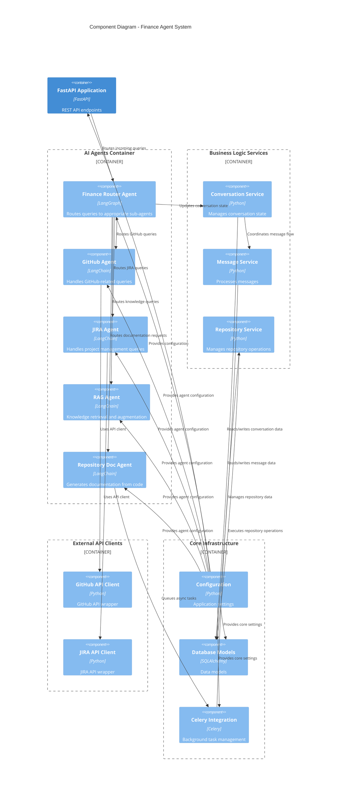

# C4 Component Diagram - Finance Agent System

## Overview
This diagram shows the internal components of the AI agent system and how they interact with each other.

## Component Details

### 1. Finance Router Agent
- **Purpose**: Entry point for all finance-related queries
- **Responsibilities**:
  - Analyzes user intent
  - Routes queries to appropriate sub-agents
  - Maintains conversation context
  - Aggregates responses

### 2. Specialized Agents
- **GitHub Agent**: Handles queries about repositories, issues, pull requests, and GitHub operations
- **JIRA Agent**: Manages queries about projects, issues, boards, and project tracking
- **RAG Agent**: Provides knowledge retrieval from documentation and databases
- **Repository Documentation Agent**: Generates documentation from code repositories

### 3. Business Logic Services
- **Conversation Service**: Manages conversation state, turns, and context
- **Message Service**: Processes incoming and outgoing messages
- **Repository Service**: Handles repository-related operations and data

### 4. External API Clients
- **GitHub API Client**: Wraps GitHub REST API for repository operations
- **JIRA API Client**: Wraps JIRA REST API for project management operations

### 5. Core Infrastructure
- **Configuration**: Manages application settings and environment variables
- **Database Models**: Defines data structures for conversations, messages, and users
- **Celery Integration**: Handles background task processing and scheduling

## Key Data Flows

1. **Query Flow**:
   - User query → FastAPI → Finance Router → Specialized Agent
   - Agent processes query using appropriate tools/clients
   - Response flows back through the same path

2. **Background Processing**:
   - Repository documentation generation queued via Celery
   - Async data fetching from GitHub/JIRA APIs
   - Results stored in database

3. **State Management**:
   - Conversation service maintains context across turns
   - Message service tracks message history
   - Repository service manages repository metadata
