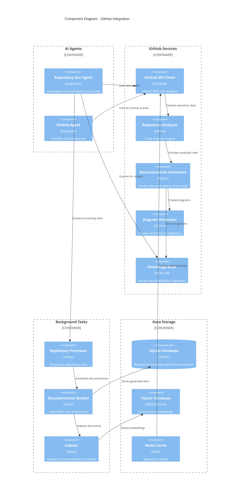

# C4 Component Diagram - GitHub Integration

## Overview
This diagram shows the detailed components involved in GitHub integration and repository documentation generation.

## Component Details

### 1. Repository Doc Agent
- **Purpose**: Generates comprehensive documentation from code repositories
- **Capabilities**:
  - Analyzes repository structure
  - Generates documentation for code
  - Creates architecture diagrams
  - Builds searchable knowledge base

### 2. GitHub Agent
- **Purpose**: Handles GitHub-specific queries
- **Capabilities**:
  - Query repositories, issues, PRs
  - Analyze commit history
  - Get contributor information
  - Manage GitHub workflows

### 3. GitHub API Client
- **Technology**: PyGithub
- **Purpose**: Wrapper for GitHub REST API
- **Features**:
  - Repository operations
  - Issue/PR management
  - GitHub GraphQL support
  - Rate limiting handling

### 4. Repository Analyzer
- **Purpose**: Analyzes code structure and content
- **Features**:
  - Parses source code
  - Identifies classes and functions
  - Extracts documentation strings
  - Builds dependency graphs

### 5. Documentation Generator
- **Purpose**: Creates human-readable documentation
- **Features**:
  - Generates API documentation
  - Creates usage examples
  - Explains code patterns
  - Generates best practices

### 6. Diagram Generator
- **Purpose**: Creates architecture diagrams
- **Features**:
  - Component diagrams
  - Sequence diagrams
  - Class diagrams
  - Package structure visualization

### 7. Background Tasks
- **Repository Processor**: Handles large repository processing
- **Documentation Builder**: Assembles final documentation
- **Indexer**: Creates searchable embeddings

### 8. Data Storage
- **SQLite Database**: Stores metadata and documentation
- **Vector Database**: For semantic search capabilities
- **Redis Cache**: For frequently accessed repository data

## Processing Flow

1. **Repository Analysis**:
   - Fetch repository via GitHub API
   - Analyze code structure
   - Extract documentation
   - Generate diagrams

2. **Documentation Generation**:
   - Create comprehensive docs
   - Include code examples
   - Add best practices
   - Build knowledge base

3. **Storage and Indexing**:
   - Store in SQLite database
   - Create embeddings for search
   - Cache frequently accessed data
