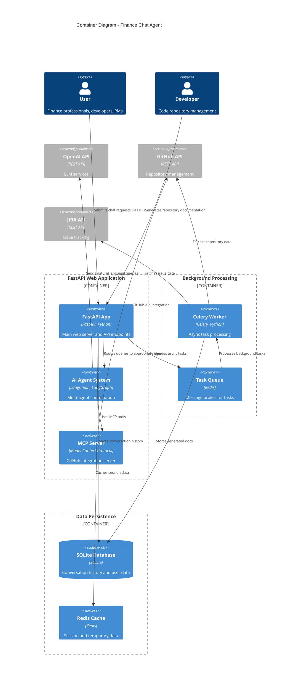

# C4 Container Diagram - Finance Chat Agent

## Overview
The container diagram shows the main applications, databases, and services that make up the finance chat agent system.

## Container Details

### 1. FastAPI Web Application
- **Technology**: FastAPI, Python 3.9+
- **Purpose**: Main API server handling HTTP requests
- **Key Features**:
  - RESTful API endpoints for chat requests
  - Authentication and authorization
  - Request validation and response formatting
  - Conversation management

### 2. AI Agent System
- **Technology**: LangChain, LangGraph, OpenAI
- **Purpose**: Multi-agent coordination and query routing
- **Key Agents**:
  - Finance Agent: Handles finance-related queries
  - GitHub Agent: Manages GitHub interactions
  - JIRA Agent: Handles project management queries
  - RAG Agent: Provides knowledge retrieval
  - Repository Documentation Agent: Generates code documentation

### 3. MCP Server
- **Technology**: Model Context Protocol
- **Purpose**: Enhanced GitHub integration
- **Features**: Tool-based AI capabilities for GitHub operations

### 4. Celery Worker
- **Technology**: Celery, Redis
- **Purpose**: Background task processing
- **Tasks**:
  - Repository analysis and documentation generation
  - GitHub/JIRA data fetching
  - Async message processing

### 5. SQLite Database
- **Technology**: SQLite, SQLAlchemy
- **Purpose**: Persistent data storage
- **Schema**:
  - Conversations table
  - Messages table
  - User data
  - Generated documentation

### 6. Redis Cache
- **Technology**: Redis
- **Purpose**: Session management and caching
- **Uses**:
  - Session storage
  - Rate limiting
  - Temporary data caching