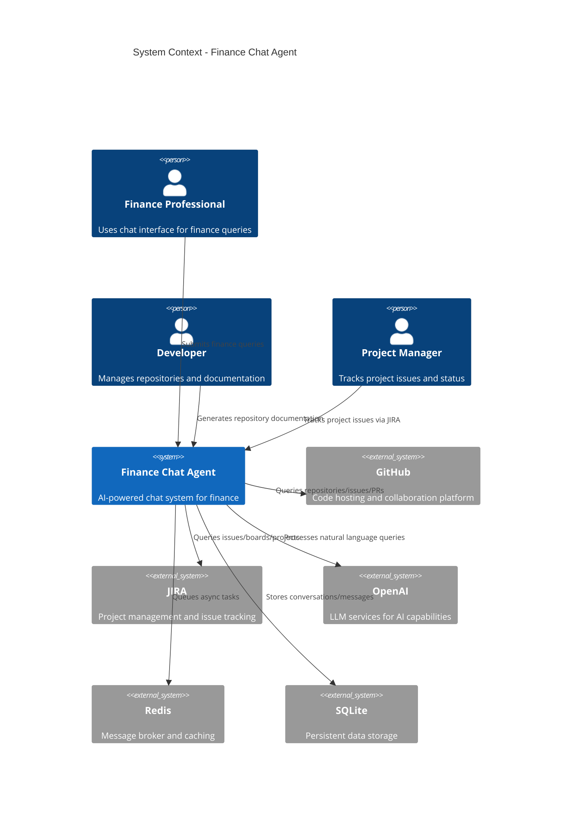

# C4 System Context - Finance Chat Agent

## Overview
The system context diagram shows the finance chat agent as a central system interacting with various users and external services.

## Key Interactions

1. **Primary Users**:
   - Finance professionals use the chat interface for finance-related queries
   - Developers use the system to generate documentation from repositories
   - Project managers use it to track project issues and status

2. **External Dependencies**:
   - OpenAI provides the core AI capabilities through LLM models
   - GitHub integration allows querying repositories, issues, and pull requests
   - JIRA integration provides project management data
   - Redis serves as the message broker for asynchronous processing
   - SQLite stores all conversation and user data

3. **Core Purpose**:
   - The finance chat agent acts as a central hub that connects users with multiple domain-specific AI agents
   - It routes queries to the appropriate agent (finance, GitHub, JIRA, or documentation)
   - Manages the conversation flow and maintains context across interactions
