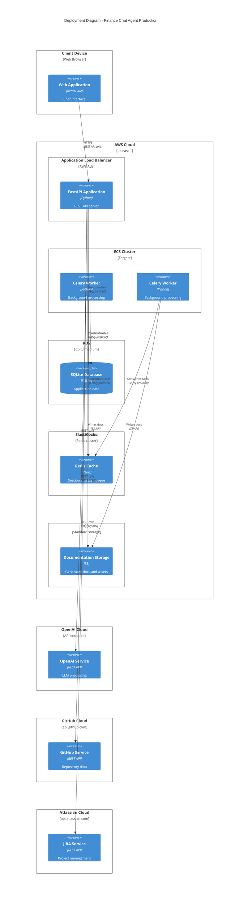

# C4 Deployment Diagram - Production Architecture

## Overview
This diagram shows the deployment architecture for the finance chat agent system in a production environment.

## Deployment Architecture

### Client Layer
- **Web Application**: Frontend chat interface built with React or Vue.js
- **Responsibilities**: User interaction, real-time messaging, display of responses

### Application Layer
- **Application Load Balancer**: Distributes traffic across API instances
- **FastAPI Application**: Main API server handling HTTP requests
- **Auto-scaling**: Horizontal scaling based on request volume

### Processing Layer
- **ECS Cluster**: Container orchestration for Celery workers
- **Celery Workers**: Background task processing
  - Repository analysis and documentation generation
  - Data fetching from external APIs
  - Indexing and caching operations
- **Auto-scaling**: Workers scale based on task queue length

### Data Layer
- **RDS with SQLite**: Persistent data storage
  - Conversation history
  - User data
  - Application state
- **ElastiCache (Redis)**: Caching and message broker
  - Session storage
  - Task queue
  - Temporary data caching
- **S3 Documentation Storage**: Generated documentation and assets
  - Static documentation files
  - Diagrams and images
  - Exported documents

### External Services
- **OpenAI API**: LLM processing for AI capabilities
- **GitHub API**: Repository data and operations
- **JIRA API**: Project management data

## Infrastructure Details

### High Availability
- **Load Balancer**: Distributes traffic across multiple API instances
- **Multi-AZ Deployment**: Resources span multiple availability zones
- **Auto Scaling**: Automatic scaling based on demand

### Security
- **VPC**: Isolated network environment
- **Security Groups**: Network access controls
- **IAM Roles**: Least-privilege access
- **SSL/TLS**: Encrypted communication

### Monitoring
- **CloudWatch**: Metrics and logging
- **Health Checks**: Automated monitoring of services
- **Alarms**: Notification for critical events

### Performance Optimization
- **Caching**: Redis for frequently accessed data
- **CDN**: Static asset delivery
- **Connection Pooling**: Efficient API connections
- **Asynchronous Processing**: Non-blocking operations

## Deployment Strategy

1. **Blue-Green Deployment**: Zero-downtime updates
2. **Canary Releases**: Gradual rollout of new features
3. **Rolling Updates**: Maintain service availability
4. **Auto-healing**: Automatic replacement of unhealthy instances

## Disaster Recovery

1. **Backup Strategy**:
   - Automated database backups
   - S3 versioning for documentation
   - Multi-region replication

2. **Recovery Procedures**:
   - Automated failover to standby instances
   - Database restore from backups
   - Service restart with graceful degradation
