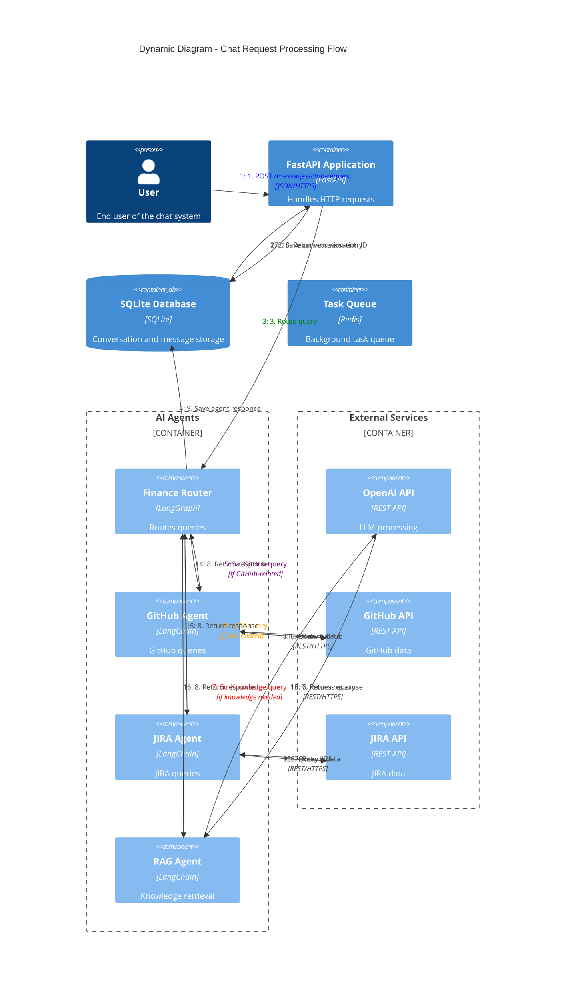

# C4 Dynamic Diagram - Chat Request Flow

## Overview
This diagram illustrates the dynamic flow of processing a chat request through the finance chat agent system.

## Flow Description

### Phase 1: Request Reception
1. **User submits chat request** via HTTP POST to `/messages/chat-request`
2. **FastAPI saves conversation entry** to SQLite database
3. **Request routed to Finance Router** agent
4. **Router updates conversation context** with new message

### Phase 2: Query Routing
5a. **GitHub queries** → GitHub Agent
5b. **JIRA queries** → JIRA Agent
5c. **Knowledge queries** → RAG Agent

### Phase 3: External API Calls
6. **Agents query respective APIs**:
   - GitHub Agent queries GitHub API
   - JIRA Agent queries JIRA API
   - RAG Agent queries OpenAI API

### Phase 4: Response Aggregation
7. **API responses returned** to respective agents
8. **Agents process responses** and return to Finance Router
9. **Router saves agent response** to database
10. **System returns conversation ID** to user

## Key Features

### Asynchronous Processing
- Long-running queries can be processed in background
- Users can check status using conversation ID
- Task queue handles complex operations

### Error Handling
- Failed API calls are logged and retried
- Graceful degradation when external services unavailable
- Clear error messages returned to user

### State Management
- Conversation context maintained across turns
- Message history preserved for continuity
- Session state managed in database

## Performance Considerations

1. **Caching**: Frequently accessed data cached in Redis
2. **Batch Processing**: Multiple queries can be processed in parallel
3. **Background Tasks**: Repository documentation generation handled asynchronously
4. **Connection Pooling**: Efficient reuse of API connections
