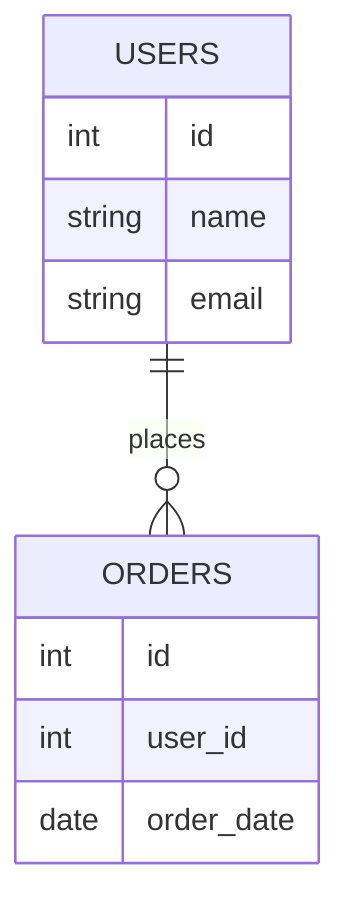
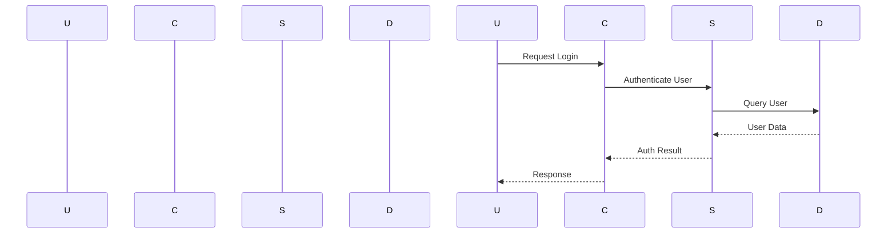
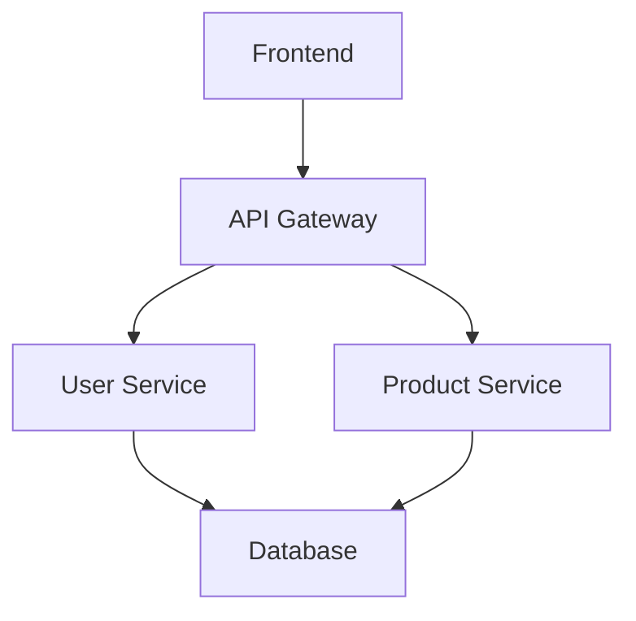

# Codebase-to-Knowledge-Docs

This functionality transforms GitHub code repositories into comprehensive markdown documentation covering project architecture, data flow, business workflows, and code relationships.

## Features

### 🎯 Comprehensive Documentation Generation

- **Project Architecture**: System overview, component identification, and architecture diagrams
- **Data Flow & Lineage**: Data sources, transformations, and flow patterns with diagrams
- **Business Workflows**: Process documentation with sequence diagrams
- **Code Structure**: Detailed analysis of code files and their relationships
- **Visual Diagrams**: ER diagrams, sequence diagrams, and architecture visualizations using Mermaid

### 📚 Supported File Types

#### Markdown Files (Copied Directly)
- `README.md`, `CONTRIBUTING.md`, `ARCHITECTURE.md`
- `docs/*.md` - All markdown files in docs directory

#### Code Files (Transformed to Markdown)
- **Python**: Classes, functions, imports, dependencies, business logic
- **Java**: Classes, methods, dependencies, architecture patterns
- **SQL**: Tables, relationships, stored procedures, queries
- **JavaScript/TypeScript**: Functions, modules, frameworks
- **Go, Rust, C++, C**: Structure analysis and documentation

### 🔍 Code Analysis Features

- **AST Parsing**: Deep code analysis using Abstract Syntax Trees
- **Business Logic Extraction**: Identifies key business domains and processes
- **Dependency Mapping**: Tracks imports, function calls, and relationships
- **Complexity Scoring**: Code complexity metrics for maintainability
- **Multi-language Support**: Handles various programming languages

## Installation

1. **Install Dependencies**
```bash
pip install -r requirements.txt
```

2. **Configure GitHub Token**
```bash
export GITHUB_TOKEN=your_github_token_here
export REPOSITORY_SERVICE_ENABLED=true
```

3. **Environment Variables (Optional)**
```bash
# Output directory for generated documentation
export REPOSITORY_SERVICE_OUTPUT_DIR="./generated-docs"

# Maximum number of files to analyze
export REPOSITORY_SERVICE_MAX_FILES=100

# Enable diagram generation
export REPOSITORY_SERVICE_ENABLE_DIAGRAMS=true

# Maximum repository size (MB)
export REPOSITORY_SERVICE_MAX_REPO_SIZE_MB=100
```

## Usage

### Command Line Interface

Generate documentation from any GitHub repository:

```bash
python scripts/generate_docs.py https://github.com/user/repo

# With options
python scripts/generate_docs.py https://github.com/user/repo \
  --branch main \
  --output-dir ./my-docs \
  --max-files 50 \
  --verbose
```

### Programmatic Usage

```python
from app.services.repository_service import RepositoryService
from app.core.config import github_settings

# Initialize service
repository_service = RepositoryService()

# Generate documentation
result = repository_service.transform_repository_to_markdown(
    url="https://github.com/user/repo",
    branch="main",
    output_dir="./documentation",
    max_files=100
)

# Check results
print(f"Generated {len(result.files_created)} files")
print(f"Output directory: {result.output_dir}")
```

### Using the Agent

```python
from app.agents.repository_doc_agent import RepositoryDocAgent, RepositoryDocRequest

# Initialize agent
agent = RepositoryDocAgent()

# Create request
request = RepositoryDocRequest(
    repo_url="https://github.com/user/repo",
    branch="main",
    output_dir="./docs",
    max_files=50
)

# Handle request
response = agent.handle_request(request)
print(f"Status: {response.status}")
print(f"Message: {response.message}")
```

## Generated Documentation

The system creates the following markdown files in your output directory:

### 1. `ARCHITECTURE.md`
- Project structure overview
- Component identification (controllers, services, models)
- Architecture diagrams using Mermaid
- System dependencies and relationships

### 2. `DATA_FLOW.md`
- Data sources and sinks
- Data transformation pipelines
- Data flow diagrams
- Database schema relationships

### 3. `WORKFLOWS.md`
- Business process documentation
- Sequence diagrams for key workflows
- Step-by-step process descriptions
- Related code files

### 4. `CODE_RELATIONSHIPS.md`
- Import dependencies between files
- Function call relationships
- Dependency graphs
- Component interactions

### 5. `code_documentation/` Directory
- Transformed code files in markdown format
- Business logic explanations
- Class and function documentation
- Code complexity analysis

## Diagram Generation

The system automatically generates various diagrams using Mermaid syntax:

### Entity-Relationship Diagrams


### Sequence Diagrams


### Architecture Diagrams


## Configuration

### Repository Service Settings

| Setting | Default | Description |
|---------|---------|-------------|
| `REPOSITORY_SERVICE_ENABLED` | false | Enable/disable the service |
| `REPOSITORY_SERVICE_OUTPUT_DIR` | ./codebase-to-knowledge-docs | Output directory |
| `REPOSITORY_SERVICE_MAX_FILES` | 100 | Maximum files to analyze |
| `REPOSITORY_SERVICE_DEFAULT_BRANCH` | main | Default branch to clone |
| `REPOSITORY_SERVICE_ENABLE_DIAGRAMS` | true | Enable diagram generation |
| `REPOSITORY_SERVICE_MAX_REPO_SIZE_MB` | 100 | Max repository size |

### Supported Languages

The system supports analyzing code in:
- Python (.py)
- Java (.java)
- SQL (.sql)
- JavaScript (.js)
- TypeScript (.ts)
- Go (.go)
- Rust (.rs)
- C++ (.cpp)
- C (.c)

## Examples

### Example 1: Simple Repository
```bash
# Generate docs for a Python repository
python scripts/generate_docs.py https://github.com/pallets/flask
```

### Example 2: Large Repository with Custom Settings
```bash
# Process a large repository with custom settings
python scripts/generate_docs.py https://github.com/django/django \
  --branch main \
  --output-dir ./django-docs \
  --max-files 200 \
  --verbose
```

### Example 3: Java Repository
```bash
# Generate docs for a Java project
python scripts/generate_docs.py https://github.com/spring-projects/spring-boot
```

## Troubleshooting

### Common Issues

1. **GitHub Token Required**
   ```
   Error: GitHub token is required
   ```
   Solution: Set `GITHUB_TOKEN` environment variable

2. **Repository Too Large**
   ```
   Error: Repository too large: 150MB > 100MB
   ```
   Solution: Increase `REPOSITORY_SERVICE_MAX_REPO_SIZE_MB` or use `--max-files`

3. **Invalid URL Format**
   ```
   Error: Invalid repository URL format
   ```
   Solution: Use format `https://github.com/owner/repo`

4. **Permission Denied**
   ```
   Error: Permission denied accessing repository
   ```
   Solution: Ensure GitHub token has access to the repository

### Debug Mode

Enable verbose logging for detailed information:
```bash
export REPOSITORY_SERVICE_ENABLED=true
python scripts/generate_docs.py https://github.com/user/repo --verbose
```

## Testing

Run the test suite:
```bash
python -m pytest tests/test_repository_service.py -v
```

## Contributing

1. Fork the repository
2. Create a feature branch
3. Add tests for new functionality
4. Submit a pull request

## License

This project is part of the finance-chat-agent project.