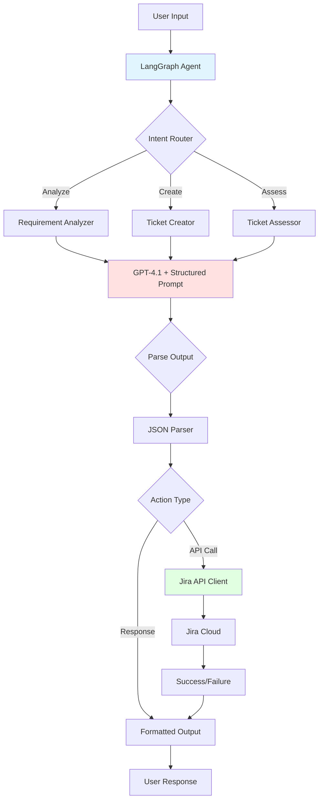
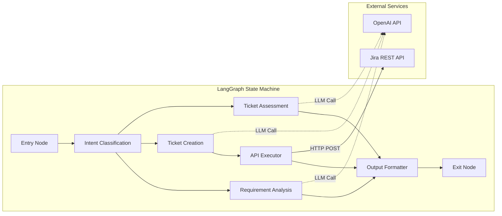
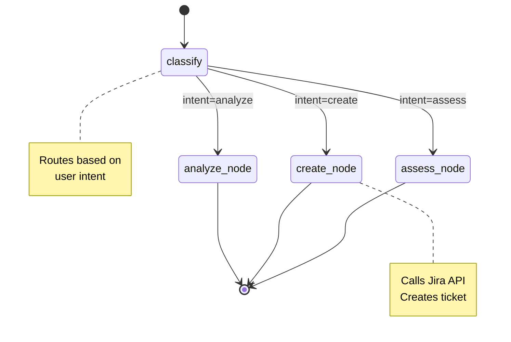
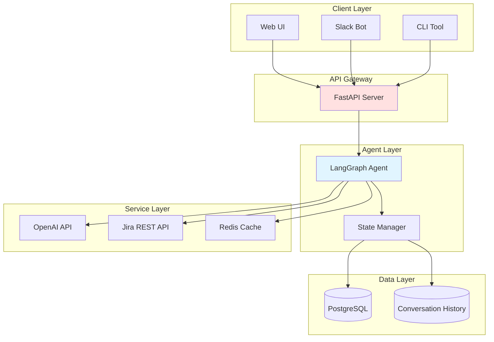

# Jira AI Agent System Design Document

## Table of Contents
1. [Executive Summary](#executive-summary)
2. [System Architecture](#system-architecture)
3. [Core Components](#core-components)
4. [Implementation Guide](#implementation-guide)
5. [Use Cases & Examples](#use-cases--examples)
6. [Prompt Engineering](#prompt-engineering)
7. [References](#references)

---

## Executive Summary

The Jira AI Agent is an intelligent automation system powered by OpenAI's GPT-4.1 model, designed to streamline Jira ticket management through natural language interactions. Despite GPT-4.1's lack of native tool-calling capabilities, this agent leverages **structured output parsing** and **LangGraph's state machine framework** to enable sophisticated workflow automation.

### Key Capabilities
- **Requirement Analysis**: Parse user input and generate structured ticket specifications
- **Ticket Creation**: Automatically create Jira tickets via API integration
- **Ticket Assessment**: Analyze existing tickets for completeness, priority, and quality
- **Workflow Orchestration**: Multi-step processes managed through LangGraph

---

## System Architecture

### High-Level Architecture



### Component Architecture



---

## Core Components

### 1. LangGraph State Machine

LangGraph provides a graph-based framework for building stateful, multi-step LLM applications. Our agent uses nodes for different operations and edges for routing logic.

#### State Schema

```python
from typing import TypedDict, Literal, Optional
from langgraph.graph import StateGraph, END

class AgentState(TypedDict):
    """State object passed between nodes"""
    user_input: str
    intent: Literal["analyze", "create", "assess"]
    structured_output: Optional[dict]
    jira_ticket_id: Optional[str]
    api_response: Optional[dict]
    final_output: str
    error: Optional[str]
```

### 2. Structured Output Parser

Since GPT-4.1 doesn't support native function calling, we use **prompt engineering** to enforce JSON output format.

#### Output Schema Example

```python
from pydantic import BaseModel, Field
from typing import List, Optional

class TicketRequirement(BaseModel):
    """Structured output for requirement analysis"""
    title: str = Field(description="Concise ticket title")
    description: str = Field(description="Detailed description")
    acceptance_criteria: List[str] = Field(description="List of AC items")
    ticket_type: Literal["Story", "Bug", "Task", "Epic"]
    priority: Literal["Highest", "High", "Medium", "Low", "Lowest"]
    estimated_story_points: Optional[int] = Field(None, ge=1, le=13)
    labels: List[str] = Field(default_factory=list)
    components: List[str] = Field(default_factory=list)

class TicketAssessment(BaseModel):
    """Structured output for ticket assessment"""
    ticket_id: str
    completeness_score: float = Field(ge=0, le=10)
    clarity_score: float = Field(ge=0, le=10)
    priority_alignment: str
    recommendations: List[str]
    missing_elements: List[str]
```

### 3. Jira API Integration

```python
import requests
from typing import Dict, Any

class JiraAPIClient:
    def __init__(self, domain: str, email: str, api_token: str):
        self.base_url = f"https://{domain}.atlassian.net"
        self.auth = (email, api_token)
        self.headers = {"Accept": "application/json", "Content-Type": "application/json"}
    
    def create_ticket(self, project_key: str, ticket_data: Dict[str, Any]) -> Dict[str, Any]:
        """Create a new Jira ticket"""
        url = f"{self.base_url}/rest/api/3/issue"
        
        payload = {
            "fields": {
                "project": {"key": project_key},
                "summary": ticket_data["title"],
                "description": {
                    "type": "doc",
                    "version": 1,
                    "content": [{
                        "type": "paragraph",
                        "content": [{"type": "text", "text": ticket_data["description"]}]
                    }]
                },
                "issuetype": {"name": ticket_data["ticket_type"]},
                "priority": {"name": ticket_data["priority"]},
                "labels": ticket_data.get("labels", []),
            }
        }
        
        response = requests.post(url, json=payload, headers=self.headers, auth=self.auth)
        response.raise_for_status()
        return response.json()
    
    def get_ticket(self, ticket_key: str) -> Dict[str, Any]:
        """Retrieve ticket details"""
        url = f"{self.base_url}/rest/api/3/issue/{ticket_key}"
        response = requests.get(url, headers=self.headers, auth=self.auth)
        response.raise_for_status()
        return response.json()
```

---

## Implementation Guide

### Complete LangGraph Agent Implementation

```python
from langgraph.graph import StateGraph, END
from openai import OpenAI
import json
import os

# Initialize clients
openai_client = OpenAI(api_key=os.getenv("OPENAI_API_KEY"))
jira_client = JiraAPIClient(
    domain=os.getenv("JIRA_DOMAIN"),
    email=os.getenv("JIRA_EMAIL"),
    api_token=os.getenv("JIRA_API_TOKEN")
)

# Define prompt templates
INTENT_CLASSIFICATION_PROMPT = """Analyze the user's request and classify the intent.

User Request: {user_input}

Respond ONLY with a JSON object:
{{
  "intent": "analyze" | "create" | "assess",
  "reasoning": "brief explanation"
}}"""

REQUIREMENT_ANALYSIS_PROMPT = """You are a Business Analyst. Analyze the requirement and output a structured ticket specification.

User Requirement: {user_input}

Respond ONLY with valid JSON matching this schema:
{{
  "title": "string",
  "description": "string",
  "acceptance_criteria": ["string"],
  "ticket_type": "Story" | "Bug" | "Task" | "Epic",
  "priority": "Highest" | "High" | "Medium" | "Low" | "Lowest",
  "estimated_story_points": integer (1-13) or null,
  "labels": ["string"],
  "components": ["string"]
}}"""

TICKET_CREATION_PROMPT = """Convert this structured requirement into a Jira-ready ticket specification.

Structured Output: {structured_output}

Respond ONLY with valid JSON for Jira API:
{{
  "title": "string",
  "description": "string",
  "ticket_type": "Story" | "Bug" | "Task",
  "priority": "Highest" | "High" | "Medium" | "Low" | "Lowest",
  "labels": ["string"]
}}"""

TICKET_ASSESSMENT_PROMPT = """Assess this Jira ticket for quality and completeness.

Ticket Data: {ticket_data}

Respond ONLY with valid JSON:
{{
  "ticket_id": "string",
  "completeness_score": float (0-10),
  "clarity_score": float (0-10),
  "priority_alignment": "string",
  "recommendations": ["string"],
  "missing_elements": ["string"]
}}"""

# Node functions
def classify_intent(state: AgentState) -> AgentState:
    """Classify user intent"""
    prompt = INTENT_CLASSIFICATION_PROMPT.format(user_input=state["user_input"])
    
    response = openai_client.chat.completions.create(
        model="gpt-4-turbo",  # Use gpt-4-turbo or gpt-4
        messages=[{"role": "user", "content": prompt}],
        temperature=0.3
    )
    
    result = json.loads(response.choices[0].message.content)
    state["intent"] = result["intent"]
    return state

def analyze_requirement(state: AgentState) -> AgentState:
    """Analyze and structure requirements"""
    prompt = REQUIREMENT_ANALYSIS_PROMPT.format(user_input=state["user_input"])
    
    response = openai_client.chat.completions.create(
        model="gpt-4-turbo",
        messages=[{"role": "user", "content": prompt}],
        temperature=0.5
    )
    
    state["structured_output"] = json.loads(response.choices[0].message.content)
    state["final_output"] = json.dumps(state["structured_output"], indent=2)
    return state

def create_ticket(state: AgentState) -> AgentState:
    """Create Jira ticket"""
    # First, structure the requirement
    prompt = REQUIREMENT_ANALYSIS_PROMPT.format(user_input=state["user_input"])
    
    response = openai_client.chat.completions.create(
        model="gpt-4-turbo",
        messages=[{"role": "user", "content": prompt}],
        temperature=0.5
    )
    
    ticket_data = json.loads(response.choices[0].message.content)
    
    # Create ticket via API
    try:
        api_response = jira_client.create_ticket("PROJ", ticket_data)
        state["jira_ticket_id"] = api_response["key"]
        state["api_response"] = api_response
        state["final_output"] = f"✅ Ticket created: {api_response['key']}\n{api_response['self']}"
    except Exception as e:
        state["error"] = str(e)
        state["final_output"] = f"❌ Error creating ticket: {str(e)}"
    
    return state

def assess_ticket(state: AgentState) -> AgentState:
    """Assess existing Jira ticket"""
    # Extract ticket ID from user input
    ticket_id = state["user_input"].split()[-1]  # Simple extraction
    
    try:
        ticket_data = jira_client.get_ticket(ticket_id)
        
        prompt = TICKET_ASSESSMENT_PROMPT.format(ticket_data=json.dumps(ticket_data, indent=2))
        
        response = openai_client.chat.completions.create(
            model="gpt-4-turbo",
            messages=[{"role": "user", "content": prompt}],
            temperature=0.5
        )
        
        assessment = json.loads(response.choices[0].message.content)
        state["structured_output"] = assessment
        state["final_output"] = f"""
📊 Ticket Assessment for {ticket_id}

Completeness: {assessment['completeness_score']}/10
Clarity: {assessment['clarity_score']}/10
Priority Alignment: {assessment['priority_alignment']}

Recommendations:
{chr(10).join(f"• {r}" for r in assessment['recommendations'])}

Missing Elements:
{chr(10).join(f"• {m}" for m in assessment['missing_elements'])}
"""
    except Exception as e:
        state["error"] = str(e)
        state["final_output"] = f"❌ Error assessing ticket: {str(e)}"
    
    return state

def route_intent(state: AgentState) -> str:
    """Route to appropriate node based on intent"""
    intent_map = {
        "analyze": "analyze_node",
        "create": "create_node",
        "assess": "assess_node"
    }
    return intent_map.get(state["intent"], END)

# Build the graph
workflow = StateGraph(AgentState)

# Add nodes
workflow.add_node("classify", classify_intent)
workflow.add_node("analyze_node", analyze_requirement)
workflow.add_node("create_node", create_ticket)
workflow.add_node("assess_node", assess_ticket)

# Add edges
workflow.set_entry_point("classify")
workflow.add_conditional_edges("classify", route_intent)
workflow.add_edge("analyze_node", END)
workflow.add_edge("create_node", END)
workflow.add_edge("assess_node", END)

# Compile the graph
app = workflow.compile()

# Visualize the graph
print(app.get_graph().draw_ascii())
```

### Workflow Visualization



---

## Use Cases & Examples

### Use Case 1: Requirement Analysis

**User Input:**
```
"We need a login feature that supports OAuth2 authentication with Google and GitHub. 
Users should be able to register, login, and reset passwords. Must be mobile responsive."
```

**Agent Process:**
1. **Intent Classification** → "analyze"
2. **Requirement Analysis** → GPT-4.1 structures the requirement
3. **Output Generation** → Returns formatted JSON

**Expected Output:**
```json
{
  "title": "Implement OAuth2 Authentication System",
  "description": "Develop a comprehensive authentication system supporting OAuth2 integration with Google and GitHub providers. The system must include user registration, login, and password reset functionality with full mobile responsiveness.",
  "acceptance_criteria": [
    "Users can register using email/password",
    "Users can login via Google OAuth2",
    "Users can login via GitHub OAuth2",
    "Password reset flow via email works correctly",
    "All forms are mobile responsive (< 768px)",
    "Session management handles token refresh"
  ],
  "ticket_type": "Story",
  "priority": "High",
  "estimated_story_points": 8,
  "labels": ["authentication", "oauth2", "security"],
  "components": ["backend-api", "frontend-ui"]
}
```

### Use Case 2: Automatic Ticket Creation

**User Input:**
```
"Create a ticket: Fix the checkout page crash when users apply invalid coupon codes. 
This is blocking production and needs immediate attention."
```

**Agent Process:**
1. **Intent Classification** → "create"
2. **Requirement Structuring** → Parses requirement
3. **API Execution** → Calls Jira REST API
4. **Response Formatting** → Returns ticket URL

**Python Execution Flow:**
```python
# User invokes agent
result = app.invoke({
    "user_input": "Create a ticket: Fix checkout crash with invalid coupons...",
    "intent": None,
    "structured_output": None,
    "jira_ticket_id": None,
    "api_response": None,
    "final_output": "",
    "error": None
})

print(result["final_output"])
# Output: ✅ Ticket created: PROJ-1234
#         https://company.atlassian.net/browse/PROJ-1234
```

**Created Jira Ticket:**
- **ID**: PROJ-1234
- **Title**: "Fix Checkout Page Crash with Invalid Coupon Codes"
- **Type**: Bug
- **Priority**: Highest
- **Description**: Detailed description with reproduction steps

### Use Case 3: Ticket Assessment

**User Input:**
```
"Assess ticket PROJ-5678"
```

**Agent Process:**
1. **Intent Classification** → "assess"
2. **Ticket Retrieval** → Fetches from Jira API
3. **LLM Assessment** → GPT-4.1 evaluates ticket quality
4. **Structured Output** → Returns assessment report

**Sample Assessment Output:**
```
📊 Ticket Assessment for PROJ-5678

Completeness: 6.5/10
Clarity: 7.0/10
Priority Alignment: Priority seems appropriate for described impact

Recommendations:
• Add specific error messages or logs from production
• Include browser/device information for reproduction
• Define acceptance criteria for the fix
• Add estimated story points for sprint planning

Missing Elements:
• Steps to reproduce the issue
• Expected vs actual behavior description
• Screenshots or error logs
• Definition of Done
```

---

## Prompt Engineering

### Design Principles

1. **Conciseness**: Keep prompts under 200 tokens where possible
2. **Explicit Format**: Always specify "Respond ONLY with valid JSON"
3. **Schema Definition**: Include exact JSON structure in prompt
4. **Context Minimization**: Only include necessary context
5. **Temperature Control**: Use 0.3-0.5 for structured outputs

### Optimized Prompt Template

```python
OPTIMIZED_ANALYSIS_PROMPT = """Analyze requirement. Output JSON only.

Input: {user_input}

Schema:
{{
  "title": "str",
  "description": "str", 
  "acceptance_criteria": ["str"],
  "ticket_type": "Story|Bug|Task",
  "priority": "Highest|High|Medium|Low|Lowest",
  "estimated_story_points": int|null,
  "labels": ["str"]
}}"""
```

### Handling Non-JSON Responses

```python
def extract_json_from_response(response_text: str) -> dict:
    """Extract JSON from LLM response that may include markdown"""
    # Remove markdown code blocks
    text = response_text.strip()
    if "```json" in text:
        text = text.split("```json")[1].split("```")[0]
    elif "```" in text:
        text = text.split("```")[1].split("```")[0]
    
    # Parse JSON
    return json.loads(text.strip())
```

---

## Performance Optimization

### Caching Strategy

```python
from functools import lru_cache
import hashlib

@lru_cache(maxsize=100)
def get_cached_llm_response(prompt_hash: str, model: str) -> str:
    """Cache LLM responses for identical prompts"""
    # This would be implemented with Redis in production
    pass

def call_llm_with_cache(prompt: str, model: str) -> str:
    prompt_hash = hashlib.md5(prompt.encode()).hexdigest()
    cached = get_cached_llm_response(prompt_hash, model)
    if cached:
        return cached
    
    # Make actual LLM call
    response = openai_client.chat.completions.create(
        model=model,
        messages=[{"role": "user", "content": prompt}]
    )
    return response.choices[0].message.content
```

### Async Processing

```python
import asyncio
from openai import AsyncOpenAI

async_client = AsyncOpenAI(api_key=os.getenv("OPENAI_API_KEY"))

async def async_analyze_requirement(user_input: str) -> dict:
    """Async requirement analysis for better throughput"""
    prompt = REQUIREMENT_ANALYSIS_PROMPT.format(user_input=user_input)
    
    response = await async_client.chat.completions.create(
        model="gpt-4-turbo",
        messages=[{"role": "user", "content": prompt}],
        temperature=0.5
    )
    
    return json.loads(response.choices[0].message.content)
```

---

## Error Handling & Monitoring

```python
import logging
from typing import Optional

logging.basicConfig(level=logging.INFO)
logger = logging.getLogger(__name__)

class AgentError(Exception):
    """Base exception for agent errors"""
    pass

class JiraAPIError(AgentError):
    """Jira API-specific errors"""
    pass

class LLMParsingError(AgentError):
    """LLM output parsing errors"""
    pass

def safe_execute_node(node_func, state: AgentState) -> AgentState:
    """Wrapper for safe node execution with error handling"""
    try:
        logger.info(f"Executing node: {node_func.__name__}")
        return node_func(state)
    except json.JSONDecodeError as e:
        logger.error(f"JSON parsing error: {e}")
        state["error"] = f"Failed to parse LLM output: {str(e)}"
        state["final_output"] = "❌ Error: Invalid response format from AI"
        return state
    except requests.RequestException as e:
        logger.error(f"Jira API error: {e}")
        state["error"] = f"Jira API failed: {str(e)}"
        state["final_output"] = "❌ Error: Failed to communicate with Jira"
        return state
    except Exception as e:
        logger.error(f"Unexpected error: {e}", exc_info=True)
        state["error"] = str(e)
        state["final_output"] = f"❌ Unexpected error: {str(e)}"
        return state
```

---

## Deployment Architecture



### FastAPI Server Example

```python
from fastapi import FastAPI, HTTPException
from pydantic import BaseModel

app = FastAPI(title="Jira AI Agent API")

class AgentRequest(BaseModel):
    user_input: str
    context: Optional[dict] = None

class AgentResponse(BaseModel):
    output: str
    ticket_id: Optional[str]
    structured_data: Optional[dict]
    error: Optional[str]

@app.post("/agent/invoke", response_model=AgentResponse)
async def invoke_agent(request: AgentRequest):
    """Invoke the Jira AI agent"""
    try:
        result = app.invoke({
            "user_input": request.user_input,
            "intent": None,
            "structured_output": None,
            "jira_ticket_id": None,
            "api_response": None,
            "final_output": "",
            "error": None
        })
        
        return AgentResponse(
            output=result["final_output"],
            ticket_id=result.get("jira_ticket_id"),
            structured_data=result.get("structured_output"),
            error=result.get("error")
        )
    except Exception as e:
        raise HTTPException(status_code=500, detail=str(e))
```

---

## Testing Strategy

### Unit Tests

```python
import pytest
from unittest.mock import Mock, patch

def test_intent_classification():
    """Test intent classification accuracy"""
    state = {
        "user_input": "Create a ticket for the login bug",
        "intent": None
    }
    
    with patch('openai_client.chat.completions.create') as mock_llm:
        mock_llm.return_value.choices[0].message.content = '{"intent": "create"}'
        result = classify_intent(state)
        
        assert result["intent"] == "create"

def test_jira_api_client():
    """Test Jira API client"""
    client = JiraAPIClient("test", "test@test.com", "token")
    
    with patch('requests.post') as mock_post:
        mock_post.return_value.json.return_value = {"key": "PROJ-1"}
        
        result = client.create_ticket("PROJ", {
            "title": "Test",
            "description": "Test desc",
            "ticket_type": "Bug",
            "priority": "High"
        })
        
        assert result["key"] == "PROJ-1"
```

### Integration Tests

```python
def test_end_to_end_ticket_creation():
    """Test complete ticket creation workflow"""
    result = app.invoke({
        "user_input": "Create a bug ticket for checkout crash",
        "intent": None,
        "structured_output": None,
        "jira_ticket_id": None,
        "api_response": None,
        "final_output": "",
        "error": None
    })
    
    assert result["jira_ticket_id"] is not None
    assert "created" in result["final_output"].lower()
    assert result["error"] is None
```

---

## References

### Documentation
- [LangGraph Documentation](https://python.langchain.com/docs/langgraph) - Official LangGraph framework guide
- [OpenAI API Reference](https://platform.openai.com/docs/api-reference) - GPT-4 API documentation
- [Jira REST API v3](https://developer.atlassian.com/cloud/jira/platform/rest/v3/intro/) - Jira Cloud API reference
- [Pydantic Documentation](https://docs.pydantic.dev/) - Data validation library

### Related Projects
- [LangChain Agents](https://python.langchain.com/docs/modules/agents/) - Agent framework patterns
- [Semantic Kernel](https://github.com/microsoft/semantic-kernel) - Alternative orchestration framework

### Research Papers
- "ReAct: Synergizing Reasoning and Acting in Language Models" (Yao et al., 2023)
- "Structured Prompting: Scaling In-Context Learning to 1,000 Examples" (Hao et al., 2022)

### Best Practices
- [Prompt Engineering Guide](https://www.promptingguide.ai/) - Comprehensive prompting techniques
- [OpenAI Best Practices](https://platform.openai.com/docs/guides/prompt-engineering) - Official prompting strategies

---

## Appendix: Environment Setup

### Dependencies

```bash
pip install langgraph openai requests pydantic python-dotenv fastapi uvicorn
```

### Environment Variables

```bash
# .env file
OPENAI_API_KEY=sk-...
JIRA_DOMAIN=your-domain
JIRA_EMAIL=your-email@company.com
JIRA_API_TOKEN=your-api-token
```

### Quick Start

```python
# main.py
from dotenv import load_dotenv
load_dotenv()

# Run the agent
if __name__ == "__main__":
    result = app.invoke({
        "user_input": "Analyze this: We need a user dashboard with analytics",
        "intent": None,
        "structured_output": None,
        "jira_ticket_id": None,
        "api_response": None,
        "final_output": "",
        "error": None
    })
    
    print(result["final_output"])
```

---

**Document Version**: 1.0  
**Last Updated**: November 2025  
**Author**: AI Systems Architecture Team