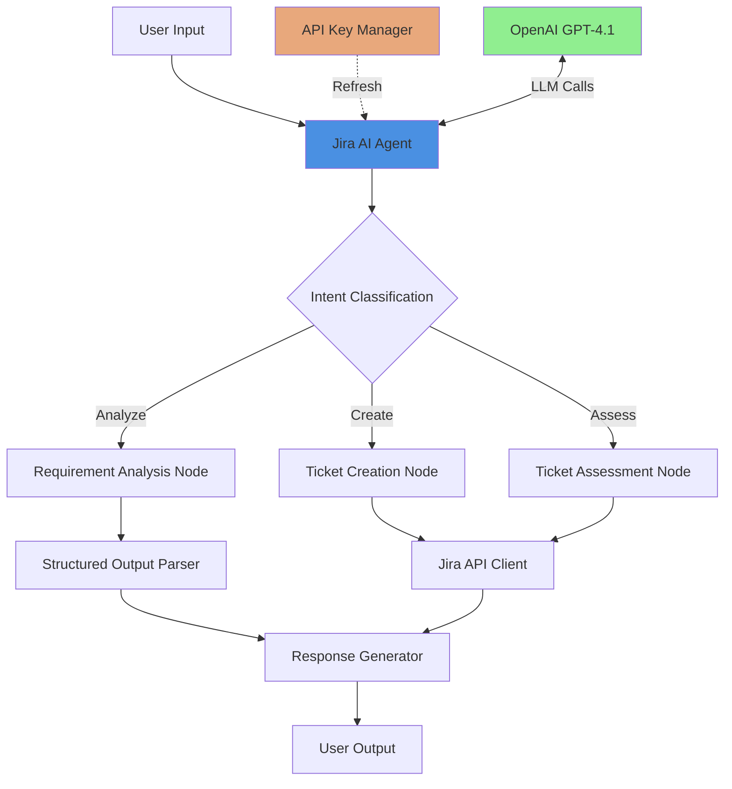
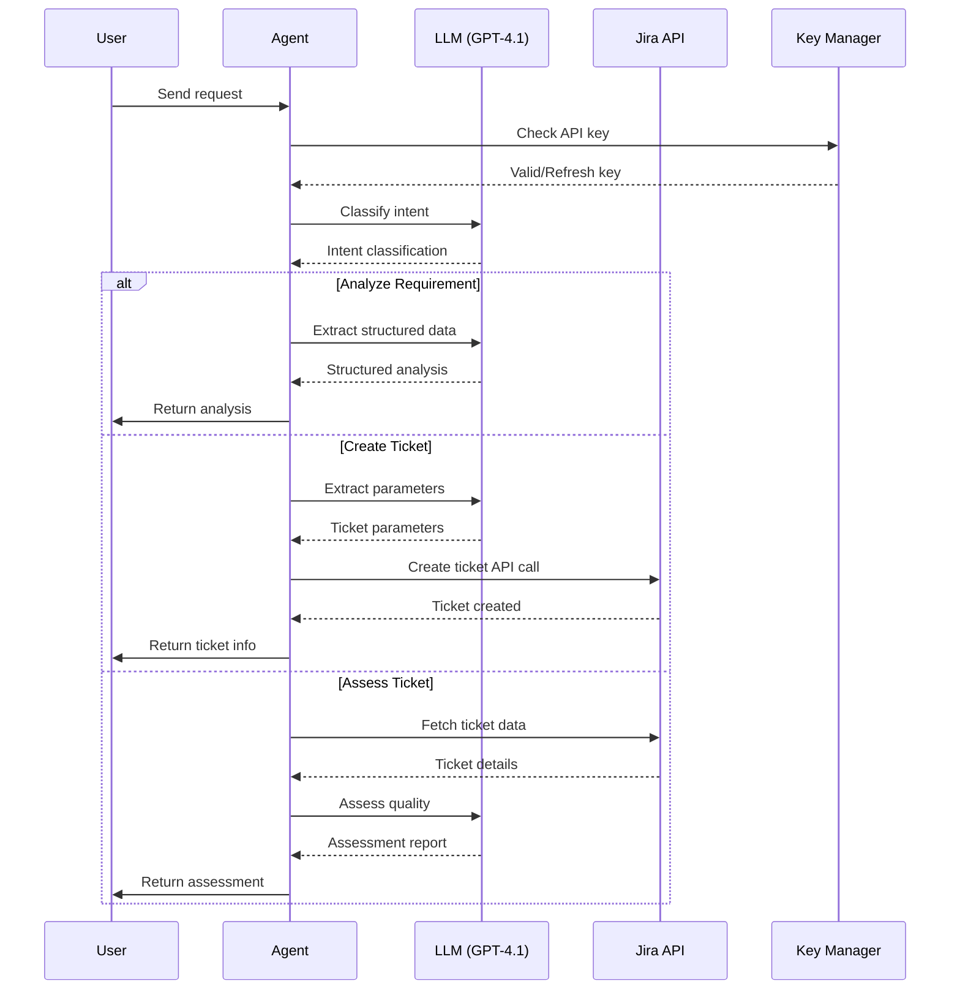
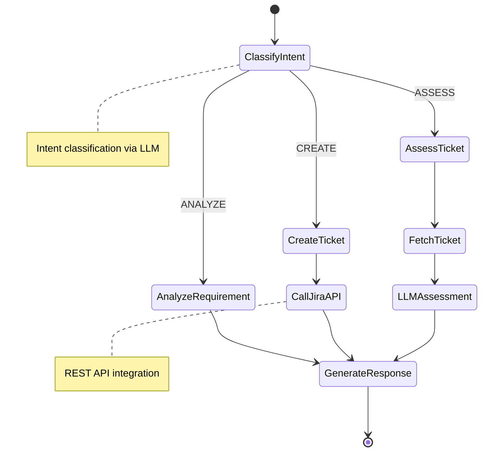
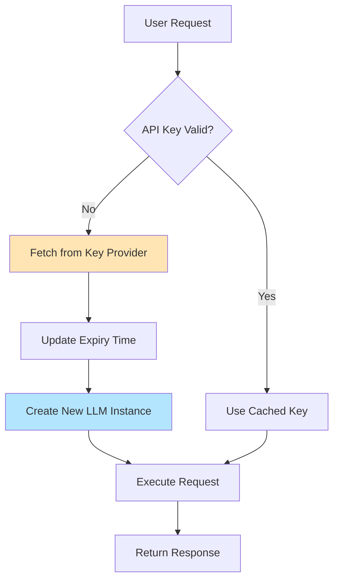
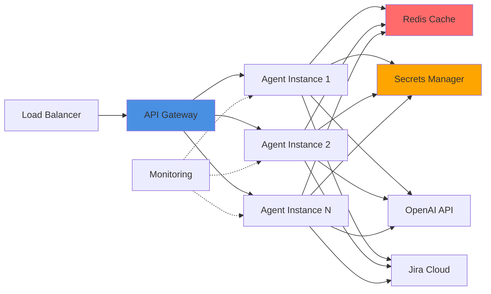

# Jira AI Agent System Design Document

## Table of Contents
1. [Executive Summary](#executive-summary)
2. [System Architecture](#system-architecture)
3. [Core Components](#core-components)
4. [Implementation Details](#implementation-details)
5. [Use Cases & Examples](#use-cases--examples)
6. [Workflow Diagrams](#workflow-diagrams)
7. [API Integration](#api-integration)
8. [Security & Authentication](#security--authentication)
9. [References](#references)

---

## Executive Summary

This document outlines the design and implementation of a Jira AI Agent powered by OpenAI's GPT-4.1 model. The agent leverages LangChain and LangGraph frameworks to provide intelligent requirement analysis, automated ticket creation, and ticket assessment capabilities. The system is designed to handle dynamic API key management and structured output generation without relying on native tool calling features.

### Key Capabilities
- **Requirement Analysis**: Parse and structure user requirements into actionable components
- **Ticket Creation**: Automatically create Jira tickets via REST API
- **Ticket Assessment**: Evaluate existing tickets for completeness and quality
- **Dynamic Authentication**: Automatic API key refresh mechanism
- **Structured Workflows**: Visual workflow orchestration using LangGraph

---

## System Architecture



### Architecture Layers

1. **Presentation Layer**: User interaction interface
2. **Orchestration Layer**: LangGraph state machine
3. **Processing Layer**: LLM reasoning and parsing
4. **Integration Layer**: Jira REST API communication
5. **Infrastructure Layer**: Authentication and key management

---

## Core Components

### 1. Dynamic OpenAI ChatModel with Key Management

The custom chat model wrapper handles automatic API key expiration and refresh:

```python
from langchain_openai import ChatOpenAI
from datetime import datetime, timedelta
from typing import Optional
import os

class DynamicAPIKeyChatModel:
    """
    Wrapper for ChatOpenAI with dynamic API key management.
    Automatically refreshes expired keys before making LLM calls.
    """
    
    def __init__(
        self, 
        model_name: str = "gpt-4-turbo-preview",
        temperature: float = 0.7,
        api_key_provider=None
    ):
        self.model_name = model_name
        self.temperature = temperature
        self.api_key_provider = api_key_provider
        self.api_key = None
        self.key_expiry = None
        self._chat_model = None
        
    def _is_key_expired(self) -> bool:
        """Check if the current API key has expired."""
        if not self.key_expiry:
            return True
        return datetime.now() >= self.key_expiry
    
    def _refresh_api_key(self):
        """Refresh the API key from the provider."""
        if self.api_key_provider:
            self.api_key = self.api_key_provider.get_key()
            # Assume keys expire in 24 hours (adjust based on your policy)
            self.key_expiry = datetime.now() + timedelta(hours=24)
        else:
            self.api_key = os.getenv("OPENAI_API_KEY")
            self.key_expiry = datetime.now() + timedelta(days=365)
        
        # Recreate ChatOpenAI instance with new key
        self._chat_model = ChatOpenAI(
            model_name=self.model_name,
            temperature=self.temperature,
            openai_api_key=self.api_key
        )
    
    def invoke(self, messages, **kwargs):
        """Invoke the LLM with automatic key refresh."""
        if self._is_key_expired():
            print("🔄 API key expired, refreshing...")
            self._refresh_api_key()
        
        return self._chat_model.invoke(messages, **kwargs)
    
    def get_chat_model(self):
        """Get the underlying ChatOpenAI instance."""
        if self._is_key_expired():
            self._refresh_api_key()
        return self._chat_model
```

**Usage Example:**

```python
# Initialize with custom key provider
class APIKeyProvider:
    def get_key(self):
        # Fetch from secure vault, database, or secrets manager
        return fetch_from_vault("openai_api_key")

key_provider = APIKeyProvider()
llm = DynamicAPIKeyChatModel(
    model_name="gpt-4-turbo-preview",
    api_key_provider=key_provider
)

# Use in your application
response = llm.invoke([("user", "Analyze this requirement...")])
```

---

### 2. Requirement Analysis with Structured Output

The requirement analysis component parses user input into structured components:

```python
from langchain.output_parsers import PydanticOutputParser
from langchain.prompts import PromptTemplate
from pydantic import BaseModel, Field
from typing import List

class RequirementAnalysis(BaseModel):
    """Structured output for requirement analysis."""
    title: str = Field(description="Concise ticket title")
    description: str = Field(description="Detailed requirement description")
    acceptance_criteria: List[str] = Field(description="List of acceptance criteria")
    priority: str = Field(description="Priority level: High, Medium, or Low")
    estimated_effort: str = Field(description="Estimated story points or hours")
    dependencies: List[str] = Field(description="List of dependencies or blockers")
    labels: List[str] = Field(description="Relevant tags or labels")

# Create parser
parser = PydanticOutputParser(pydantic_object=RequirementAnalysis)

# Concise prompt template
analysis_prompt = PromptTemplate(
    template="""Analyze this requirement and extract structured information.

Requirement: {requirement}

{format_instructions}

Output:""",
    input_variables=["requirement"],
    partial_variables={"format_instructions": parser.get_format_instructions()}
)

def analyze_requirement(requirement: str, llm) -> RequirementAnalysis:
    """Analyze a requirement and return structured output."""
    chain = analysis_prompt | llm | parser
    result = chain.invoke({"requirement": requirement})
    return result
```

**Example Usage:**

```python
requirement = """
We need a user authentication system that supports OAuth2 and JWT tokens.
Users should be able to login with Google and GitHub. Session timeout should
be configurable. This is urgent for the Q1 release.
"""

analysis = analyze_requirement(requirement, llm)
print(f"Title: {analysis.title}")
print(f"Priority: {analysis.priority}")
print(f"Acceptance Criteria: {analysis.acceptance_criteria}")
```

---

### 3. Jira API Integration (Without Tool Calling)

Since GPT-4.1 may not support native tool calling in some configurations, we use prompt engineering to extract parameters:

```python
import requests
from typing import Dict, Any
import json

class JiraClient:
    """Client for Jira REST API operations."""
    
    def __init__(self, jira_url: str, email: str, api_token: str):
        self.jira_url = jira_url.rstrip('/')
        self.auth = (email, api_token)
        self.headers = {
            "Accept": "application/json",
            "Content-Type": "application/json"
        }
    
    def create_ticket(
        self, 
        project_key: str,
        summary: str,
        description: str,
        issue_type: str = "Task",
        priority: str = "Medium",
        labels: List[str] = None
    ) -> Dict[str, Any]:
        """Create a new Jira ticket."""
        url = f"{self.jira_url}/rest/api/3/issue"
        
        payload = {
            "fields": {
                "project": {"key": project_key},
                "summary": summary,
                "description": {
                    "type": "doc",
                    "version": 1,
                    "content": [
                        {
                            "type": "paragraph",
                            "content": [{"type": "text", "text": description}]
                        }
                    ]
                },
                "issuetype": {"name": issue_type},
                "priority": {"name": priority}
            }
        }
        
        if labels:
            payload["fields"]["labels"] = labels
        
        response = requests.post(
            url, 
            json=payload, 
            headers=self.headers, 
            auth=self.auth
        )
        response.raise_for_status()
        return response.json()
    
    def get_ticket(self, issue_key: str) -> Dict[str, Any]:
        """Retrieve a Jira ticket by key."""
        url = f"{self.jira_url}/rest/api/3/issue/{issue_key}"
        response = requests.get(url, headers=self.headers, auth=self.auth)
        response.raise_for_status()
        return response.json()
    
    def assess_ticket(self, issue_key: str) -> Dict[str, Any]:
        """Retrieve ticket for assessment."""
        ticket = self.get_ticket(issue_key)
        return {
            "key": ticket["key"],
            "summary": ticket["fields"]["summary"],
            "description": ticket["fields"].get("description", ""),
            "status": ticket["fields"]["status"]["name"],
            "priority": ticket["fields"].get("priority", {}).get("name", "N/A"),
            "assignee": ticket["fields"].get("assignee", {}).get("displayName", "Unassigned")
        }
```

**Ticket Creation via LLM Parameter Extraction:**

```python
from langchain.prompts import ChatPromptTemplate

# Prompt to extract Jira ticket parameters
extraction_prompt = ChatPromptTemplate.from_messages([
    ("system", """Extract Jira ticket parameters from user request.
Output JSON with: project_key, summary, description, issue_type, priority, labels.
Be concise and precise."""),
    ("user", "{user_request}")
])

def create_jira_ticket_from_request(user_request: str, llm, jira_client: JiraClient):
    """Create Jira ticket by extracting parameters via LLM."""
    # Extract parameters
    chain = extraction_prompt | llm
    response = chain.invoke({"user_request": user_request})
    
    # Parse JSON from LLM response
    params = json.loads(response.content)
    
    # Create ticket
    result = jira_client.create_ticket(
        project_key=params["project_key"],
        summary=params["summary"],
        description=params["description"],
        issue_type=params.get("issue_type", "Task"),
        priority=params.get("priority", "Medium"),
        labels=params.get("labels", [])
    )
    
    return result
```

---

### 4. LangGraph Workflow Implementation

LangGraph orchestrates the agent's state machine:

```python
from langgraph.graph import StateGraph, END
from typing import TypedDict, Annotated, Sequence
import operator

class AgentState(TypedDict):
    """State definition for the agent."""
    messages: Annotated[Sequence[str], operator.add]
    intent: str
    requirement: str
    analysis: dict
    jira_response: dict
    error: str

def classify_intent(state: AgentState) -> AgentState:
    """Classify user intent."""
    user_message = state["messages"][-1]
    
    intent_prompt = f"""Classify the intent of this message into one category:
- ANALYZE: User wants requirement analysis
- CREATE: User wants to create a Jira ticket
- ASSESS: User wants to assess an existing ticket

Message: {user_message}

Output only the category name."""
    
    response = llm.invoke([("user", intent_prompt)])
    state["intent"] = response.content.strip()
    return state

def analyze_requirement_node(state: AgentState) -> AgentState:
    """Analyze requirement and structure output."""
    requirement = state["messages"][-1]
    analysis = analyze_requirement(requirement, llm)
    state["analysis"] = analysis.dict()
    return state

def create_ticket_node(state: AgentState) -> AgentState:
    """Create Jira ticket."""
    try:
        user_request = state["messages"][-1]
        jira_client = JiraClient(
            jira_url="https://your-domain.atlassian.net",
            email="your-email@example.com",
            api_token="your-api-token"
        )
        result = create_jira_ticket_from_request(user_request, llm, jira_client)
        state["jira_response"] = result
    except Exception as e:
        state["error"] = str(e)
    return state

def assess_ticket_node(state: AgentState) -> AgentState:
    """Assess existing Jira ticket."""
    try:
        # Extract ticket key from message
        message = state["messages"][-1]
        # Simple extraction (improve with regex)
        ticket_key = message.split()[-1]
        
        jira_client = JiraClient(
            jira_url="https://your-domain.atlassian.net",
            email="your-email@example.com",
            api_token="your-api-token"
        )
        ticket_data = jira_client.assess_ticket(ticket_key)
        
        # Use LLM to assess ticket quality
        assessment_prompt = f"""Assess this Jira ticket for completeness and quality:

Ticket: {json.dumps(ticket_data, indent=2)}

Evaluate:
1. Clarity of summary and description
2. Completeness of information
3. Priority appropriateness
4. Suggestions for improvement

Provide concise assessment:"""
        
        response = llm.invoke([("user", assessment_prompt)])
        state["jira_response"] = {
            "ticket_data": ticket_data,
            "assessment": response.content
        }
    except Exception as e:
        state["error"] = str(e)
    return state

def route_intent(state: AgentState) -> str:
    """Route to appropriate node based on intent."""
    intent = state.get("intent", "")
    if "ANALYZE" in intent:
        return "analyze"
    elif "CREATE" in intent:
        return "create"
    elif "ASSESS" in intent:
        return "assess"
    return END

# Build the graph
workflow = StateGraph(AgentState)

# Add nodes
workflow.add_node("classify", classify_intent)
workflow.add_node("analyze", analyze_requirement_node)
workflow.add_node("create", create_ticket_node)
workflow.add_node("assess", assess_ticket_node)

# Add edges
workflow.set_entry_point("classify")
workflow.add_conditional_edges(
    "classify",
    route_intent,
    {
        "analyze": "analyze",
        "create": "create",
        "assess": "assess",
        END: END
    }
)
workflow.add_edge("analyze", END)
workflow.add_edge("create", END)
workflow.add_edge("assess", END)

# Compile the graph
app = workflow.compile()

# Visualize the workflow
print(app.get_graph().draw_mermaid())
```

---

## Use Cases & Examples

### Use Case 1: Requirement Analysis

**User Input:**
```
"Build a payment processing module that integrates with Stripe and PayPal.
Must handle refunds, support multiple currencies, and log all transactions
for audit purposes. This is critical for compliance."
```

**Agent Output:**
```json
{
  "title": "Payment Processing Module with Multi-Gateway Support",
  "description": "Develop a payment processing module that integrates with both Stripe and PayPal APIs, supports refund operations, multi-currency transactions, and comprehensive audit logging for compliance requirements.",
  "acceptance_criteria": [
    "Integration with Stripe API for payment processing",
    "Integration with PayPal API for payment processing",
    "Refund functionality for both payment gateways",
    "Support for USD, EUR, GBP, and JPY currencies",
    "Transaction logging with timestamp, amount, and status",
    "Audit log accessible to compliance team"
  ],
  "priority": "High",
  "estimated_effort": "13 story points",
  "dependencies": [
    "Stripe API credentials",
    "PayPal merchant account",
    "Database schema for transaction logs"
  ],
  "labels": ["payment", "integration", "compliance", "critical"]
}
```

---

### Use Case 2: Automated Ticket Creation

**User Input:**
```
"Create a ticket in project MOBILE for implementing push notifications
for iOS and Android. Priority is high."
```

**Agent Process:**

1. **Intent Classification**: Identifies as `CREATE`
2. **Parameter Extraction**: 
   ```json
   {
     "project_key": "MOBILE",
     "summary": "Implement Push Notifications for iOS and Android",
     "description": "Develop push notification functionality for both iOS and Android platforms",
     "issue_type": "Task",
     "priority": "High",
     "labels": ["mobile", "notifications", "ios", "android"]
   }
   ```
3. **Jira API Call**: Creates ticket
4. **Response**:
   ```
   ✅ Ticket created successfully!
   Key: MOBILE-1234
   Link: https://your-domain.atlassian.net/browse/MOBILE-1234
   ```

---

### Use Case 3: Ticket Assessment

**User Input:**
```
"Assess ticket PROJ-456"
```

**Agent Analysis:**
```
📋 Ticket Assessment: PROJ-456

Ticket Details:
- Summary: User authentication system
- Status: In Progress
- Priority: Medium
- Assignee: John Doe

Quality Assessment:
✅ Strengths:
- Clear and concise summary
- Assigned to appropriate team member
- Reasonable priority level

⚠️ Areas for Improvement:
- Description lacks technical specifications
- No acceptance criteria defined
- Missing estimated completion date
- Should add labels for better categorization

Recommendations:
1. Add detailed acceptance criteria
2. Include API endpoints specification
3. Define security requirements
4. Add labels: "authentication", "security", "backend"
5. Set due date based on sprint planning
```

---

## Workflow Diagrams

### High-Level Agent Flow



### State Machine Visualization



---

## API Integration

### Jira REST API Endpoints

| Endpoint | Method | Purpose |
|----------|--------|---------|
| `/rest/api/3/issue` | POST | Create new ticket |
| `/rest/api/3/issue/{issueKey}` | GET | Retrieve ticket details |
| `/rest/api/3/issue/{issueKey}` | PUT | Update ticket |
| `/rest/api/3/search` | POST | Search tickets with JQL |

### Authentication Flow



---

## Security & Authentication

### Best Practices

1. **API Key Management**
   - Store keys in secure vaults (AWS Secrets Manager, HashiCorp Vault)
   - Rotate keys regularly (every 90 days recommended)
   - Use environment variables, never hardcode

2. **Jira Authentication**
   - Use API tokens instead of passwords
   - Implement IP whitelisting if possible
   - Enable 2FA for Jira accounts

3. **Data Protection**
   - Encrypt sensitive data in transit (TLS 1.3)
   - Sanitize user inputs to prevent injection
   - Implement rate limiting

### Example: Secure Configuration

```python
import os
from typing import Protocol

class SecretProvider(Protocol):
    """Protocol for secret management providers."""
    def get_secret(self, key: str) -> str: ...

class AWSSecretsProvider:
    """AWS Secrets Manager implementation."""
    def __init__(self, region: str = "us-east-1"):
        import boto3
        self.client = boto3.client('secretsmanager', region_name=region)
    
    def get_secret(self, key: str) -> str:
        response = self.client.get_secret_value(SecretId=key)
        return response['SecretString']

# Usage
secret_provider = AWSSecretsProvider()
jira_token = secret_provider.get_secret("jira-api-token")
openai_key = secret_provider.get_secret("openai-api-key")
```

---

## Performance Considerations

### Optimization Strategies

1. **Caching**
   - Cache Jira ticket metadata (5-minute TTL)
   - Cache LLM responses for identical queries
   - Use Redis for distributed caching

2. **Async Operations**
   ```python
   import asyncio
   from langchain_openai import AsyncChatOpenAI
   
   async def batch_analyze_requirements(requirements: List[str]):
       """Analyze multiple requirements concurrently."""
       async_llm = AsyncChatOpenAI(model="gpt-4-turbo-preview")
       tasks = [analyze_requirement(req, async_llm) for req in requirements]
       return await asyncio.gather(*tasks)
   ```

3. **Rate Limiting**
   - OpenAI: Respect tier limits (10,000 RPM for GPT-4)
   - Jira: Default limit is 20 requests per second

---

## Error Handling

### Comprehensive Error Management

```python
from typing import Union
from enum import Enum

class ErrorType(Enum):
    API_KEY_INVALID = "Invalid API key"
    JIRA_AUTH_FAILED = "Jira authentication failed"
    TICKET_NOT_FOUND = "Ticket not found"
    LLM_TIMEOUT = "LLM request timeout"
    PARSE_ERROR = "Failed to parse LLM response"

class AgentError(Exception):
    """Custom exception for agent errors."""
    def __init__(self, error_type: ErrorType, details: str):
        self.error_type = error_type
        self.details = details
        super().__init__(f"{error_type.value}: {details}")

def safe_execute(func, *args, **kwargs) -> Union[Any, AgentError]:
    """Execute function with comprehensive error handling."""
    try:
        return func(*args, **kwargs)
    except requests.exceptions.HTTPError as e:
        if e.response.status_code == 401:
            return AgentError(ErrorType.JIRA_AUTH_FAILED, str(e))
        elif e.response.status_code == 404:
            return AgentError(ErrorType.TICKET_NOT_FOUND, str(e))
        raise
    except json.JSONDecodeError as e:
        return AgentError(ErrorType.PARSE_ERROR, str(e))
    except Exception as e:
        raise AgentError(ErrorType.LLM_TIMEOUT, str(e))
```

---

## Testing Strategy

### Unit Tests Example

```python
import pytest
from unittest.mock import Mock, patch

def test_requirement_analysis():
    """Test requirement analysis with mocked LLM."""
    mock_llm = Mock()
    mock_llm.invoke.return_value.content = """{
        "title": "Test Feature",
        "description": "Test description",
        "acceptance_criteria": ["AC1", "AC2"],
        "priority": "High",
        "estimated_effort": "5 points",
        "dependencies": [],
        "labels": ["test"]
    }"""
    
    result = analyze_requirement("Test requirement", mock_llm)
    assert result.title == "Test Feature"
    assert result.priority == "High"

@patch('requests.post')
def test_jira_ticket_creation(mock_post):
    """Test Jira ticket creation."""
    mock_post.return_value.status_code = 201
    mock_post.return_value.json.return_value = {
        "key": "PROJ-123",
        "self": "https://jira.example.com/rest/api/3/issue/PROJ-123"
    }
    
    client = JiraClient("https://jira.example.com", "user@example.com", "token")
    result = client.create_ticket("PROJ", "Test Summary", "Test Description")
    
    assert result["key"] == "PROJ-123"
    mock_post.assert_called_once()
```

---

## Deployment Architecture



---

## References

### Documentation & Resources

1. **OpenAI GPT-4 Documentation**
   - [API Reference](https://platform.openai.com/docs/api-reference)
   - [Best Practices](https://platform.openai.com/docs/guides/production-best-practices)

2. **LangChain & LangGraph**
   - [LangChain Documentation](https://python.langchain.com/docs/get_started/introduction)
   - [LangGraph Guide](https://langchain-ai.github.io/langgraph/)
   - [Output Parsers](https://python.langchain.com/docs/modules/model_io/output_parsers/)

3. **Jira REST API**
   - [API Documentation](https://developer.atlassian.com/cloud/jira/platform/rest/v3/intro/)
   - [Authentication Guide](https://developer.atlassian.com/cloud/jira/platform/basic-auth-for-rest-apis/)
   - [Issue Creation Examples](https://developer.atlassian.com/cloud/jira/platform/rest/v3/api-group-issues/#api-rest-api-3-issue-post)

4. **Security Best Practices**
   - [OWASP API Security](https://owasp.org/www-project-api-security/)
   - [AWS Secrets Manager](https://docs.aws.amazon.com/secretsmanager/latest/userguide/intro.html)

5. **Python Libraries**
   - [Pydantic](https://docs.pydantic.dev/latest/) - Data validation
   - [Requests](https://requests.readthedocs.io/) - HTTP library
   - [python-dotenv](https://pypi.org/project/python-dotenv/) - Environment management

---

 

```python
# main.py - Complete working example

from typing import Dict, Any
import os

# Initialize components
api_key_provider = APIKeyProvider()
llm = DynamicAPIKeyChatModel(
    model_name="gpt-4-turbo-preview",
    api_key_provider=api_key_provider
)

jira_client = JiraClient(
    jira_url=os.getenv("JIRA_URL"),
    email=os.getenv("JIRA_EMAIL"),
    api_token=os.getenv("JIRA_API_TOKEN")
)

# Compile the agent
agent = workflow.compile()

# Example interactions
def run_agent(user_message: str) -> Dict[str, Any]:
    """Run the agent with a user message."""
    initial_state = {
        "messages": [user_message],
        "intent": "",
        "requirement": "",
        "analysis": {},
        "jira_response": {},
        "error": ""
    }
    
    result = agent.invoke(initial_state)
    return result

# Test the agent
if __name__ == "__main__":
    # Example 1: Analyze requirement
    result1 = run_agent("""
        Analyze this requirement: Build a REST API for user management
        with CRUD operations, JWT authentication, and rate limiting.
    """)
    print("Analysis:", result1["analysis"])
    
    # Example 2: Create ticket
    result2 = run_agent("""
        Create a ticket in project API for implementing GraphQL support.
        This is high priority for Q2 release.
    """)
    print("Jira Response:", result2["jira_response"])
    
    # Example 3: Assess ticket
    result3 = run_agent("Assess ticket API-789")
    print("Assessment:", result3["jira_response"]["assessment"])
```

---

## Conclusion

This Jira AI Agent design provides a robust, scalable solution for intelligent requirement management and ticket automation. The architecture leverages state-of-the-art LLM capabilities while maintaining flexibility for custom integrations and security requirements.
