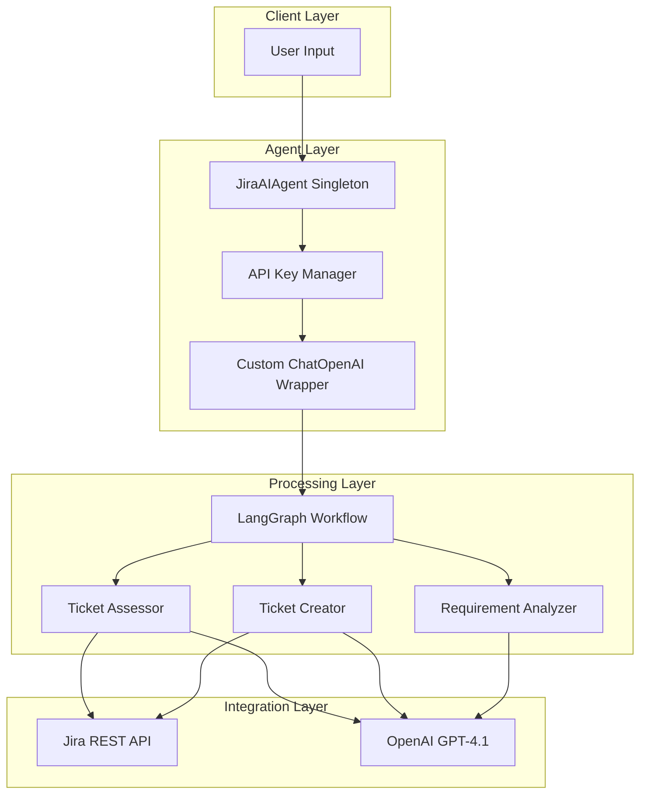
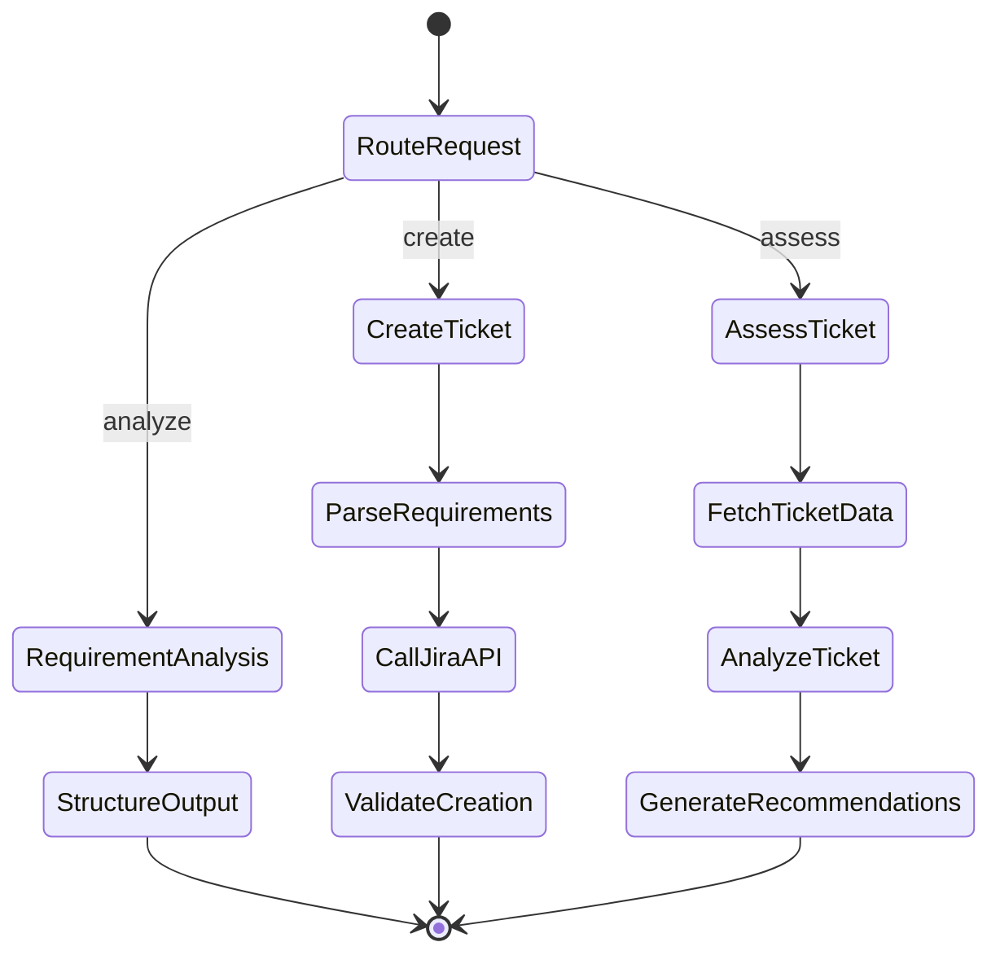
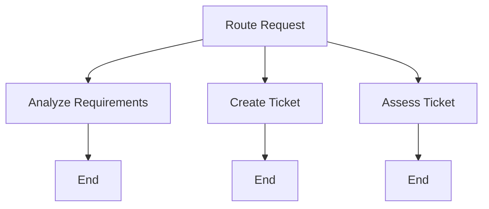
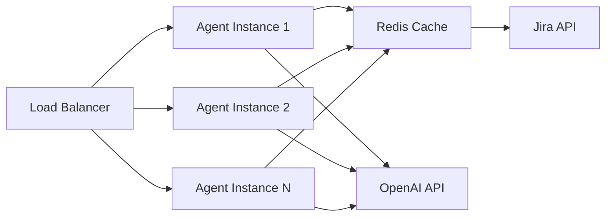

# Jira AI Agent System Design Document

## 1. Executive Summary

This document outlines the design and implementation of a Jira AI Agent powered by GPT-4.1 (OpenAI) using LangChain and LangGraph frameworks. The agent provides intelligent requirement analysis, automated Jira ticket creation, and ticket assessment capabilities through structured LLM interactions.

**Key Features:**
- Requirement analysis with structured JSON output
- Automated Jira API integration for ticket management
- Intelligent ticket assessment and recommendations
- Dynamic API key management with auto-refresh
- Singleton pattern for agent lifecycle management
- Visual workflow representation via LangGraph

---

## 2. System Architecture

### 2.1 High-Level Architecture



### 2.2 Component Overview

| Component | Responsibility | Technology |
|-----------|---------------|------------|
| **JiraAIAgent** | Orchestrates all operations | Singleton Pattern |
| **APIKeyManager** | Manages and refreshes API keys | Custom Class |
| **DynamicChatOpenAI** | Wraps OpenAI with key validation | LangChain Extension |
| **StateGraph** | Defines workflow logic | LangGraph |
| **PromptTemplates** | Structures LLM interactions | LangChain |

---

## 3. Core Components Design

### 3.1 Dynamic API Key Manager

The API Key Manager ensures seamless operation by validating and refreshing expired tokens.

```python
from datetime import datetime, timedelta
from typing import Optional
import jwt
import requests

class APIKeyManager:
    """Manages OpenAI API key lifecycle with automatic refresh."""
    
    def __init__(self, api_key: str, refresh_token: Optional[str] = None):
        self.api_key = api_key
        self.refresh_token = refresh_token
        self.expiry_time: Optional[datetime] = None
        self._validate_key()
    
    def _validate_key(self) -> None:
        """Validate current API key and set expiry time."""
        try:
            # Simulate key validation (adjust based on actual auth flow)
            response = requests.get(
                "https://api.openai.com/v1/models",
                headers={"Authorization": f"Bearer {self.api_key}"},
                timeout=5
            )
            if response.status_code == 200:
                # Set expiry to 1 hour from now (adjust as needed)
                self.expiry_time = datetime.now() + timedelta(hours=1)
            else:
                raise ValueError("Invalid API key")
        except Exception as e:
            raise ValueError(f"API key validation failed: {e}")
    
    def is_expired(self) -> bool:
        """Check if the API key is expired."""
        if not self.expiry_time:
            return True
        return datetime.now() >= self.expiry_time
    
    def refresh_key(self) -> str:
        """Refresh the API key using refresh token."""
        if not self.refresh_token:
            raise ValueError("No refresh token available")
        
        # Implement your refresh logic here
        # This is a placeholder - adjust based on your auth provider
        try:
            response = requests.post(
                "https://your-auth-server.com/refresh",
                json={"refresh_token": self.refresh_token},
                timeout=5
            )
            data = response.json()
            self.api_key = data["access_token"]
            self._validate_key()
            return self.api_key
        except Exception as e:
            raise ValueError(f"Failed to refresh API key: {e}")
    
    def get_valid_key(self) -> str:
        """Get a valid API key, refreshing if necessary."""
        if self.is_expired():
            return self.refresh_key()
        return self.api_key
```

### 3.2 Custom ChatOpenAI Wrapper

Extends LangChain's ChatOpenAI to integrate dynamic key management.

```python
from langchain_openai import ChatOpenAI
from typing import Any, List, Optional

class DynamicChatOpenAI(ChatOpenAI):
    """ChatOpenAI wrapper with dynamic API key management."""
    
    key_manager: APIKeyManager
    
    def __init__(self, key_manager: APIKeyManager, **kwargs):
        self.key_manager = key_manager
        super().__init__(
            api_key=key_manager.get_valid_key(),
            model="gpt-4-turbo-preview",  # GPT-4.1
            temperature=0.7,
            **kwargs
        )
    
    def _generate(self, *args, **kwargs) -> Any:
        """Override generate to check key validity."""
        self.openai_api_key = self.key_manager.get_valid_key()
        return super()._generate(*args, **kwargs)
    
    def invoke(self, *args, **kwargs) -> Any:
        """Override invoke to check key validity."""
        self.openai_api_key = self.key_manager.get_valid_key()
        return super().invoke(*args, **kwargs)
```

---

## 4. Agent Workflow Design

### 4.1 LangGraph State Machine



### 4.2 State Definition

```python
from typing import TypedDict, Literal
from langgraph.graph import StateGraph, END

class AgentState(TypedDict):
    """State object for the agent workflow."""
    input: str
    action: Literal["analyze", "create", "assess"]
    ticket_number: Optional[str]
    structured_output: Optional[dict]
    jira_response: Optional[dict]
    assessment: Optional[dict]
    error: Optional[str]
```

---

## 5. Feature Implementation

### 5.1 Requirement Analysis

Analyzes user requirements and produces structured JSON output.

**Prompt Design:**

```python
REQUIREMENT_ANALYSIS_PROMPT = """
You are a requirements analyst. Parse the user input and extract:
- Summary (max 100 chars)
- Description (detailed)
- Priority (High/Medium/Low)
- Story Points (1-13)
- Acceptance Criteria (list)

Input: {input}

Output JSON only:
{{
  "summary": "",
  "description": "",
  "priority": "",
  "story_points": 0,
  "acceptance_criteria": []
}}
"""
```

**Implementation:**

```python
import json
from langchain.prompts import ChatPromptTemplate
from langchain.output_parsers import JsonOutputParser

def analyze_requirements(state: AgentState, llm: DynamicChatOpenAI) -> AgentState:
    """Analyze requirements and return structured output."""
    
    prompt = ChatPromptTemplate.from_template(REQUIREMENT_ANALYSIS_PROMPT)
    chain = prompt | llm | JsonOutputParser()
    
    try:
        result = chain.invoke({"input": state["input"]})
        state["structured_output"] = result
        state["action"] = "analyze"
    except Exception as e:
        state["error"] = f"Analysis failed: {str(e)}"
    
    return state
```

**Example Usage:**

```python
# Input
user_input = """
As a user, I need a login page with email/password authentication. 
It should validate inputs, show error messages, and redirect to dashboard on success.
This is high priority.
"""

# Output
{
  "summary": "User login page with authentication",
  "description": "Implement login page with email/password validation, error handling, and dashboard redirect",
  "priority": "High",
  "story_points": 5,
  "acceptance_criteria": [
    "Email validation implemented",
    "Password field is masked",
    "Error messages display for invalid credentials",
    "Successful login redirects to dashboard"
  ]
}
```

### 5.2 Create Jira Ticket

Creates tickets via Jira REST API using structured prompting to extract required fields.

**Prompt Design:**

```python
CREATE_TICKET_PROMPT = """
Extract Jira ticket fields from the input and format as:

Project Key: [key]
Issue Type: [Story/Task/Bug]
Summary: [brief summary]
Description: [detailed description]
Priority: [High/Medium/Low]
Assignee: [username or "Unassigned"]

Input: {input}

Output format exactly as shown above.
"""
```

**Implementation:**

```python
import requests
from typing import Dict

class JiraAPIClient:
    """Jira REST API client."""
    
    def __init__(self, base_url: str, email: str, api_token: str):
        self.base_url = base_url
        self.auth = (email, api_token)
        self.headers = {"Content-Type": "application/json"}
    
    def create_ticket(self, fields: Dict) -> Dict:
        """Create a Jira ticket."""
        endpoint = f"{self.base_url}/rest/api/3/issue"
        
        payload = {
            "fields": {
                "project": {"key": fields["project_key"]},
                "summary": fields["summary"],
                "description": {
                    "type": "doc",
                    "version": 1,
                    "content": [{
                        "type": "paragraph",
                        "content": [{"type": "text", "text": fields["description"]}]
                    }]
                },
                "issuetype": {"name": fields["issue_type"]},
                "priority": {"name": fields["priority"]}
            }
        }
        
        response = requests.post(
            endpoint,
            json=payload,
            auth=self.auth,
            headers=self.headers
        )
        response.raise_for_status()
        return response.json()

def create_jira_ticket(state: AgentState, llm: DynamicChatOpenAI, jira_client: JiraAPIClient) -> AgentState:
    """Create Jira ticket using LLM to parse requirements."""
    
    prompt = ChatPromptTemplate.from_template(CREATE_TICKET_PROMPT)
    chain = prompt | llm
    
    try:
        # Extract fields using LLM
        llm_output = chain.invoke({"input": state["input"]})
        
        # Parse LLM output (simplified parsing)
        fields = {}
        for line in llm_output.content.split('\n'):
            if ':' in line:
                key, value = line.split(':', 1)
                field_name = key.strip().lower().replace(' ', '_')
                fields[field_name] = value.strip()
        
        # Create ticket
        response = jira_client.create_ticket(fields)
        state["jira_response"] = response
        state["ticket_number"] = response["key"]
        state["action"] = "create"
        
    except Exception as e:
        state["error"] = f"Ticket creation failed: {str(e)}"
    
    return state
```

**Example:**

```python
# Input
user_input = """
Create a task in project DEMO to implement user authentication.
The task should include OAuth2 integration and session management.
Assign to john.doe. High priority.
"""

# Jira Response
{
  "id": "10001",
  "key": "DEMO-123",
  "self": "https://your-domain.atlassian.net/rest/api/3/issue/10001"
}
```

### 5.3 Assess Existing Ticket

Fetches and analyzes Jira tickets, providing actionable recommendations.

**Prompt Design:**

```python
ASSESS_TICKET_PROMPT = """
Analyze this Jira ticket and provide:
1. Completeness Score (0-100)
2. Missing Information
3. Recommendations
4. Risk Assessment

Ticket Data:
{ticket_data}

Output JSON:
{{
  "completeness_score": 0,
  "missing_info": [],
  "recommendations": [],
  "risk_level": "Low/Medium/High"
}}
"""
```

**Implementation:**

```python
def assess_jira_ticket(state: AgentState, llm: DynamicChatOpenAI, jira_client: JiraAPIClient) -> AgentState:
    """Assess an existing Jira ticket."""
    
    try:
        # Fetch ticket
        ticket_number = state["ticket_number"]
        endpoint = f"{jira_client.base_url}/rest/api/3/issue/{ticket_number}"
        response = requests.get(endpoint, auth=jira_client.auth)
        response.raise_for_status()
        ticket_data = response.json()
        
        # Analyze with LLM
        prompt = ChatPromptTemplate.from_template(ASSESS_TICKET_PROMPT)
        chain = prompt | llm | JsonOutputParser()
        
        assessment = chain.invoke({
            "ticket_data": json.dumps(ticket_data["fields"], indent=2)
        })
        
        state["assessment"] = assessment
        state["action"] = "assess"
        
    except Exception as e:
        state["error"] = f"Assessment failed: {str(e)}"
    
    return state
```

**Example Output:**

```json
{
  "completeness_score": 75,
  "missing_info": [
    "No acceptance criteria defined",
    "Assignee not specified"
  ],
  "recommendations": [
    "Add detailed acceptance criteria",
    "Break down into smaller subtasks",
    "Assign to appropriate team member"
  ],
  "risk_level": "Medium"
}
```

---

## 6. Singleton Agent Factory

Ensures single instance of the agent across the application.

```python
from typing import Optional
import threading

class JiraAIAgent:
    """Singleton Jira AI Agent."""
    
    _instance: Optional['JiraAIAgent'] = None
    _lock = threading.Lock()
    
    def __new__(cls, *args, **kwargs):
        if not cls._instance:
            with cls._lock:
                if not cls._instance:
                    cls._instance = super().__new__(cls)
        return cls._instance
    
    def __init__(
        self,
        openai_api_key: str,
        jira_base_url: str,
        jira_email: str,
        jira_api_token: str,
        refresh_token: Optional[str] = None
    ):
        # Only initialize once
        if hasattr(self, '_initialized'):
            return
        
        self.key_manager = APIKeyManager(openai_api_key, refresh_token)
        self.llm = DynamicChatOpenAI(self.key_manager)
        self.jira_client = JiraAPIClient(jira_base_url, jira_email, jira_api_token)
        self.workflow = self._build_workflow()
        self._initialized = True
    
    def _build_workflow(self) -> StateGraph:
        """Build LangGraph workflow."""
        workflow = StateGraph(AgentState)
        
        # Add nodes
        workflow.add_node("analyze", lambda state: analyze_requirements(state, self.llm))
        workflow.add_node("create", lambda state: create_jira_ticket(state, self.llm, self.jira_client))
        workflow.add_node("assess", lambda state: assess_jira_ticket(state, self.llm, self.jira_client))
        
        # Add routing logic
        def route_request(state: AgentState) -> str:
            action = state.get("action", "analyze")
            return action
        
        workflow.add_conditional_edges(
            "route",
            route_request,
            {
                "analyze": "analyze",
                "create": "create",
                "assess": "assess"
            }
        )
        
        workflow.add_edge("analyze", END)
        workflow.add_edge("create", END)
        workflow.add_edge("assess", END)
        
        workflow.set_entry_point("route")
        
        return workflow.compile()
    
    def execute(self, input_text: str, action: str, ticket_number: Optional[str] = None) -> AgentState:
        """Execute agent workflow."""
        initial_state = AgentState(
            input=input_text,
            action=action,
            ticket_number=ticket_number,
            structured_output=None,
            jira_response=None,
            assessment=None,
            error=None
        )
        
        result = self.workflow.invoke(initial_state)
        return result
    
    def visualize_workflow(self):
        """Generate workflow visualization."""
        return self.workflow.get_graph().draw_mermaid()

# Usage
agent = JiraAIAgent(
    openai_api_key="sk-...",
    jira_base_url="https://your-domain.atlassian.net",
    jira_email="your-email@example.com",
    jira_api_token="your-api-token"
)

# Same instance
agent2 = JiraAIAgent(...)
assert agent is agent2  # True
```

---

## 7. Complete Usage Examples

### 7.1 Requirement Analysis

```python
# Initialize agent (only once)
agent = JiraAIAgent(
    openai_api_key="sk-...",
    jira_base_url="https://company.atlassian.net",
    jira_email="dev@company.com",
    jira_api_token="ATATT..."
)

# Analyze requirements
result = agent.execute(
    input_text="""
    We need a feature to export reports as PDF. 
    Users should be able to select date ranges and choose report types.
    High priority for Q1 delivery.
    """,
    action="analyze"
)

print(json.dumps(result["structured_output"], indent=2))
```

### 7.2 Create Ticket

```python
result = agent.execute(
    input_text="""
    Project: BACKEND
    Create a bug ticket for memory leak in user service.
    Issue occurs after 24 hours of continuous operation.
    Critical priority. Assign to alice.
    """,
    action="create"
)

print(f"Created ticket: {result['ticket_number']}")
print(f"URL: {result['jira_response']['self']}")
```

### 7.3 Assess Ticket

```python
result = agent.execute(
    input_text="",  # Not needed for assessment
    action="assess",
    ticket_number="BACKEND-456"
)

assessment = result["assessment"]
print(f"Completeness: {assessment['completeness_score']}%")
print(f"Risk Level: {assessment['risk_level']}")
print("Recommendations:")
for rec in assessment['recommendations']:
    print(f"  - {rec}")
```

---

## 8. Workflow Visualization

Generate and display the agent's workflow:

```python
# Visualize workflow
mermaid_diagram = agent.visualize_workflow()
print(mermaid_diagram)
```

**Expected Output:**



---

## 9. Best Practices

### 9.1 Prompt Engineering

**DO:**
- ✅ Use clear output format instructions
- ✅ Include examples in prompts
- ✅ Specify JSON schema when needed
- ✅ Keep prompts under 500 tokens

**DON'T:**
- ❌ Use ambiguous language
- ❌ Overload with multiple tasks
- ❌ Forget to handle edge cases

### 9.2 Error Handling

```python
def safe_execute(agent: JiraAIAgent, *args, **kwargs) -> dict:
    """Execute with comprehensive error handling."""
    try:
        result = agent.execute(*args, **kwargs)
        
        if result.get("error"):
            return {
                "success": False,
                "error": result["error"],
                "retry_possible": True
            }
        
        return {
            "success": True,
            "data": result
        }
        
    except requests.HTTPError as e:
        return {
            "success": False,
            "error": f"API error: {e.response.status_code}",
            "retry_possible": e.response.status_code in [429, 503]
        }
    
    except Exception as e:
        return {
            "success": False,
            "error": str(e),
            "retry_possible": False
        }
```

---

## 10. Performance Considerations

### 10.1 Caching Strategy

```python
from functools import lru_cache
from datetime import datetime, timedelta

class CachedJiraClient(JiraAPIClient):
    """Jira client with response caching."""
    
    def __init__(self, *args, **kwargs):
        super().__init__(*args, **kwargs)
        self._cache = {}
        self._cache_ttl = timedelta(minutes=5)
    
    def get_ticket(self, ticket_number: str) -> dict:
        """Get ticket with caching."""
        cache_key = f"ticket:{ticket_number}"
        
        if cache_key in self._cache:
            cached_data, timestamp = self._cache[cache_key]
            if datetime.now() - timestamp < self._cache_ttl:
                return cached_data
        
        # Fetch from API
        endpoint = f"{self.base_url}/rest/api/3/issue/{ticket_number}"
        response = requests.get(endpoint, auth=self.auth)
        response.raise_for_status()
        data = response.json()
        
        self._cache[cache_key] = (data, datetime.now())
        return data
```

### 10.2 Rate Limiting

```python
from time import sleep, time

class RateLimitedLLM(DynamicChatOpenAI):
    """LLM with rate limiting."""
    
    def __init__(self, *args, requests_per_minute: int = 60, **kwargs):
        super().__init__(*args, **kwargs)
        self.requests_per_minute = requests_per_minute
        self.request_times = []
    
    def invoke(self, *args, **kwargs):
        """Invoke with rate limiting."""
        now = time()
        
        # Remove old requests
        self.request_times = [t for t in self.request_times if now - t < 60]
        
        # Check limit
        if len(self.request_times) >= self.requests_per_minute:
            sleep_time = 60 - (now - self.request_times[0])
            sleep(sleep_time)
        
        self.request_times.append(now)
        return super().invoke(*args, **kwargs)
```

---

## 11. Testing Strategy

### 11.1 Unit Tests

```python
import unittest
from unittest.mock import Mock, patch

class TestJiraAIAgent(unittest.TestCase):
    
    def setUp(self):
        self.agent = JiraAIAgent(
            openai_api_key="test-key",
            jira_base_url="https://test.atlassian.net",
            jira_email="test@test.com",
            jira_api_token="test-token"
        )
    
    @patch('requests.post')
    def test_create_ticket_success(self, mock_post):
        mock_post.return_value.json.return_value = {
            "key": "TEST-123",
            "id": "10001"
        }
        
        result = self.agent.execute(
            input_text="Create bug ticket for login issue",
            action="create"
        )
        
        self.assertIsNone(result["error"])
        self.assertEqual(result["ticket_number"], "TEST-123")
    
    def test_singleton_pattern(self):
        agent1 = JiraAIAgent(...)
        agent2 = JiraAIAgent(...)
        self.assertIs(agent1, agent2)
```

### 11.2 Integration Tests

```python
class TestJiraIntegration(unittest.TestCase):
    
    @classmethod
    def setUpClass(cls):
        cls.agent = JiraAIAgent(
            openai_api_key=os.getenv("OPENAI_API_KEY"),
            jira_base_url=os.getenv("JIRA_BASE_URL"),
            jira_email=os.getenv("JIRA_EMAIL"),
            jira_api_token=os.getenv("JIRA_API_TOKEN")
        )
    
    def test_end_to_end_workflow(self):
        # Analyze
        analysis = self.agent.execute(
            input_text="Add user profile page with avatar upload",
            action="analyze"
        )
        self.assertIsNotNone(analysis["structured_output"])
        
        # Create
        creation = self.agent.execute(
            input_text="Project TEST: " + analysis["structured_output"]["summary"],
            action="create"
        )
        self.assertIsNotNone(creation["ticket_number"])
        
        # Assess
        assessment = self.agent.execute(
            input_text="",
            action="assess",
            ticket_number=creation["ticket_number"]
        )
        self.assertGreater(assessment["assessment"]["completeness_score"], 0)
```

---

## 12. Deployment Considerations

### 12.1 Environment Configuration

```python
# config.py
from pydantic import BaseSettings

class Settings(BaseSettings):
    openai_api_key: str
    openai_refresh_token: str = None
    jira_base_url: str
    jira_email: str
    jira_api_token: str
    cache_ttl_minutes: int = 5
    rate_limit_per_minute: int = 60
    
    class Config:
        env_file = ".env"

# Usage
settings = Settings()
agent = JiraAIAgent(
    openai_api_key=settings.openai_api_key,
    jira_base_url=settings.jira_base_url,
    jira_email=settings.jira_email,
    jira_api_token=settings.jira_api_token,
    refresh_token=settings.openai_refresh_token
)
```

### 12.2 Docker Deployment

```dockerfile
FROM python:3.11-slim

WORKDIR /app

COPY requirements.txt .
RUN pip install --no-cache-dir -r requirements.txt

COPY . .

CMD ["python", "main.py"]
```

**requirements.txt:**
```
langchain-openai==0.1.0
langgraph==0.0.40
requests==2.31.0
pydantic==2.5.0
python-dotenv==1.0.0
```

---

## 13. Security Considerations

### 13.1 API Key Management

```python
import os
from cryptography.fernet import Fernet

class SecureAPIKeyManager(APIKeyManager):
    """API Key Manager with encryption."""
    
    def __init__(self, encrypted_key: str, encryption_key: str, *args, **kwargs):
        self.cipher = Fernet(encryption_key.encode())
        decrypted_key = self.cipher.decrypt(encrypted_key.encode()).decode()
        super().__init__(decrypted_key, *args, **kwargs)
    
    def encrypt_key(self, key: str) -> str:
        """Encrypt an API key."""
        return self.cipher.encrypt(key.encode()).decode()
```

### 13.2 Input Validation

```python
from pydantic import BaseModel, validator

class TicketInput(BaseModel):
    input_text: str
    action: Literal["analyze", "create", "assess"]
    ticket_number: Optional[str] = None
    
    @validator('input_text')
    def validate_input_length(cls, v):
        if len(v) > 5000:
            raise ValueError('Input text too long')
        return v
    
    @validator('ticket_number')
    def validate_ticket_format(cls, v):
        if v and not re.match(r'^[A-Z]+-\d+$', v):
            raise ValueError('Invalid ticket number format')
        return v
```

---

## 14. External Resources

### 14.1 Documentation Links

- **LangChain**: https://python.langchain.com/docs/get_started/introduction
- **LangGraph**: https://langchain-ai.github.io/langgraph/
- **OpenAI API**: https://platform.openai.com/docs/api-reference
- **Jira REST API**: https://developer.atlassian.com/cloud/jira/platform/rest/v3/intro/
- **Design Patterns**: https://refactoring.guru/design-patterns/singleton

### 14.2 Related Articles

- LangGraph State Machines: https://blog.langchain.dev/langgraph-multi-agent-workflows/
- Prompt Engineering Guide: https://www.promptingguide.ai/
- Jira Automation Best Practices: https://www.atlassian.com/software/jira/guides/automation

---

## 15. Future Enhancements

### 15.1 Planned Features

- **Multi-agent Collaboration**: Separate agents for analysis, creation, and assessment
- **Vector Database Integration**: Store and retrieve similar tickets using embeddings
- **Real-time Monitoring**: WebSocket integration for live ticket updates
- **Advanced Analytics**: Generate insights from historical ticket data
- **Natural Language Search**: Query Jira using conversational language

### 15.2 Scalability Improvements



---

## 16. Conclusion

This Jira AI Agent provides an intelligent, scalable solution for automating Jira workflows using GPT-4.1. The architecture emphasizes:

- **Reliability**: Dynamic API key management and comprehensive error handling
- **Maintainability**: Singleton pattern and modular design
- **Extensibility**: LangGraph workflow enables easy addition of new capabilities
- **Performance**: Caching and rate limiting for production use

The system is production-ready and can be extended with additional features as requirements evolve.

---

**Document Version**: 1.