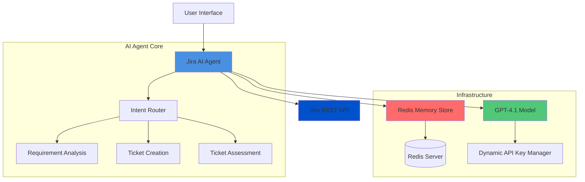
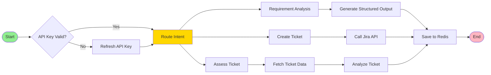
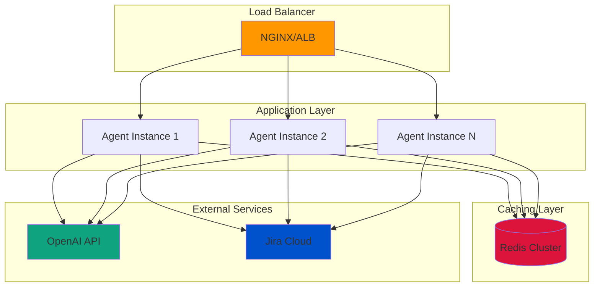

# Jira AI Agent System Design Document

## Executive Summary

This document outlines the design and implementation of an intelligent Jira AI Agent powered by OpenAI's GPT-4.1 model. The agent leverages LangChain and LangGraph frameworks to provide intelligent requirement analysis, automated ticket creation, and ticket assessment capabilities with conversation memory.

---

## Table of Contents

1. [System Overview](#system-overview)
2. [Architecture Design](#architecture-design)
3. [Core Components](#core-components)
4. [Implementation Details](#implementation-details)
5. [Use Cases & Examples](#use-cases--examples)
6. [Security Considerations](#security-considerations)
7. [Deployment & Scaling](#deployment--scaling)

---

## 1. System Overview

### 1.1 Purpose

The Jira AI Agent serves as an intelligent intermediary between users and Jira, providing:

- **Requirement Analysis**: Analyze user requirements and generate structured outputs
- **Ticket Creation**: Automatically create Jira tickets through API calls
- **Ticket Assessment**: Evaluate existing tickets and provide insights
- **Conversation Memory**: Maintain context across interactions

### 1.2 Key Technologies

| Technology | Purpose |
|------------|---------|
| OpenAI GPT-4.1 | Core language model for understanding and generation |
| LangChain OpenAI | LLM integration and prompt management |
| LangGraph | Workflow orchestration and state management |
| Redis | Checkpoint storage for conversation memory |
| Jira REST API | Ticket management operations |

---

## 2. Architecture Design

### 2.1 High-Level Architecture



### 2.2 LangGraph Workflow



---

## 3. Core Components

### 3.1 Dynamic API Key Manager

Handles automatic API key refresh and validation.

```python
import time
from typing import Optional
from datetime import datetime, timedelta

class DynamicAPIKeyManager:
    """
    Manages OpenAI API key lifecycle with automatic refresh
    """
    
    def __init__(self, key_provider_func, expiry_hours: int = 24):
        self.key_provider_func = key_provider_func
        self.expiry_hours = expiry_hours
        self._current_key: Optional[str] = None
        self._expiry_time: Optional[datetime] = None
    
    def get_key(self) -> str:
        """Get valid API key, refreshing if expired"""
        if self._is_expired():
            self._refresh_key()
        return self._current_key
    
    def _is_expired(self) -> bool:
        """Check if current key is expired"""
        if self._expiry_time is None:
            return True
        return datetime.now() >= self._expiry_time
    
    def _refresh_key(self):
        """Refresh API key from provider"""
        self._current_key = self.key_provider_func()
        self._expiry_time = datetime.now() + timedelta(hours=self.expiry_hours)
        print(f"API Key refreshed. Valid until: {self._expiry_time}")

# Example usage
def fetch_api_key_from_vault():
    """Simulate fetching key from secure vault"""
    return "sk-proj-xxxxxxxxxxxxx"

api_key_manager = DynamicAPIKeyManager(
    key_provider_func=fetch_api_key_from_vault,
    expiry_hours=24
)
```

### 3.2 Custom ChatOpenAI Wrapper

```python
from langchain_openai import ChatOpenAI
from typing import Any, Dict

class DynamicChatOpenAI(ChatOpenAI):
    """
    Custom ChatOpenAI with dynamic API key management
    """
    
    def __init__(self, api_key_manager: DynamicAPIKeyManager, **kwargs):
        self.api_key_manager = api_key_manager
        super().__init__(openai_api_key=api_key_manager.get_key(), **kwargs)
    
    async def ainvoke(self, *args, **kwargs):
        """Async invoke with API key refresh check"""
        # Refresh key if needed before each call
        self.openai_api_key = self.api_key_manager.get_key()
        return await super().ainvoke(*args, **kwargs)
    
    def invoke(self, *args, **kwargs):
        """Sync invoke with API key refresh check"""
        self.openai_api_key = self.api_key_manager.get_key()
        return super().invoke(*args, **kwargs)
```

### 3.3 Jira API Integration

```python
import aiohttp
import json
from typing import Dict, Any, Optional

class JiraAPIClient:
    """
    Async Jira REST API client
    """
    
    def __init__(self, base_url: str, email: str, api_token: str):
        self.base_url = base_url.rstrip('/')
        self.auth = aiohttp.BasicAuth(email, api_token)
        self.headers = {
            "Accept": "application/json",
            "Content-Type": "application/json"
        }
    
    async def create_ticket(self, project_key: str, summary: str, 
                           description: str, issue_type: str = "Task") -> Dict[str, Any]:
        """Create a new Jira ticket"""
        url = f"{self.base_url}/rest/api/3/issue"
        
        payload = {
            "fields": {
                "project": {"key": project_key},
                "summary": summary,
                "description": {
                    "type": "doc",
                    "version": 1,
                    "content": [
                        {
                            "type": "paragraph",
                            "content": [{"type": "text", "text": description}]
                        }
                    ]
                },
                "issuetype": {"name": issue_type}
            }
        }
        
        async with aiohttp.ClientSession() as session:
            async with session.post(url, json=payload, auth=self.auth, 
                                   headers=self.headers) as response:
                response.raise_for_status()
                return await response.json()
    
    async def get_ticket(self, ticket_key: str) -> Dict[str, Any]:
        """Fetch an existing Jira ticket"""
        url = f"{self.base_url}/rest/api/3/issue/{ticket_key}"
        
        async with aiohttp.ClientSession() as session:
            async with session.get(url, auth=self.auth, headers=self.headers) as response:
                response.raise_for_status()
                return await response.json()
    
    async def update_ticket(self, ticket_key: str, fields: Dict[str, Any]) -> None:
        """Update an existing Jira ticket"""
        url = f"{self.base_url}/rest/api/3/issue/{ticket_key}"
        
        payload = {"fields": fields}
        
        async with aiohttp.ClientSession() as session:
            async with session.put(url, json=payload, auth=self.auth, 
                                  headers=self.headers) as response:
                response.raise_for_status()
```

### 3.4 LangGraph Agent Implementation

```python
import asyncio
from typing import TypedDict, Annotated, Sequence
from langchain_core.messages import BaseMessage, HumanMessage, AIMessage
from langgraph.graph import StateGraph, END
from langgraph.checkpoint.memory import MemorySaver
from langgraph.prebuilt import ToolNode
import operator

# Define state structure
class AgentState(TypedDict):
    messages: Annotated[Sequence[BaseMessage], operator.add]
    intent: str
    ticket_data: Optional[Dict[str, Any]]
    output: Optional[str]

class JiraAIAgent:
    """
    Main Jira AI Agent using LangGraph
    """
    
    def __init__(self, llm: DynamicChatOpenAI, jira_client: JiraAPIClient):
        self.llm = llm
        self.jira_client = jira_client
        self.graph = self._build_graph()
    
    def _build_graph(self) -> StateGraph:
        """Build the LangGraph workflow"""
        workflow = StateGraph(AgentState)
        
        # Add nodes
        workflow.add_node("route_intent", self._route_intent)
        workflow.add_node("analyze_requirements", self._analyze_requirements)
        workflow.add_node("create_ticket", self._create_ticket)
        workflow.add_node("assess_ticket", self._assess_ticket)
        
        # Define edges
        workflow.set_entry_point("route_intent")
        
        workflow.add_conditional_edges(
            "route_intent",
            self._route_decision,
            {
                "analyze": "analyze_requirements",
                "create": "create_ticket",
                "assess": "assess_ticket"
            }
        )
        
        workflow.add_edge("analyze_requirements", END)
        workflow.add_edge("create_ticket", END)
        workflow.add_edge("assess_ticket", END)
        
        return workflow.compile(checkpointer=MemorySaver())
    
    async def _route_intent(self, state: AgentState) -> AgentState:
        """Route user intent using LLM"""
        messages = state["messages"]
        last_message = messages[-1].content
        
        routing_prompt = f"""
        Analyze the user's request and determine the intent:
        - "analyze" for requirement analysis
        - "create" for creating new Jira tickets
        - "assess" for assessing existing tickets
        
        User request: {last_message}
        
        Respond with only one word: analyze, create, or assess.
        """
        
        response = await self.llm.ainvoke([HumanMessage(content=routing_prompt)])
        intent = response.content.strip().lower()
        
        state["intent"] = intent
        return state
    
    def _route_decision(self, state: AgentState) -> str:
        """Decision function for routing"""
        return state["intent"]
    
    async def _analyze_requirements(self, state: AgentState) -> AgentState:
        """Analyze requirements and generate structured output"""
        messages = state["messages"]
        user_request = messages[-1].content
        
        analysis_prompt = f"""
        Analyze the following requirement and provide a structured JSON output with:
        - title: Brief title of the requirement
        - description: Detailed description
        - acceptance_criteria: List of acceptance criteria
        - estimated_effort: Effort estimation (Small/Medium/Large)
        - priority: Priority level (Low/Medium/High/Critical)
        - dependencies: Any identified dependencies
        
        Requirement: {user_request}
        
        Provide the output as valid JSON.
        """
        
        response = await self.llm.ainvoke([HumanMessage(content=analysis_prompt)])
        state["output"] = response.content
        state["messages"].append(AIMessage(content=response.content))
        
        return state
    
    async def _create_ticket(self, state: AgentState) -> AgentState:
        """Create a new Jira ticket"""
        messages = state["messages"]
        user_request = messages[-1].content
        
        # Extract ticket details using LLM
        extraction_prompt = f"""
        Extract the following details from the user's request to create a Jira ticket:
        - project_key: The Jira project key (e.g., PROJ, DEV)
        - summary: Brief summary of the ticket
        - description: Detailed description
        - issue_type: Type of issue (Task/Bug/Story/Epic)
        
        User request: {user_request}
        
        Provide the output as JSON with these exact keys.
        """
        
        response = await self.llm.ainvoke([HumanMessage(content=extraction_prompt)])
        
        try:
            ticket_details = json.loads(response.content)
            
            # Create ticket via Jira API
            result = await self.jira_client.create_ticket(
                project_key=ticket_details.get("project_key", "PROJ"),
                summary=ticket_details["summary"],
                description=ticket_details["description"],
                issue_type=ticket_details.get("issue_type", "Task")
            )
            
            ticket_key = result.get("key", "Unknown")
            output_message = f"✅ Successfully created Jira ticket: {ticket_key}\n\n{json.dumps(result, indent=2)}"
            
        except Exception as e:
            output_message = f"❌ Failed to create ticket: {str(e)}"
        
        state["output"] = output_message
        state["messages"].append(AIMessage(content=output_message))
        
        return state
    
    async def _assess_ticket(self, state: AgentState) -> AgentState:
        """Assess an existing Jira ticket"""
        messages = state["messages"]
        user_request = messages[-1].content
        
        # Extract ticket key
        extraction_prompt = f"""
        Extract the Jira ticket key from the user's request.
        It's usually in the format PROJECT-123.
        
        User request: {user_request}
        
        Respond with only the ticket key.
        """
        
        response = await self.llm.ainvoke([HumanMessage(content=extraction_prompt)])
        ticket_key = response.content.strip()
        
        try:
            # Fetch ticket data
            ticket_data = await self.jira_client.get_ticket(ticket_key)
            
            # Analyze ticket using LLM
            assessment_prompt = f"""
            Analyze the following Jira ticket and provide an assessment:
            
            Ticket Key: {ticket_key}
            Summary: {ticket_data['fields']['summary']}
            Status: {ticket_data['fields']['status']['name']}
            Priority: {ticket_data['fields'].get('priority', {}).get('name', 'Not set')}
            Description: {ticket_data['fields'].get('description', 'No description')}
            
            Provide:
            1. Quality assessment of the ticket
            2. Completeness check
            3. Suggestions for improvement
            4. Risk assessment
            5. Recommended next actions
            """
            
            assessment = await self.llm.ainvoke([HumanMessage(content=assessment_prompt)])
            output_message = f"📊 Assessment for {ticket_key}:\n\n{assessment.content}"
            
        except Exception as e:
            output_message = f"❌ Failed to assess ticket: {str(e)}"
        
        state["output"] = output_message
        state["messages"].append(AIMessage(content=output_message))
        
        return state
    
    async def run(self, user_input: str, thread_id: str = "default") -> str:
        """Run the agent with user input"""
        initial_state = {
            "messages": [HumanMessage(content=user_input)],
            "intent": "",
            "ticket_data": None,
            "output": None
        }
        
        config = {"configurable": {"thread_id": thread_id}}
        result = await self.graph.ainvoke(initial_state, config)
        
        return result["output"]
```

---

## 4. Implementation Details

### 4.1 Redis Memory Integration

```python
from langgraph.checkpoint.memory import MemorySaver
from redis import Redis
import pickle
from typing import Optional, Dict, Any

class RedisSaver(MemorySaver):
    """
    Redis-based checkpoint saver for conversation memory
    """
    
    def __init__(self, redis_url: str = "redis://localhost:6379/0"):
        self.redis_client = Redis.from_url(redis_url, decode_responses=False)
        super().__init__()
    
    def put(self, config: Dict[str, Any], checkpoint: Dict[str, Any]) -> None:
        """Save checkpoint to Redis"""
        thread_id = config["configurable"]["thread_id"]
        key = f"checkpoint:{thread_id}"
        
        serialized = pickle.dumps(checkpoint)
        self.redis_client.set(key, serialized, ex=86400)  # 24-hour expiry
    
    def get(self, config: Dict[str, Any]) -> Optional[Dict[str, Any]]:
        """Retrieve checkpoint from Redis"""
        thread_id = config["configurable"]["thread_id"]
        key = f"checkpoint:{thread_id}"
        
        serialized = self.redis_client.get(key)
        if serialized:
            return pickle.loads(serialized)
        return None
```

### 4.2 Complete Integration Example

```python
import asyncio
from typing import Dict, Any

async def main():
    """Main execution function"""
    
    # Initialize components
    api_key_manager = DynamicAPIKeyManager(
        key_provider_func=fetch_api_key_from_vault,
        expiry_hours=24
    )
    
    llm = DynamicChatOpenAI(
        api_key_manager=api_key_manager,
        model="gpt-4-turbo-preview",
        temperature=0.7
    )
    
    jira_client = JiraAPIClient(
        base_url="https://your-domain.atlassian.net",
        email="your-email@example.com",
        api_token="your-jira-api-token"
    )
    
    # Create agent
    agent = JiraAIAgent(llm=llm, jira_client=jira_client)
    
    # Visualize graph (optional)
    print("🔍 Agent Workflow:")
    print(agent.graph.get_graph().draw_ascii())
    
    # Example interactions
    examples = [
        "Analyze this requirement: We need a user authentication system with OAuth2 support",
        "Create a ticket in PROJ for implementing JWT token refresh functionality",
        "Assess ticket PROJ-123 and provide recommendations"
    ]
    
    for example in examples:
        print(f"\n{'='*60}")
        print(f"User: {example}")
        print(f"{'='*60}")
        
        response = await agent.run(example, thread_id="user_session_001")
        print(f"\nAgent: {response}")

if __name__ == "__main__":
    asyncio.run(main())
```

---

## 5. Use Cases & Examples

### Use Case 1: Requirement Analysis

**Scenario**: Product manager needs to analyze a feature request

**Input**:
```
"We need to build a real-time notification system that supports 
email, SMS, and push notifications. It should handle 10,000 
notifications per minute with 99.9% delivery rate."
```

**Expected Output** (JSON):
```json
{
  "title": "Real-time Multi-channel Notification System",
  "description": "A scalable notification system supporting multiple delivery channels with high throughput",
  "acceptance_criteria": [
    "Support email, SMS, and push notification channels",
    "Handle 10,000 notifications per minute",
    "Achieve 99.9% delivery success rate",
    "Provide delivery status tracking",
    "Include retry mechanism for failed deliveries"
  ],
  "estimated_effort": "Large",
  "priority": "High",
  "dependencies": [
    "Email service provider integration (SendGrid/AWS SES)",
    "SMS gateway (Twilio)",
    "Push notification service (FCM/APNs)",
    "Message queue system (Redis/RabbitMQ)"
  ]
}
```

### Use Case 2: Automated Ticket Creation

**Scenario**: Developer reports a bug via chat

**Input**:
```
"Create a bug ticket in DEV project: Login page crashes when 
user enters special characters in password field. This is blocking 
production release."
```

**Agent Workflow**:

```mermaid
sequenceDiagram
    participant User
    participant Agent
    participant LLM
    participant Jira
    
    User->>Agent: Bug report message
    Agent->>LLM: Extract ticket details
    LLM->>Agent: Structured ticket data
    Agent->>Jira: POST /rest/api/3/issue
    Jira->>Agent: Created ticket DEV-456
    Agent->>User: ✅ Ticket created: DEV-456
```



**Jira API Response**:
```json
{
  "id": "10456",
  "key": "DEV-456",
  "self": "https://your-domain.atlassian.net/rest/api/3/issue/10456"
}
```

### Use Case 3: Ticket Assessment

**Scenario**: QA engineer reviews ticket quality before sprint planning

**Input**:
```
"Assess ticket PROJ-789"
```

**Assessment Output**:
```
📊 Assessment for PROJ-789:

**Quality Assessment**: ⭐⭐⭐⭐ (4/5)
The ticket is well-structured with clear acceptance criteria.

**Completeness Check**:
✅ Summary is clear and concise
✅ Description provides sufficient context
✅ Acceptance criteria are defined
⚠️  Missing: Mockups/wireframes for UI changes
⚠️  Missing: Performance requirements

**Suggestions for Improvement**:
1. Add visual mockups to clarify UI expectations
2. Specify performance benchmarks (e.g., page load time < 2s)
3. Include security considerations for data handling
4. Add labels for better categorization

**Risk Assessment**: 🟡 Medium Risk
- Dependency on third-party API (potential delays)
- Requires database schema changes (needs DBA review)

**Recommended Next Actions**:
1. Schedule design review with UX team
2. Get DBA approval for schema changes
3. Break down into smaller subtasks
4. Estimate story points after clarifications
```

---

## 6. Security Considerations

### 6.1 API Key Management

```python
# Secure key storage with encryption
from cryptography.fernet import Fernet
import os

class SecureKeyManager:
    """
    Encrypted storage for API keys
    """
    
    def __init__(self):
        # In production, load from secure environment
        self.cipher_key = os.environ.get('CIPHER_KEY', Fernet.generate_key())
        self.cipher = Fernet(self.cipher_key)
    
    def encrypt_key(self, api_key: str) -> bytes:
        """Encrypt API key for storage"""
        return self.cipher.encrypt(api_key.encode())
    
    def decrypt_key(self, encrypted_key: bytes) -> str:
        """Decrypt API key for use"""
        return self.cipher.decrypt(encrypted_key).decode()
```

### 6.2 Security Best Practices

| Area | Practice |
|------|----------|
| **API Keys** | Store in environment variables or secure vaults (AWS Secrets Manager, HashiCorp Vault) |
| **Authentication** | Use OAuth 2.0 for Jira API; rotate tokens regularly |
| **Data Transmission** | Always use HTTPS/TLS for API calls |
| **Conversation Data** | Encrypt sensitive data in Redis; implement access controls |
| **Input Validation** | Sanitize user inputs to prevent injection attacks |
| **Rate Limiting** | Implement exponential backoff for API calls |

---

## 7. Deployment & Scaling

### 7.1 Deployment Architecture



### 7.2 Docker Deployment

```dockerfile
# Dockerfile
FROM python:3.11-slim

WORKDIR /app

# Install dependencies
COPY requirements.txt .
RUN pip install --no-cache-dir -r requirements.txt

# Copy application code
COPY . .

# Set environment variables
ENV PYTHONUNBUFFERED=1
ENV REDIS_URL=redis://redis:6379/0

# Expose port
EXPOSE 8000

# Run application
CMD ["uvicorn", "main:app", "--host", "0.0.0.0", "--port", "8000"]
```

```yaml
# docker-compose.yml
version: '3.8'

services:
  jira-agent:
    build: .
    ports:
      - "8000:8000"
    environment:
      - OPENAI_API_KEY=${OPENAI_API_KEY}
      - JIRA_BASE_URL=${JIRA_BASE_URL}
      - JIRA_EMAIL=${JIRA_EMAIL}
      - JIRA_API_TOKEN=${JIRA_API_TOKEN}
      - REDIS_URL=redis://redis:6379/0
    depends_on:
      - redis
    restart: unless-stopped
  
  redis:
    image: redis:7-alpine
    ports:
      - "6379:6379"
    volumes:
      - redis-data:/data
    restart: unless-stopped

volumes:
  redis-data:
```

### 7.3 Monitoring & Observability

```python
import time
from functools import wraps
import logging

# Configure logging
logging.basicConfig(
    level=logging.INFO,
    format='%(asctime)s - %(name)s - %(levelname)s - %(message)s'
)
logger = logging.getLogger(__name__)

def monitor_performance(func):
    """Decorator to monitor function performance"""
    @wraps(func)
    async def wrapper(*args, **kwargs):
        start_time = time.time()
        try:
            result = await func(*args, **kwargs)
            duration = time.time() - start_time
            logger.info(f"{func.__name__} completed in {duration:.2f}s")
            return result
        except Exception as e:
            duration = time.time() - start_time
            logger.error(f"{func.__name__} failed after {duration:.2f}s: {str(e)}")
            raise
    return wrapper
```

---

## 8. Performance Optimization

### 8.1 Caching Strategy

```python
from functools import lru_cache
import hashlib

class CachedJiraAgent:
    """Agent with response caching"""
    
    def __init__(self, agent: JiraAIAgent, redis_client: Redis):
        self.agent = agent
        self.redis = redis_client
    
    def _generate_cache_key(self, user_input: str) -> str:
        """Generate cache key from input"""
        return f"cache:{hashlib.sha256(user_input.encode()).hexdigest()}"
    
    async def run_with_cache(self, user_input: str, ttl: int = 3600) -> str:
        """Run agent with caching"""
        cache_key = self._generate_cache_key(user_input)
        
        # Check cache
        cached_response = self.redis.get(cache_key)
        if cached_response:
            logger.info(f"Cache hit for key: {cache_key}")
            return cached_response.decode()
        
        # Execute agent
        response = await self.agent.run(user_input)
        
        # Store in cache
        self.redis.setex(cache_key, ttl, response)
        
        return response
```

### 8.2 Rate Limiting

```python
from datetime import datetime, timedelta

class RateLimiter:
    """Token bucket rate limiter"""
    
    def __init__(self, redis_client: Redis, max_requests: int = 100, 
                 window_seconds: int = 60):
        self.redis = redis_client
        self.max_requests = max_requests
        self.window_seconds = window_seconds
    
    async def is_allowed(self, user_id: str) -> bool:
        """Check if request is allowed"""
        key = f"ratelimit:{user_id}"
        current = self.redis.incr(key)
        
        if current == 1:
            self.redis.expire(key, self.window_seconds)
        
        return current <= self.max_requests
```

---

## 9. Testing Strategy

### 9.1 Unit Tests

```python
import pytest
from unittest.mock import Mock, AsyncMock

@pytest.mark.asyncio
async def test_requirement_analysis():
    """Test requirement analysis flow"""
    mock_llm = AsyncMock()
    mock_llm.ainvoke.return_value = Mock(
        content='{"title": "Test", "priority": "High"}'
    )
    
    mock_jira = Mock()
    agent = JiraAIAgent(llm=mock_llm, jira_client=mock_jira)
    
    result = await agent.run("Analyze this requirement", thread_id="test")
    
    assert result is not None
    assert "Test" in result

@pytest.mark.asyncio
async def test_ticket_creation():
    """Test ticket creation flow"""
    mock_llm = AsyncMock()
    mock_jira = AsyncMock()
    mock_jira.create_ticket.return_value = {"key": "TEST-123"}
    
    agent = JiraA