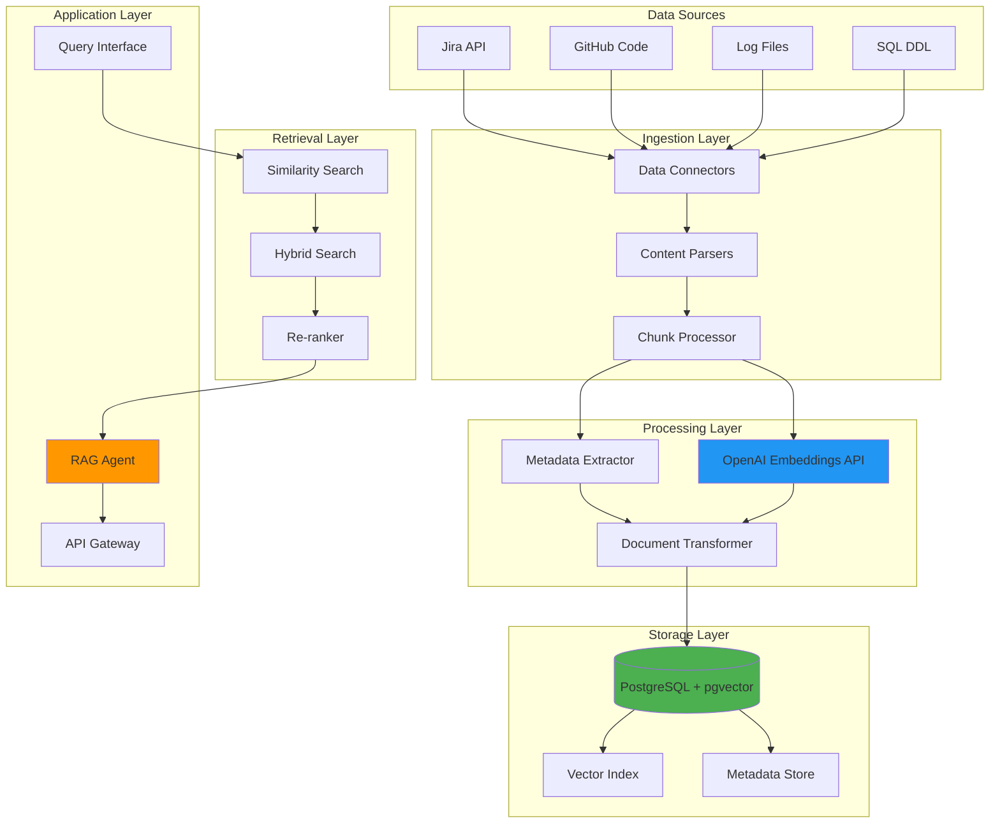
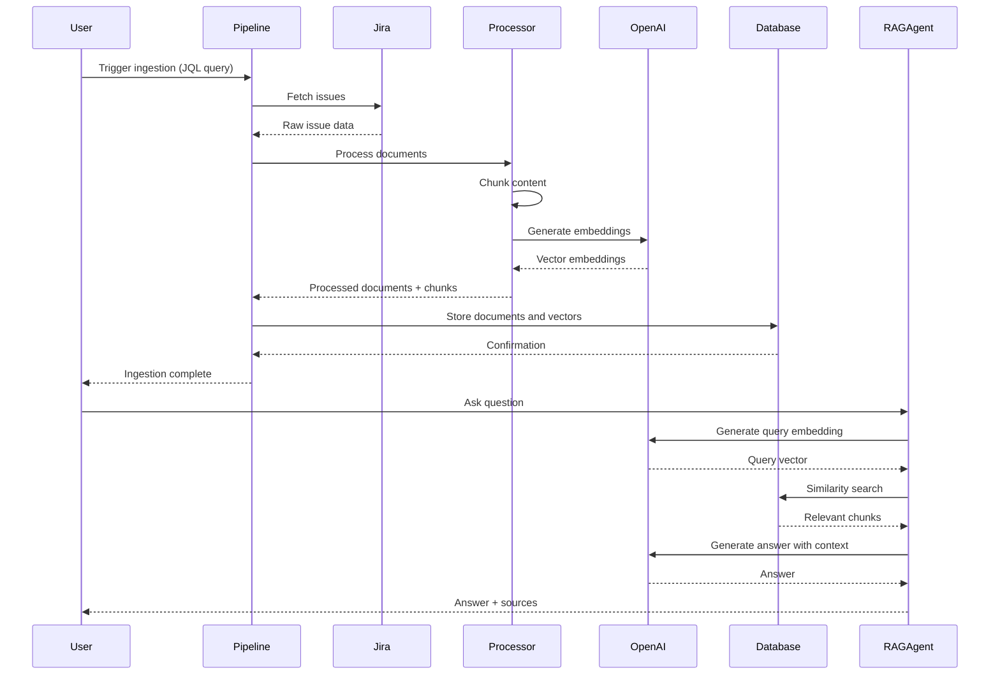

# Jira Issue Content Knowledge Base - System Design Document

## Executive Summary

This document outlines the architecture and implementation of a scalable Knowledge Base system powered by LLM embeddings, designed to ingest, store, and retrieve Jira issues and other document types for RAG-based AI applications.

## Table of Contents

1. [System Overview](#system-overview)
2. [Architecture Design](#architecture-design)
3. [Core Components](#core-components)
4. [Data Flow](#data-flow)
5. [Implementation Details](#implementation-details)
6. [Use Cases & Examples](#use-cases--examples)
7. [Design Principles](#design-principles)
8. [Scalability & Performance](#scalability--performance)

---

## System Overview

### Purpose
Build a backend service that enables semantic search and retrieval-augmented generation (RAG) for financial QA applications by ingesting structured data from Jira and supporting future expansion to other data sources.

### Key Technologies
- **Framework**: LangChain
- **Vector Database**: PostgreSQL with pgvector extension
- **Embedding Model**: OpenAI Ada (text-embedding-ada-002)
- **Language**: Python 3.9+

### High-Level Capabilities
- Ingest Jira issues with metadata preservation
- Generate and store vector embeddings
- Perform semantic similarity search
- Support RAG-based question answering
- Extensible architecture for multiple data sources

---

## Architecture Design



### System Architecture Layers

| Layer | Responsibility | Key Components |
|-------|---------------|----------------|
| **Data Sources** | External data providers | Jira, GitHub, Logs, SQL |
| **Ingestion** | Data extraction and normalization | Connectors, Parsers, Chunkers |
| **Processing** | Embedding generation and enrichment | OpenAI API, Metadata extraction |
| **Storage** | Persistent vector and metadata storage | PostgreSQL, pgvector |
| **Retrieval** | Semantic search and ranking | Similarity search, Re-ranking |
| **Application** | User-facing services | RAG agent, API endpoints |

---

## Core Components

### 1. Configuration Management

```python
from dataclasses import dataclass
from typing import Optional
import os

@dataclass
class SystemConfig:
    """Central configuration for the knowledge base system."""
    
    # OpenAI Configuration
    openai_api_key: str = os.getenv("OPENAI_API_KEY")
    embedding_model: str = "text-embedding-ada-002"
    embedding_dimension: int = 1536
    
    # Database Configuration
    db_host: str = os.getenv("DB_HOST", "localhost")
    db_port: int = int(os.getenv("DB_PORT", "5432"))
    db_name: str = os.getenv("DB_NAME", "knowledge_base")
    db_user: str = os.getenv("DB_USER", "postgres")
    db_password: str = os.getenv("DB_PASSWORD", "")
    
    # Jira Configuration
    jira_url: str = os.getenv("JIRA_URL")
    jira_email: str = os.getenv("JIRA_EMAIL")
    jira_api_token: str = os.getenv("JIRA_API_TOKEN")
    
    # Processing Configuration
    chunk_size: int = 1000
    chunk_overlap: int = 200
    batch_size: int = 100
    
    # Search Configuration
    top_k: int = 5
    similarity_threshold: float = 0.7
    
    @property
    def db_connection_string(self) -> str:
        """Generate PostgreSQL connection string."""
        return f"postgresql://{self.db_user}:{self.db_password}@{self.db_host}:{self.db_port}/{self.db_name}"

config = SystemConfig()
```

### 2. Database Schema

```python
from sqlalchemy import create_engine, Column, String, Text, DateTime, JSON, Integer
from sqlalchemy.ext.declarative import declarative_base
from sqlalchemy.orm import sessionmaker
from pgvector.sqlalchemy import Vector
from datetime import datetime

Base = declarative_base()

class Document(Base):
    """Main document table storing content and embeddings."""
    __tablename__ = "documents"
    
    id = Column(String(255), primary_key=True)
    source_type = Column(String(50), nullable=False, index=True)  # 'jira', 'github', etc.
    source_id = Column(String(255), nullable=False, index=True)  # Original ID from source
    content = Column(Text, nullable=False)
    content_hash = Column(String(64), nullable=False, unique=True)
    embedding = Column(Vector(1536))  # Ada embedding dimension
    metadata = Column(JSON)
    created_at = Column(DateTime, default=datetime.utcnow)
    updated_at = Column(DateTime, default=datetime.utcnow, onupdate=datetime.utcnow)
    
    def __repr__(self):
        return f"<Document(id={self.id}, source={self.source_type})>"

class DocumentChunk(Base):
    """Chunked documents for improved retrieval."""
    __tablename__ = "document_chunks"
    
    id = Column(String(255), primary_key=True)
    document_id = Column(String(255), nullable=False, index=True)
    chunk_index = Column(Integer, nullable=False)
    content = Column(Text, nullable=False)
    embedding = Column(Vector(1536))
    metadata = Column(JSON)
    created_at = Column(DateTime, default=datetime.utcnow)
    
    def __repr__(self):
        return f"<DocumentChunk(id={self.id}, doc_id={self.document_id})>"

def initialize_database(config: SystemConfig):
    """Initialize database with pgvector extension."""
    engine = create_engine(config.db_connection_string)
    
    # Create pgvector extension
    with engine.connect() as conn:
        conn.execute("CREATE EXTENSION IF NOT EXISTS vector")
        conn.commit()
    
    # Create tables
    Base.metadata.create_all(engine)
    
    # Create vector index for faster similarity search
    with engine.connect() as conn:
        conn.execute("""
            CREATE INDEX IF NOT EXISTS documents_embedding_idx 
            ON documents USING ivfflat (embedding vector_cosine_ops)
            WITH (lists = 100)
        """)
        conn.execute("""
            CREATE INDEX IF NOT EXISTS chunks_embedding_idx 
            ON document_chunks USING ivfflat (embedding vector_cosine_ops)
            WITH (lists = 100)
        """)
        conn.commit()
    
    return sessionmaker(bind=engine)
```

### 3. Jira Data Connector

```python
from jira import JIRA
from typing import List, Dict, Any
import hashlib
from datetime import datetime

class JiraConnector:
    """Handles connection and data extraction from Jira."""
    
    def __init__(self, config: SystemConfig):
        self.config = config
        self.client = JIRA(
            server=config.jira_url,
            basic_auth=(config.jira_email, config.jira_api_token)
        )
    
    def fetch_issues(self, jql_query: str, max_results: int = 100) -> List[Dict[str, Any]]:
        """Fetch issues from Jira using JQL query."""
        issues = self.client.search_issues(
            jql_query, 
            maxResults=max_results,
            fields='summary,description,status,priority,assignee,reporter,created,updated,labels,components,issuetype,project'
        )
        
        return [self._parse_issue(issue) for issue in issues]
    
    def _parse_issue(self, issue) -> Dict[str, Any]:
        """Parse Jira issue into standardized format."""
        fields = issue.fields
        
        # Build comprehensive content
        content_parts = [
            f"Issue: {issue.key}",
            f"Summary: {fields.summary}",
            f"Type: {fields.issuetype.name}",
            f"Status: {fields.status.name}",
            f"Priority: {fields.priority.name if fields.priority else 'None'}",
        ]
        
        if fields.description:
            content_parts.append(f"Description: {fields.description}")
        
        if fields.labels:
            content_parts.append(f"Labels: {', '.join(fields.labels)}")
        
        content = "\n\n".join(content_parts)
        
        # Extract metadata
        metadata = {
            "issue_key": issue.key,
            "summary": fields.summary,
            "status": fields.status.name,
            "priority": fields.priority.name if fields.priority else None,
            "assignee": fields.assignee.displayName if fields.assignee else None,
            "reporter": fields.reporter.displayName if fields.reporter else None,
            "created": fields.created,
            "updated": fields.updated,
            "labels": fields.labels or [],
            "components": [c.name for c in fields.components] if fields.components else [],
            "issue_type": fields.issuetype.name,
            "project": fields.project.key,
            "url": f"{self.config.jira_url}/browse/{issue.key}"
        }
        
        return {
            "id": issue.key,
            "content": content,
            "metadata": metadata,
            "content_hash": hashlib.sha256(content.encode()).hexdigest()
        }
    
    def fetch_comments(self, issue_key: str) -> List[str]:
        """Fetch comments for a specific issue."""
        issue = self.client.issue(issue_key)
        return [comment.body for comment in issue.fields.comment.comments]
```

### 4. Document Processor

```python
from langchain.text_splitter import RecursiveCharacterTextSplitter
from langchain.embeddings import OpenAIEmbeddings
from typing import List, Dict, Any
import uuid

class DocumentProcessor:
    """Handles document chunking and embedding generation."""
    
    def __init__(self, config: SystemConfig):
        self.config = config
        self.embeddings = OpenAIEmbeddings(
            openai_api_key=config.openai_api_key,
            model=config.embedding_model
        )
        self.text_splitter = RecursiveCharacterTextSplitter(
            chunk_size=config.chunk_size,
            chunk_overlap=config.chunk_overlap,
            separators=["\n\n", "\n", ". ", " ", ""]
        )
    
    def process_document(self, document: Dict[str, Any]) -> Dict[str, Any]:
        """Process a single document: chunk and generate embeddings."""
        content = document["content"]
        
        # Generate embedding for full document
        doc_embedding = self.embeddings.embed_query(content)
        
        # Create chunks
        chunks = self.text_splitter.split_text(content)
        
        # Generate embeddings for chunks
        chunk_embeddings = self.embeddings.embed_documents(chunks)
        
        # Create chunk objects
        chunk_objects = []
        for idx, (chunk, embedding) in enumerate(zip(chunks, chunk_embeddings)):
            chunk_obj = {
                "id": f"{document['id']}_chunk_{idx}",
                "document_id": document["id"],
                "chunk_index": idx,
                "content": chunk,
                "embedding": embedding,
                "metadata": {
                    **document.get("metadata", {}),
                    "chunk_index": idx,
                    "total_chunks": len(chunks)
                }
            }
            chunk_objects.append(chunk_obj)
        
        return {
            "document": {
                "id": document["id"],
                "content": content,
                "embedding": doc_embedding,
                "metadata": document.get("metadata", {}),
                "content_hash": document["content_hash"]
            },
            "chunks": chunk_objects
        }
    
    def batch_process(self, documents: List[Dict[str, Any]]) -> List[Dict[str, Any]]:
        """Process multiple documents in batch."""
        return [self.process_document(doc) for doc in documents]
```

### 5. Vector Store Manager

```python
from sqlalchemy.orm import Session
from pgvector.sqlalchemy import Vector
from typing import List, Dict, Any, Optional
import numpy as np

class VectorStoreManager:
    """Manages vector storage and retrieval operations."""
    
    def __init__(self, session_factory, config: SystemConfig):
        self.session_factory = session_factory
        self.config = config
    
    def store_documents(self, processed_docs: List[Dict[str, Any]], source_type: str):
        """Store processed documents and chunks in database."""
        session = self.session_factory()
        try:
            for proc_doc in processed_docs:
                doc_data = proc_doc["document"]
                
                # Store main document
                document = Document(
                    id=doc_data["id"],
                    source_type=source_type,
                    source_id=doc_data["id"],
                    content=doc_data["content"],
                    content_hash=doc_data["content_hash"],
                    embedding=doc_data["embedding"],
                    metadata=doc_data["metadata"]
                )
                session.merge(document)
                
                # Store chunks
                for chunk_data in proc_doc["chunks"]:
                    chunk = DocumentChunk(
                        id=chunk_data["id"],
                        document_id=chunk_data["document_id"],
                        chunk_index=chunk_data["chunk_index"],
                        content=chunk_data["content"],
                        embedding=chunk_data["embedding"],
                        metadata=chunk_data["metadata"]
                    )
                    session.merge(chunk)
            
            session.commit()
        except Exception as e:
            session.rollback()
            raise e
        finally:
            session.close()
    
    def similarity_search(
        self, 
        query_embedding: List[float], 
        top_k: int = None,
        filters: Optional[Dict[str, Any]] = None,
        use_chunks: bool = True
    ) -> List[Dict[str, Any]]:
        """Perform similarity search using cosine distance."""
        top_k = top_k or self.config.top_k
        session = self.session_factory()
        
        try:
            if use_chunks:
                query = session.query(
                    DocumentChunk,
                    DocumentChunk.embedding.cosine_distance(query_embedding).label("distance")
                )
                
                # Apply filters if provided
                if filters:
                    for key, value in filters.items():
                        query = query.filter(DocumentChunk.metadata[key].astext == str(value))
                
                results = query.order_by("distance").limit(top_k).all()
                
                return [
                    {
                        "id": chunk.id,
                        "document_id": chunk.document_id,
                        "content": chunk.content,
                        "metadata": chunk.metadata,
                        "similarity_score": 1 - distance
                    }
                    for chunk, distance in results
                ]
            else:
                query = session.query(
                    Document,
                    Document.embedding.cosine_distance(query_embedding).label("distance")
                )
                
                if filters:
                    for key, value in filters.items():
                        query = query.filter(Document.metadata[key].astext == str(value))
                
                results = query.order_by("distance").limit(top_k).all()
                
                return [
                    {
                        "id": doc.id,
                        "content": doc.content,
                        "metadata": doc.metadata,
                        "similarity_score": 1 - distance
                    }
                    for doc, distance in results
                ]
        finally:
            session.close()
    
    def hybrid_search(
        self,
        query_embedding: List[float],
        query_text: str,
        top_k: int = None,
        alpha: float = 0.7
    ) -> List[Dict[str, Any]]:
        """Combine vector similarity with keyword search."""
        top_k = top_k or self.config.top_k
        session = self.session_factory()
        
        try:
            # Vector similarity search
            vector_results = session.query(
                DocumentChunk,
                DocumentChunk.embedding.cosine_distance(query_embedding).label("distance")
            ).order_by("distance").limit(top_k * 2).all()
            
            # Keyword search using PostgreSQL full-text search
            keyword_results = session.query(DocumentChunk).filter(
                DocumentChunk.content.ilike(f"%{query_text}%")
            ).limit(top_k * 2).all()
            
            # Combine and re-rank
            combined = {}
            for chunk, distance in vector_results:
                score = alpha * (1 - distance)
                combined[chunk.id] = {
                    "chunk": chunk,
                    "score": score
                }
            
            for chunk in keyword_results:
                if chunk.id in combined:
                    combined[chunk.id]["score"] += (1 - alpha) * 0.5
                else:
                    combined[chunk.id] = {
                        "chunk": chunk,
                        "score": (1 - alpha) * 0.5
                    }
            
            # Sort by combined score
            sorted_results = sorted(
                combined.values(), 
                key=lambda x: x["score"], 
                reverse=True
            )[:top_k]
            
            return [
                {
                    "id": item["chunk"].id,
                    "document_id": item["chunk"].document_id,
                    "content": item["chunk"].content,
                    "metadata": item["chunk"].metadata,
                    "similarity_score": item["score"]
                }
                for item in sorted_results
            ]
        finally:
            session.close()
```

### 6. RAG Agent

```python
from langchain.chains import RetrievalQA
from langchain.llms import OpenAI
from langchain.prompts import PromptTemplate
from typing import Dict, Any, List

class RAGAgent:
    """Retrieval-Augmented Generation agent for question answering."""
    
    def __init__(self, vector_store: VectorStoreManager, config: SystemConfig):
        self.vector_store = vector_store
        self.config = config
        self.embeddings = OpenAIEmbeddings(
            openai_api_key=config.openai_api_key,
            model=config.embedding_model
        )
        self.llm = OpenAI(
            temperature=0.7,
            openai_api_key=config.openai_api_key
        )
    
    def answer_question(
        self, 
        question: str, 
        filters: Optional[Dict[str, Any]] = None,
        use_hybrid: bool = True
    ) -> Dict[str, Any]:
        """Answer a question using RAG approach."""
        
        # Generate query embedding
        query_embedding = self.embeddings.embed_query(question)
        
        # Retrieve relevant documents
        if use_hybrid:
            relevant_docs = self.vector_store.hybrid_search(
                query_embedding=query_embedding,
                query_text=question,
                top_k=self.config.top_k
            )
        else:
            relevant_docs = self.vector_store.similarity_search(
                query_embedding=query_embedding,
                filters=filters,
                top_k=self.config.top_k
            )
        
        # Build context from retrieved documents
        context = self._build_context(relevant_docs)
        
        # Generate answer using LLM
        answer = self._generate_answer(question, context)
        
        return {
            "question": question,
            "answer": answer,
            "sources": relevant_docs,
            "num_sources": len(relevant_docs)
        }
    
    def _build_context(self, documents: List[Dict[str, Any]]) -> str:
        """Build context string from retrieved documents."""
        context_parts = []
        for i, doc in enumerate(documents, 1):
            metadata = doc.get("metadata", {})
            source_info = f"[Source {i}]"
            
            if "issue_key" in metadata:
                source_info += f" Jira Issue: {metadata['issue_key']}"
            
            context_parts.append(f"{source_info}\n{doc['content']}\n")
        
        return "\n---\n".join(context_parts)
    
    def _generate_answer(self, question: str, context: str) -> str:
        """Generate answer using LLM with context."""
        prompt_template = """You are a helpful assistant answering questions based on the provided context from Jira issues and other documents.

Context:
{context}

Question: {question}

Instructions:
- Answer the question based solely on the provided context
- If the context doesn't contain enough information, say so
- Reference specific sources when possible
- Be concise and accurate

Answer:"""
        
        prompt = PromptTemplate(
            template=prompt_template,
            input_variables=["context", "question"]
        )
        
        formatted_prompt = prompt.format(context=context, question=question)
        answer = self.llm(formatted_prompt)
        
        return answer.strip()
```

### 7. Ingestion Pipeline

```python
from typing import List, Dict, Any
import logging

logging.basicConfig(level=logging.INFO)
logger = logging.getLogger(__name__)

class IngestionPipeline:
    """Orchestrates the complete ingestion pipeline."""
    
    def __init__(
        self,
        connector,
        processor: DocumentProcessor,
        vector_store: VectorStoreManager,
        config: SystemConfig
    ):
        self.connector = connector
        self.processor = processor
        self.vector_store = vector_store
        self.config = config
    
    def ingest_jira_issues(self, jql_query: str, max_results: int = 100):
        """Complete pipeline to ingest Jira issues."""
        logger.info(f"Starting Jira ingestion with query: {jql_query}")
        
        # Step 1: Fetch data from Jira
        logger.info("Fetching issues from Jira...")
        raw_issues = self.connector.fetch_issues(jql_query, max_results)
        logger.info(f"Fetched {len(raw_issues)} issues")
        
        # Step 2: Process documents in batches
        logger.info("Processing documents and generating embeddings...")
        processed_docs = []
        
        for i in range(0, len(raw_issues), self.config.batch_size):
            batch = raw_issues[i:i + self.config.batch_size]
            batch_processed = self.processor.batch_process(batch)
            processed_docs.extend(batch_processed)
            logger.info(f"Processed batch {i//self.config.batch_size + 1}")
        
        # Step 3: Store in vector database
        logger.info("Storing documents in vector database...")
        self.vector_store.store_documents(processed_docs, source_type="jira")
        logger.info(f"Successfully ingested {len(processed_docs)} documents")
        
        return {
            "total_documents": len(processed_docs),
            "total_chunks": sum(len(doc["chunks"]) for doc in processed_docs)
        }
```

---

## Data Flow



---

## Use Cases & Examples

### Use Case 1: Ingest Jira Issues for a Project

```python
# Initialize system
config = SystemConfig()
session_factory = initialize_database(config)

# Setup components
jira_connector = JiraConnector(config)
processor = DocumentProcessor(config)
vector_store = VectorStoreManager(session_factory, config)
pipeline = IngestionPipeline(jira_connector, processor, vector_store, config)

# Ingest issues from a specific project
result = pipeline.ingest_jira_issues(
    jql_query="project = FIN AND status IN (Open, 'In Progress') ORDER BY created DESC",
    max_results=500
)

print(f"Ingested {result['total_documents']} documents with {result['total_chunks']} chunks")
```

### Use Case 2: Financial QA - Finding Budget Information

```python
# Initialize RAG agent
rag_agent = RAGAgent(vector_store, config)

# Ask question about budget
question = "What are the budget constraints mentioned in Q4 planning issues?"

response = rag_agent.answer_question(
    question=question,
    filters={"project": "FIN"},
    use_hybrid=True
)

print(f"Question: {response['question']}")
print(f"Answer: {response['answer']}")
print(f"\nSources ({response['num_sources']}):")
for source in response['sources']:
    print(f"- {source['metadata']['issue_key']}: {source['metadata']['summary']}")
```

**Expected Output:**
```
Question: What are the budget constraints mentioned in Q4 planning issues?
Answer: Based on the retrieved Jira issues, there are several budget constraints for Q4:

1. FIN-1234 mentions a hard cap of $500K for infrastructure spending
2. FIN-1245 indicates that marketing budget has been reduced by 15% to $200K
3. FIN-1267 specifies that all new hires must be approved by finance due to budget freezes

These constraints are primarily driven by the company's cost optimization initiative mentioned in FIN-1200.

Sources (4):
- FIN-1234: Q4 Infrastructure Budget Planning
- FIN-1245: Marketing Budget Adjustment Q4
- FIN-1267: Hiring Freeze Policy Update
- FIN-1200: Cost Optimization Initiative 2024
```

### Use Case 3: Searching by Metadata Filters

```python
# Search for high-priority security issues
query_embedding = processor.embeddings.embed_query("authentication vulnerabilities")

results = vector_store.similarity_search(
    query_embedding=query_embedding,
    filters={
        "priority": "High",
        "labels": "security"
    },
    top_k=10
)

for result in results:
    print(f"{result['metadata']['issue_key']}: {result['metadata']['summary']}")
    print(f"Similarity: {result['similarity_score']:.3f}\n")
```

### Use Case 4: Incremental Updates

```python
def incremental_update():
    """Update only new or modified issues."""
    # Fetch recently updated issues
    recent_issues = jira_connector.fetch_issues(
        jql_query="updated >= -7d ORDER BY updated DESC",
        max_results=1000
    )
    
    # Check which issues are new or updated
    session = session_factory()
    existing_hashes = {
        doc.source_id: doc.content_hash 
        for doc in session.query(Document).filter(
            Document.source_id.in_([issue['id'] for issue in recent_issues])
        ).all()
    }
    session.close()
    
    # Filter to only changed documents
    changed_issues = [
        issue for issue in recent_issues
        if issue['id'] not in existing_hashes or 
           existing_hashes[issue['id']] != issue['content_hash']
    ]
    
    if changed_issues:
        processed = processor.batch_process(changed_issues)
        vector_store.store_documents(processed, source_type="jira")
        print(f"Updated {len(changed_issues)} issues")
    else:
        print("No updates needed")

# Run incremental update daily
incremental_update()
```

---

## Design Principles

### 1. **Modularity**
Each component (connector, processor, vector store, RAG agent) is independent and can be replaced or extended without affecting others.

### 2. **Scalability**
- Batch processing for large datasets
- Vector indexing (IVFFlat) for fast similarity search
- Chunking strategy balances granularity and context

### 3. **Extensibility**
The architecture supports adding new data sources by implementing the connector interface:

```python
class BaseConnector:
    """Base class for data connectors."""
    
    def fetch_data(self, query: str, max_results: int) -> List[Dict[str, Any]]:
        raise NotImplementedError
    
    def parse_item(self, item: Any) -> Dict[str, Any]:
        raise NotImplementedError

# Example: GitHub connector
class GitHubConnector(BaseConnector):
    def fetch_data(self, query: str, max_results: int):
        # Implement GitHub API calls
        pass
    
    def parse_item(self, item: Any):
        # Parse GitHub issues/PRs
        pass
```

### 4. **Data Quality**
- Content hashing prevents duplicate ingestion
- Metadata preservation enables filtering and traceability
- Chunking overlap maintains context continuity

### 5. **Performance Optimization**
- Vector indexes for sub-linear search time
- Batch processing reduces API calls
- Hybrid search combines semantic and keyword matching

### 6. **Observability**
```python
import logging
from datetime