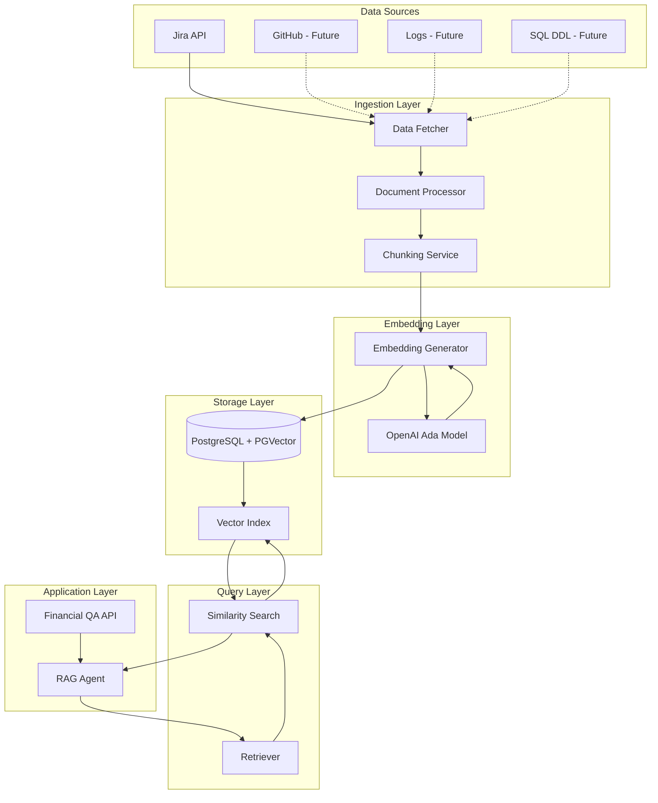
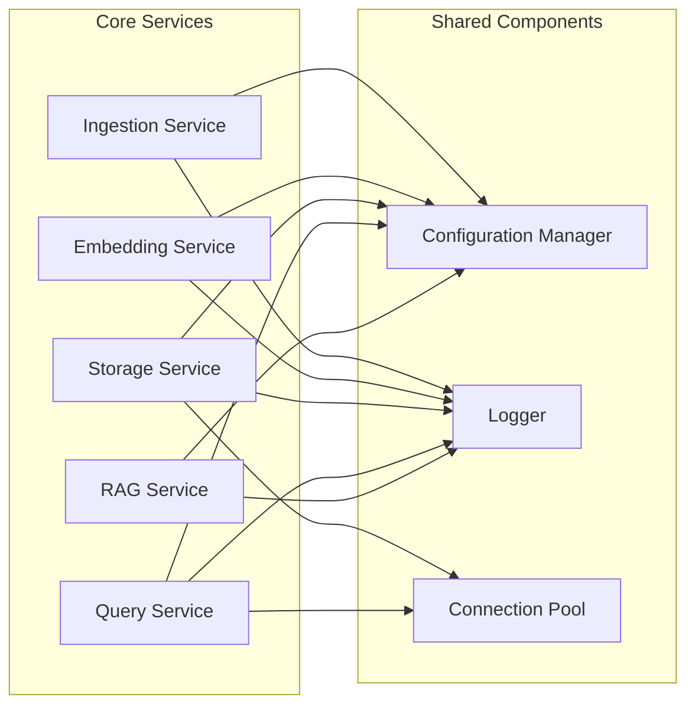
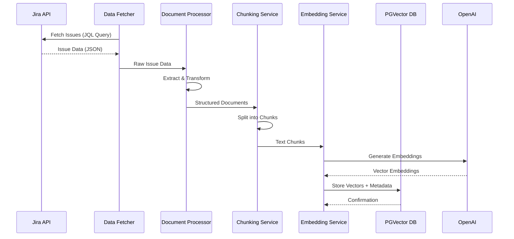
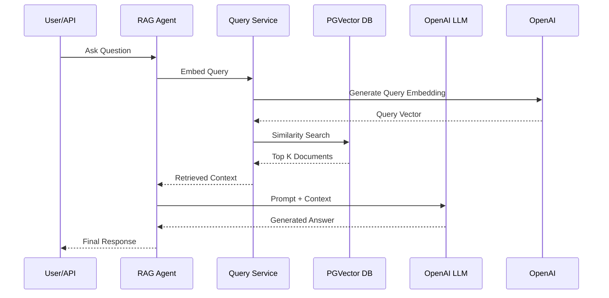
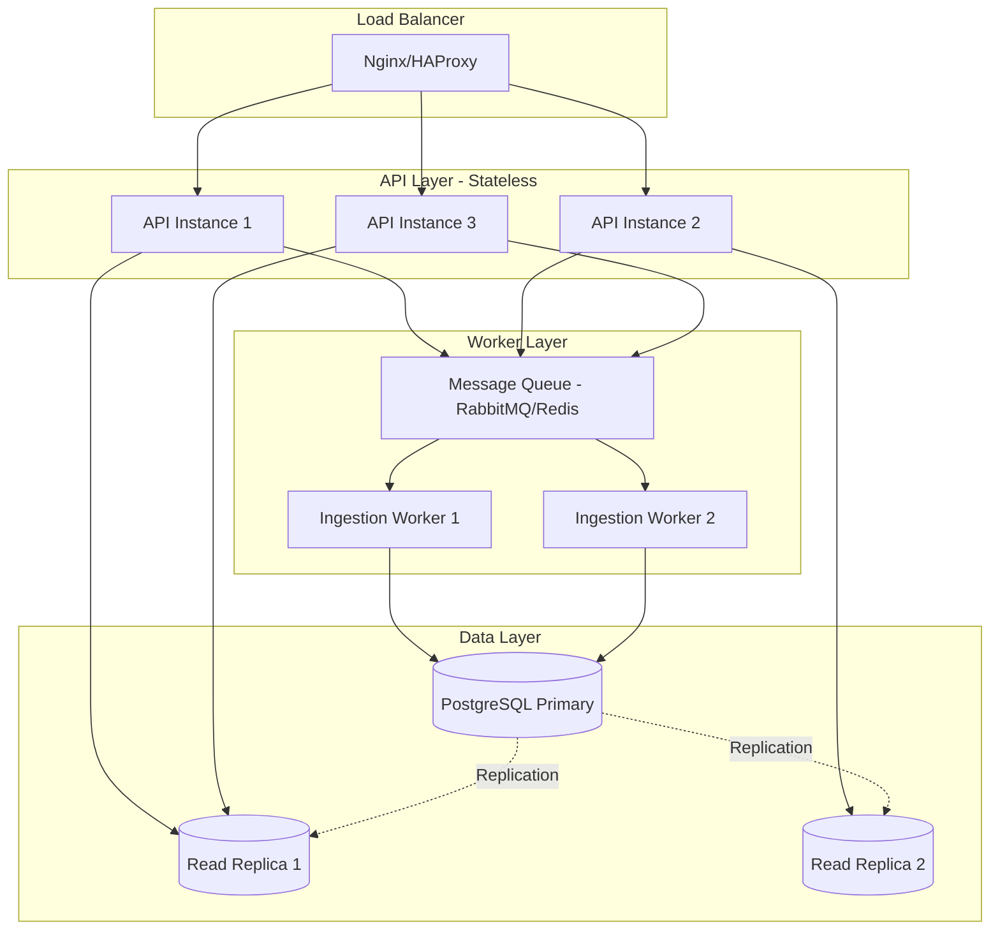

# Jira Issue Content Knowledge Base - System Design Document

## Executive Summary

This document outlines the architecture and implementation of a **Jira Issue Content Knowledge Base** powered by LLM embeddings. The system serves as a backend service that ingests Jira issues, stores them in a vector database (PGVector), and enables semantic search and RAG (Retrieval-Augmented Generation) for financial QA applications.

---

## Table of Contents

1. [System Overview](#system-overview)
2. [Architecture Design](#architecture-design)
3. [Design Principles](#design-principles)
4. [Core Components](#core-components)
5. [Data Flow](#data-flow)
6. [Implementation Details](#implementation-details)
7. [Use Cases & Examples](#use-cases--examples)
8. [Scalability & Future Extensions](#scalability--future-extensions)
9. [Security & Best Practices](#security--best-practices)

---

## System Overview

### Purpose
The Jira Issue Content Knowledge Base is designed to:
- Ingest structured and unstructured data from Jira issues
- Generate semantic embeddings using OpenAI's Ada model
- Store vectors in PGVector for efficient similarity search
- Power RAG-based AI agents for intelligent question answering

### Key Features
- **Data Ingestion Pipeline**: Automated extraction and processing of Jira issues
- **Vector Storage**: PGVector integration for scalable embedding storage
- **Semantic Search**: Fast similarity search using cosine distance
- **RAG Integration**: Context-aware AI responses using retrieved documents
- **Extensible Architecture**: Support for future data sources (GitHub, logs, SQL DDL)

---

## Architecture Design



### System Layers

1. **Data Sources Layer**: External systems providing raw content
2. **Ingestion Layer**: ETL pipeline for data extraction and transformation
3. **Embedding Layer**: Vector generation using OpenAI models
4. **Storage Layer**: PostgreSQL with PGVector extension
5. **Query Layer**: Semantic search and retrieval mechanisms
6. **Application Layer**: RAG agent and API endpoints

---

## Design Principles

### 1. Separation of Concerns
Each component has a single, well-defined responsibility, making the system modular and maintainable.

### 2. Scalability
- Horizontal scaling through stateless services
- Efficient vector indexing for large-scale data
- Batch processing for ingestion workloads

### 3. Extensibility
- Plugin architecture for new data sources
- Configurable embedding models
- Flexible document processing pipeline

### 4. Data Quality
- Metadata preservation for traceability
- Content validation and sanitization
- Duplicate detection and deduplication

### 5. Performance
- Asynchronous processing for I/O operations
- Connection pooling for database efficiency
- Caching strategies for frequently accessed data

---

## Core Components

### Component Diagram



---

## Data Flow

### Ingestion Flow



### Query Flow



---

## Implementation Details

### 1. Environment Configuration

```python
# config.py
import os
from dataclasses import dataclass
from typing import Optional

@dataclass
class Config:
    """Central configuration for the knowledge base system"""
    
    # Database Configuration
    db_host: str = os.getenv("DB_HOST", "localhost")
    db_port: int = int(os.getenv("DB_PORT", "5432"))
    db_name: str = os.getenv("DB_NAME", "jira_kb")
    db_user: str = os.getenv("DB_USER", "postgres")
    db_password: str = os.getenv("DB_PASSWORD", "")
    
    # OpenAI Configuration
    openai_api_key: str = os.getenv("OPENAI_API_KEY", "")
    embedding_model: str = "text-embedding-ada-002"
    embedding_dimension: int = 1536
    
    # Jira Configuration
    jira_url: str = os.getenv("JIRA_URL", "")
    jira_email: str = os.getenv("JIRA_EMAIL", "")
    jira_api_token: str = os.getenv("JIRA_API_TOKEN", "")
    
    # Processing Configuration
    chunk_size: int = 1000
    chunk_overlap: int = 200
    batch_size: int = 100
    
    # Search Configuration
    top_k_results: int = 5
    similarity_threshold: float = 0.7
    
    @property
    def database_url(self) -> str:
        return f"postgresql://{self.db_user}:{self.db_password}@{self.db_host}:{self.db_port}/{self.db_name}"

config = Config()
```

### 2. Database Initialization

```python
# db_setup.py
from sqlalchemy import create_engine, text
from langchain_postgres import PGVector
from langchain_postgres.vectorstores import PGVector
from config import config

def initialize_database():
    """Initialize PostgreSQL database with PGVector extension"""
    
    # Create engine
    engine = create_engine(config.database_url)
    
    with engine.connect() as conn:
        # Enable PGVector extension
        conn.execute(text("CREATE EXTENSION IF NOT EXISTS vector"))
        conn.commit()
        
        print("✓ PGVector extension enabled")
    
    return engine

def create_vector_store(collection_name: str = "jira_issues"):
    """Create or connect to vector store"""
    
    from langchain_openai import OpenAIEmbeddings
    
    embeddings = OpenAIEmbeddings(
        model=config.embedding_model,
        openai_api_key=config.openai_api_key
    )
    
    vector_store = PGVector(
        embeddings=embeddings,
        collection_name=collection_name,
        connection=config.database_url,
        use_jsonb=True,
    )
    
    print(f"✓ Vector store '{collection_name}' initialized")
    
    return vector_store
```

### 3. Jira Data Fetcher

```python
# jira_fetcher.py
from jira import JIRA
from typing import List, Dict, Any
from config import config
import logging

logger = logging.getLogger(__name__)

class JiraFetcher:
    """Fetch issues from Jira using JQL queries"""
    
    def __init__(self):
        self.jira = JIRA(
            server=config.jira_url,
            basic_auth=(config.jira_email, config.jira_api_token)
        )
    
    def fetch_issues(
        self, 
        jql: str = "project = FIN ORDER BY created DESC",
        max_results: int = 100,
        fields: List[str] = None
    ) -> List[Dict[str, Any]]:
        """
        Fetch Jira issues based on JQL query
        
        Args:
            jql: Jira Query Language string
            max_results: Maximum number of issues to fetch
            fields: Specific fields to retrieve
        
        Returns:
            List of issue dictionaries
        """
        
        if fields is None:
            fields = [
                "summary", "description", "status", "priority",
                "assignee", "reporter", "created", "updated",
                "components", "labels", "comment"
            ]
        
        try:
            issues = self.jira.search_issues(
                jql_str=jql,
                maxResults=max_results,
                fields=",".join(fields)
            )
            
            parsed_issues = []
            for issue in issues:
                parsed_issue = self._parse_issue(issue)
                parsed_issues.append(parsed_issue)
            
            logger.info(f"✓ Fetched {len(parsed_issues)} issues from Jira")
            return parsed_issues
            
        except Exception as e:
            logger.error(f"✗ Error fetching Jira issues: {e}")
            raise
    
    def _parse_issue(self, issue) -> Dict[str, Any]:
        """Parse Jira issue object into dictionary"""
        
        fields = issue.fields
        
        # Extract comments
        comments = []
        if hasattr(fields, 'comment') and fields.comment:
            comments = [
                {
                    "author": c.author.displayName,
                    "body": c.body,
                    "created": c.created
                }
                for c in fields.comment.comments
            ]
        
        return {
            "id": issue.key,
            "summary": fields.summary,
            "description": fields.description or "",
            "status": fields.status.name,
            "priority": fields.priority.name if fields.priority else "None",
            "assignee": fields.assignee.displayName if fields.assignee else "Unassigned",
            "reporter": fields.reporter.displayName if fields.reporter else "Unknown",
            "created": str(fields.created),
            "updated": str(fields.updated),
            "components": [c.name for c in fields.components],
            "labels": fields.labels,
            "comments": comments,
            "url": f"{config.jira_url}/browse/{issue.key}"
        }
```

### 4. Document Processor

```python
# document_processor.py
from typing import List, Dict, Any
from langchain.text_splitter import RecursiveCharacterTextSplitter
from langchain.schema import Document
from config import config
import logging

logger = logging.getLogger(__name__)

class DocumentProcessor:
    """Process and chunk Jira issues into documents"""
    
    def __init__(self):
        self.text_splitter = RecursiveCharacterTextSplitter(
            chunk_size=config.chunk_size,
            chunk_overlap=config.chunk_overlap,
            length_function=len,
            separators=["\n\n", "\n", " ", ""]
        )
    
    def process_issues(self, issues: List[Dict[str, Any]]) -> List[Document]:
        """
        Convert Jira issues to LangChain documents with chunking
        
        Args:
            issues: List of parsed Jira issues
        
        Returns:
            List of Document objects ready for embedding
        """
        
        documents = []
        
        for issue in issues:
            # Create main content
            content = self._build_content(issue)
            
            # Create metadata
            metadata = {
                "source": "jira",
                "issue_id": issue["id"],
                "title": issue["summary"],
                "status": issue["status"],
                "priority": issue["priority"],
                "assignee": issue["assignee"],
                "created": issue["created"],
                "updated": issue["updated"],
                "url": issue["url"],
                "labels": ",".join(issue["labels"]),
                "components": ",".join(issue["components"])
            }
            
            # Split into chunks
            chunks = self.text_splitter.create_documents(
                texts=[content],
                metadatas=[metadata]
            )
            
            # Add chunk index to metadata
            for idx, chunk in enumerate(chunks):
                chunk.metadata["chunk_index"] = idx
                chunk.metadata["total_chunks"] = len(chunks)
            
            documents.extend(chunks)
        
        logger.info(f"✓ Processed {len(issues)} issues into {len(documents)} document chunks")
        return documents
    
    def _build_content(self, issue: Dict[str, Any]) -> str:
        """Build searchable content from issue fields"""
        
        sections = [
            f"Issue: {issue['id']}",
            f"Title: {issue['summary']}",
            f"Status: {issue['status']} | Priority: {issue['priority']}",
            f"Assignee: {issue['assignee']} | Reporter: {issue['reporter']}",
            "",
            "Description:",
            issue['description'],
        ]
        
        # Add comments
        if issue['comments']:
            sections.append("")
            sections.append("Comments:")
            for comment in issue['comments']:
                sections.append(f"- {comment['author']}: {comment['body']}")
        
        # Add labels and components
        if issue['labels']:
            sections.append(f"\nLabels: {', '.join(issue['labels'])}")
        
        if issue['components']:
            sections.append(f"Components: {', '.join(issue['components'])}")
        
        return "\n".join(sections)
```

### 5. Ingestion Service

```python
# ingestion_service.py
from typing import List, Optional
from jira_fetcher import JiraFetcher
from document_processor import DocumentProcessor
from db_setup import create_vector_store
import logging

logger = logging.getLogger(__name__)

class IngestionService:
    """Orchestrate the data ingestion pipeline"""
    
    def __init__(self, collection_name: str = "jira_issues"):
        self.fetcher = JiraFetcher()
        self.processor = DocumentProcessor()
        self.vector_store = create_vector_store(collection_name)
    
    def ingest_jira_issues(
        self,
        jql: str = "project = FIN ORDER BY created DESC",
        max_results: int = 100
    ) -> int:
        """
        Complete ingestion pipeline for Jira issues
        
        Args:
            jql: Jira query string
            max_results: Maximum issues to ingest
        
        Returns:
            Number of documents ingested
        """
        
        logger.info(f"Starting ingestion with JQL: {jql}")
        
        # Step 1: Fetch issues from Jira
        issues = self.fetcher.fetch_issues(jql=jql, max_results=max_results)
        
        if not issues:
            logger.warning("No issues fetched")
            return 0
        
        # Step 2: Process issues into documents
        documents = self.processor.process_issues(issues)
        
        # Step 3: Generate embeddings and store in vector DB
        logger.info(f"Generating embeddings for {len(documents)} documents...")
        self.vector_store.add_documents(documents)
        
        logger.info(f"✓ Successfully ingested {len(documents)} document chunks")
        return len(documents)
    
    def ingest_incremental(self, since_date: str):
        """Ingest only new or updated issues since a specific date"""
        
        jql = f"updated >= '{since_date}' ORDER BY updated DESC"
        return self.ingest_jira_issues(jql=jql)
```

### 6. Query Service

```python
# query_service.py
from typing import List, Dict, Any
from langchain.schema import Document
from db_setup import create_vector_store
from config import config
import logging

logger = logging.getLogger(__name__)

class QueryService:
    """Handle semantic search queries"""
    
    def __init__(self, collection_name: str = "jira_issues"):
        self.vector_store = create_vector_store(collection_name)
    
    def similarity_search(
        self,
        query: str,
        k: int = None,
        filter_metadata: Dict[str, Any] = None
    ) -> List[Document]:
        """
        Perform similarity search on the knowledge base
        
        Args:
            query: Natural language query
            k: Number of results to return
            filter_metadata: Metadata filters (e.g., {"status": "Open"})
        
        Returns:
            List of relevant documents with scores
        """
        
        k = k or config.top_k_results
        
        logger.info(f"Searching for: '{query}' (top {k} results)")
        
        if filter_metadata:
            results = self.vector_store.similarity_search(
                query=query,
                k=k,
                filter=filter_metadata
            )
        else:
            results = self.vector_store.similarity_search(query=query, k=k)
        
        logger.info(f"✓ Found {len(results)} relevant documents")
        return results
    
    def similarity_search_with_score(
        self,
        query: str,
        k: int = None,
        score_threshold: float = None
    ) -> List[tuple[Document, float]]:
        """
        Perform similarity search with relevance scores
        
        Returns:
            List of (document, score) tuples
        """
        
        k = k or config.top_k_results
        score_threshold = score_threshold or config.similarity_threshold
        
        results = self.vector_store.similarity_search_with_score(query=query, k=k)
        
        # Filter by threshold
        filtered_results = [
            (doc, score) for doc, score in results
            if score >= score_threshold
        ]
        
        logger.info(f"✓ Found {len(filtered_results)} documents above threshold {score_threshold}")
        return filtered_results
```

### 7. RAG Agent Service

```python
# rag_agent.py
from typing import List, Dict, Any
from langchain_openai import ChatOpenAI
from langchain.chains import RetrievalQA
from langchain.prompts import PromptTemplate
from query_service import QueryService
from db_setup import create_vector_store
from config import config
import logging

logger = logging.getLogger(__name__)

class RAGAgent:
    """RAG-based question answering agent"""
    
    def __init__(self, collection_name: str = "jira_issues"):
        self.query_service = QueryService(collection_name)
        self.vector_store = create_vector_store(collection_name)
        self.llm = ChatOpenAI(
            model="gpt-4",
            temperature=0.2,
            openai_api_key=config.openai_api_key
        )
        
        # Define custom prompt template
        self.prompt_template = PromptTemplate(
            template="""You are a knowledgeable assistant helping with questions about Jira issues and financial projects.

Use the following context to answer the question. If you cannot find the answer in the context, say so clearly.

Context:
{context}

Question: {question}

Provide a comprehensive answer with:
1. Direct answer to the question
2. Relevant issue IDs and links when applicable
3. Any important details from the context

Answer:""",
            input_variables=["context", "question"]
        )
    
    def ask(self, question: str, filters: Dict[str, Any] = None) -> Dict[str, Any]:
        """
        Ask a question and get RAG-powered answer
        
        Args:
            question: User's question
            filters: Optional metadata filters
        
        Returns:
            Dictionary with answer and source documents
        """
        
        logger.info(f"Processing question: {question}")
        
        # Retrieve relevant documents
        if filters:
            documents = self.query_service.similarity_search(
                query=question,
                k=config.top_k_results,
                filter_metadata=filters
            )
        else:
            documents = self.query_service.similarity_search(
                query=question,
                k=config.top_k_results
            )
        
        if not documents:
            return {
                "answer": "I couldn't find any relevant information to answer your question.",
                "sources": [],
                "confidence": "low"
            }
        
        # Build context from retrieved documents
        context = self._build_context(documents)
        
        # Generate answer using LLM
        prompt = self.prompt_template.format(context=context, question=question)
        response = self.llm.invoke(prompt)
        
        # Extract source information
        sources = self._extract_sources(documents)
        
        return {
            "answer": response.content,
            "sources": sources,
            "confidence": "high" if len(documents) >= 3 else "medium",
            "num_sources": len(documents)
        }
    
    def _build_context(self, documents: List) -> str:
        """Build context string from retrieved documents"""
        
        context_parts = []
        for idx, doc in enumerate(documents, 1):
            metadata = doc.metadata
            context_parts.append(
                f"[Document {idx}]\n"
                f"Issue: {metadata.get('issue_id', 'N/A')}\n"
                f"Title: {metadata.get('title', 'N/A')}\n"
                f"Status: {metadata.get('status', 'N/A')}\n"
                f"Content: {doc.page_content}\n"
                f"URL: {metadata.get('url', 'N/A')}\n"
            )
        
        return "\n---\n".join(context_parts)
    
    def _extract_sources(self, documents: List) -> List[Dict[str, str]]:
        """Extract source information from documents"""
        
        sources = []
        seen_issues = set()
        
        for doc in documents:
            issue_id = doc.metadata.get('issue_id')
            if issue_id and issue_id not in seen_issues:
                sources.append({
                    "issue_id": issue_id,
                    "title": doc.metadata.get('title'),
                    "url": doc.metadata.get('url'),
                    "status": doc.metadata.get('status')
                })
                seen_issues.add(issue_id)
        
        return sources
```

### 8. Main Application Entry Point

```python
# main.py
import logging
from ingestion_service import IngestionService
from rag_agent import RAGAgent
from db_setup import initialize_database

# Configure logging
logging.basicConfig(
    level=logging.INFO,
    format='%(asctime)s - %(name)s - %(levelname)s - %(message)s'
)

logger = logging.getLogger(__name__)

def setup_system():
    """Initialize the system"""
    logger.info("Initializing Jira Knowledge Base System...")
    initialize_database()
    logger.info("✓ System initialized successfully")

def ingest_data():
    """Run data ingestion"""
    logger.info("Starting data ingestion...")
    
    ingestion_service = IngestionService()
    
    # Ingest Jira issues from financial project
    count = ingestion_service.ingest_jira_issues(
        jql="project = FIN AND status IN (Open, 'In Progress', Resolved) ORDER BY created DESC",
        max_results=200
    )
    
    logger.info(f"✓ Ingestion complete: {count} documents processed")

def query_example():
    """Example queries"""
    logger.info("Running example queries...")
    
    agent = RAGAgent()
    
    # Example 1: General question
    result1 = agent.ask("What are the critical financial bugs currently open?")
    print("\n" + "="*80)
    print("Question: What are the critical financial bugs currently open?")
    print("-"*80)
    print(f"Answer: {result1['answer']}")
    print(f"\nSources: {len(result1['sources'])} issues referenced")
    for source in result1['sources']:
        print(f"  - {source['issue_id']}: {source['title']}")
    
    # Example 2: Filtered question
    result2 = agent.ask(
        "What payment processing issues have been reported?",
        filters={"status": "Open"}
    )
    print("\n" + "="*80)
    print("Question: What payment processing issues have been reported? (Status: Open)")
    print("-"*80)
    print(f"Answer: {result2['answer']}")
    print(f"\nSources: {len(result2['sources'])} issues referenced")

if __name__ == "__main__":
    # Step 1: Setup
    setup_system()
    
    # Step 2: Ingest data
    ingest_data()
    
    # Step 3: Run queries
    query_example()
```

---

## Use Cases & Examples

### Use Case 1: Bug Triage Assistant

**Scenario**: A support engineer needs to quickly find similar historical bugs to understand resolution patterns.

**Query**:
```python
agent = RAGAgent()
result = agent.ask(
    "Show me past payment gateway timeout issues and how they were resolved",
    filters={"status": "Resolved", "priority": "High"}
)
```

**Expected Output**:
```
Answer: Based on historical data, there were 5 payment gateway timeout issues:

1. FIN-1234: Payment API timeout during peak hours
   - Resolution: Increased connection pool size and timeout thresholds
   
2. FIN-2456: Gateway intermittent timeouts
   - Resolution: Implemented retry logic with exponential backoff
   
3. FIN-3789: Bulk payment processing timeouts
   - Resolution: Added batch processing with queue management

Common patterns: Most issues were resolved by optimizing connection 
management and implementing proper retry mechanisms.

Sources: FIN-1234, FIN-2456, FIN-3789
```

### Use Case 2: Project Status Dashboard

**Scenario**: A product manager wants to understand the current state of financial features.

**Query**:
```python
result = agent.ask(
    "What are the open features for Q1 2025 in the financial module?",
    filters={"labels": "Q1-2025"}
)
```

### Use Case 3: Knowledge Discovery

**Scenario**: A new developer wants to understand the architecture of the payment system.

**Query**:
```python
result = agent.ask(
    "Explain the payment processing architecture based on issue discussions"
)
```

### Use Case 4: Compliance Audit

**Scenario**: An auditor needs to find all issues related to PCI compliance.

**Query**:
```python
from query_service import QueryService

query_service = QueryService()
compliance_docs = query_service.similarity_search(
    query="PCI DSS compliance security audit payment data",
    k=20
)

# Generate compliance report
for doc in compliance_docs:
    print(f"Issue: {doc.metadata['issue_id']}")
    print(f"Title: {doc.metadata['title']}")
    print(f"Status: {doc.metadata['status']}")
    print("-" * 40)
```

---

## Scalability & Future Extensions

### Horizontal Scaling



### Future Data Source Extensions

```python
# abstract_fetcher.py
from abc import ABC, abstractmethod
from typing import List, Dict, Any

class DataFetcher(ABC):
    """Abstract base class for data fetchers"""
    
    @abstractmethod
    def fetch_data(self, **kwargs) -> List[Dict[str, Any]]:
        """Fetch data from source"""
        pass
    
    @abstractmethod
    def get_source_type(self) -> str:
        """Return the source type identifier"""
        pass

# github_fetcher.py
class GitHubFetcher(DataFetcher):
    """Fetch code and documentation from GitHub"""
    
    def fetch_data(self, repo: str, file_types: List[str]) -> List[Dict[str, Any]]:
        # Implementation for GitHub API
        pass
    
    def get_source_type(self) -> str:
        return "github"

# log_fetcher.py
class LogFetcher(DataFetcher):
    """Fetch and parse application logs"""
    
    def fetch_data(self, log_path: str, start_date: str) -> List[Dict[str, Any]]:
        # Implementation for log parsing
        pass
    
    def get_source_type(