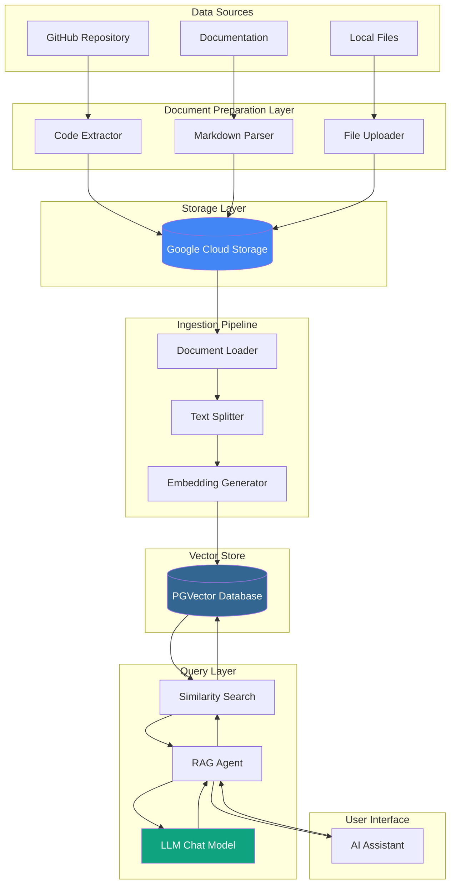
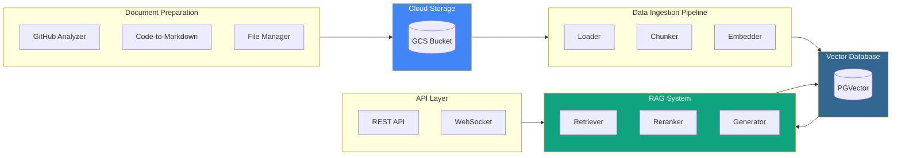
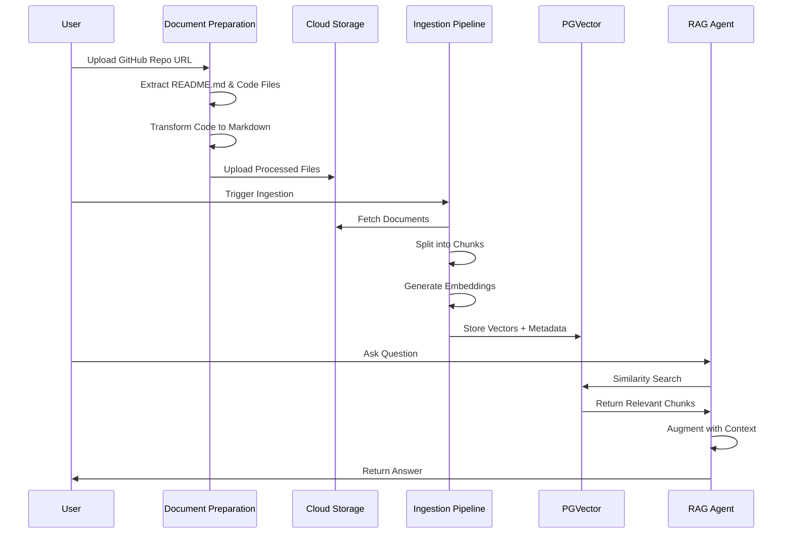
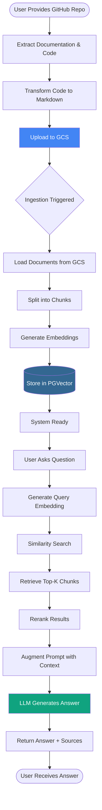

# Knowledge Base Platform System Design

**Version:** 1.0  
**Date:** February 2026  
**Author:** System Architecture Team

---

## Table of Contents

1. [Executive Summary](#executive-summary)
2. [System Overview](#system-overview)
3. [Design Principles](#design-principles)
4. [Architecture](#architecture)
5. [Core Components](#core-components)
6. [Data Flow](#data-flow)
7. [Implementation Details](#implementation-details)
8. [Use Cases & Examples](#use-cases--examples)
9. [Security & Performance](#security--performance)
10. [Future Enhancements](#future-enhancements)

---

## Executive Summary

The Knowledge Base Platform System is a comprehensive RAG (Retrieval-Augmented Generation) solution designed to transform code repositories and documents into an intelligent, searchable knowledge base. The system leverages LLM-powered document analysis, vector embeddings, and semantic search to provide accurate, context-aware responses to user queries.

**Key Capabilities:**
- Automated extraction and transformation of code repositories into structured knowledge
- Multi-format document ingestion with intelligent chunking strategies
- High-performance vector similarity search using PGVector
- RAG-powered AI assistant for natural language querying
- Scalable cloud-native architecture with GCS integration

---

## System Overview

### High-Level Architecture



### Technology Stack

| Component | Technology | Purpose |
|-----------|-----------|---------|
| Cloud Storage | Google Cloud Storage | Centralized document repository |
| Vector Database | PostgreSQL + PGVector | Efficient similarity search |
| Embeddings | OpenAI Ada-002 / Vertex AI | Text vectorization |
| LLM | GPT-4 / Claude / Gemini | Natural language understanding |
| Document Processing | LangChain / LlamaIndex | Text splitting and chunking |
| Programming Language | Python 3.10+ | Core implementation |
| Orchestration | Apache Airflow / Prefect | Pipeline automation |

---

## Design Principles

### 1. **Modularity and Separation of Concerns**
Each component operates independently with clear interfaces, enabling easy testing, maintenance, and upgrades.

### 2. **Scalability**
Horizontal scaling capability through stateless design and distributed vector storage.

### 3. **Data Quality First**
Intelligent chunking strategies preserve semantic meaning and code structure.

### 4. **Cost Optimization**
Efficient embedding reuse, caching mechanisms, and tiered storage strategies.

### 5. **Security by Design**
End-to-end encryption, access control, and audit logging at every layer.

### 6. **Observability**
Comprehensive logging, metrics, and tracing for production debugging.

---

## Architecture

### System Components Diagram



### Data Processing Pipeline



---

## Core Components

### 1. Document Preparation Module

#### 1.1 GitHub Repository Extractor

**Purpose:** Analyzes GitHub repositories and extracts relevant documentation and code structure.

```python
"""
GitHub Repository Extractor
Handles cloning, analysis, and extraction of documentation from GitHub repos.
"""

import os
import re
from typing import List, Dict, Optional
from pathlib import Path
import subprocess
from dataclasses import dataclass
from github import Github


@dataclass
class RepoFile:
    """Represents a file extracted from a repository."""
    path: str
    content: str
    file_type: str
    language: Optional[str] = None


class GitHubExtractor:
    """Extracts and processes files from GitHub repositories."""
    
    SUPPORTED_CODE_EXTENSIONS = {
        '.py': 'python',
        '.java': 'java',
        '.js': 'javascript',
        '.ts': 'typescript',
        '.sql': 'sql',
        '.go': 'go',
        '.rs': 'rust',
        '.cpp': 'cpp',
        '.c': 'c',
    }
    
    DOCUMENTATION_FILES = [
        'README.md',
        'CONTRIBUTING.md',
        'ARCHITECTURE.md',
        'DESIGN.md',
        'API.md',
    ]
    
    def __init__(self, github_token: Optional[str] = None):
        """Initialize GitHub extractor with optional authentication token."""
        self.github = Github(github_token) if github_token else Github()
        self.temp_dir = Path("/tmp/repo_extraction")
        self.temp_dir.mkdir(exist_ok=True)
    
    def clone_repository(self, repo_url: str) -> Path:
        """
        Clone a GitHub repository to temporary directory.
        
        Args:
            repo_url: GitHub repository URL
            
        Returns:
            Path to cloned repository
        """
        repo_name = repo_url.split('/')[-1].replace('.git', '')
        clone_path = self.temp_dir / repo_name
        
        if clone_path.exists():
            # Pull latest changes if already cloned
            subprocess.run(
                ['git', 'pull'],
                cwd=clone_path,
                capture_output=True,
                check=True
            )
        else:
            # Clone repository
            subprocess.run(
                ['git', 'clone', '--depth', '1', repo_url, str(clone_path)],
                capture_output=True,
                check=True
            )
        
        return clone_path
    
    def extract_documentation(self, repo_path: Path) -> List[RepoFile]:
        """
        Extract existing documentation files from repository.
        
        Args:
            repo_path: Path to cloned repository
            
        Returns:
            List of documentation files
        """
        doc_files = []
        
        for doc_name in self.DOCUMENTATION_FILES:
            doc_path = repo_path / doc_name
            if doc_path.exists():
                with open(doc_path, 'r', encoding='utf-8') as f:
                    content = f.read()
                
                doc_files.append(RepoFile(
                    path=str(doc_path.relative_to(repo_path)),
                    content=content,
                    file_type='markdown',
                    language=None
                ))
        
        return doc_files
    
    def extract_code_files(self, repo_path: Path, max_files: int = 100) -> List[RepoFile]:
        """
        Extract code files for analysis.
        
        Args:
            repo_path: Path to cloned repository
            max_files: Maximum number of files to extract
            
        Returns:
            List of code files
        """
        code_files = []
        
        for ext, lang in self.SUPPORTED_CODE_EXTENSIONS.items():
            files = list(repo_path.rglob(f"*{ext}"))
            
            # Skip test files and vendor directories
            files = [
                f for f in files 
                if not any(part in f.parts for part in ['test', 'tests', '__pycache__', 'node_modules', 'vendor'])
            ]
            
            for file_path in files[:max_files]:
                try:
                    with open(file_path, 'r', encoding='utf-8') as f:
                        content = f.read()
                    
                    # Skip very large files (>50KB)
                    if len(content) > 50000:
                        continue
                    
                    code_files.append(RepoFile(
                        path=str(file_path.relative_to(repo_path)),
                        content=content,
                        file_type='code',
                        language=lang
                    ))
                except (UnicodeDecodeError, IOError):
                    # Skip binary or unreadable files
                    continue
        
        return code_files
    
    def get_repository_structure(self, repo_path: Path) -> str:
        """
        Generate a tree-like structure of the repository.
        
        Args:
            repo_path: Path to repository
            
        Returns:
            String representation of directory structure
        """
        def build_tree(path: Path, prefix: str = "", max_depth: int = 3, current_depth: int = 0) -> List[str]:
            if current_depth >= max_depth:
                return []
            
            items = []
            try:
                entries = sorted(path.iterdir(), key=lambda x: (x.is_file(), x.name))
                for i, entry in enumerate(entries):
                    # Skip hidden files and common ignore directories
                    if entry.name.startswith('.') or entry.name in ['node_modules', '__pycache__', 'vendor']:
                        continue
                    
                    is_last = i == len(entries) - 1
                    current = "└── " if is_last else "├── "
                    items.append(f"{prefix}{current}{entry.name}")
                    
                    if entry.is_dir():
                        extension = "    " if is_last else "│   "
                        items.extend(build_tree(entry, prefix + extension, max_depth, current_depth + 1))
            except PermissionError:
                pass
            
            return items
        
        tree_lines = [repo_path.name + "/"]
        tree_lines.extend(build_tree(repo_path))
        return "\n".join(tree_lines)
    
    def process_repository(self, repo_url: str) -> Dict[str, List[RepoFile]]:
        """
        Complete repository processing pipeline.
        
        Args:
            repo_url: GitHub repository URL
            
        Returns:
            Dictionary containing documentation and code files
        """
        print(f"Cloning repository: {repo_url}")
        repo_path = self.clone_repository(repo_url)
        
        print("Extracting documentation files...")
        doc_files = self.extract_documentation(repo_path)
        
        print("Extracting code files...")
        code_files = self.extract_code_files(repo_path)
        
        print("Generating repository structure...")
        structure = self.get_repository_structure(repo_path)
        
        # Add structure as a special document
        doc_files.append(RepoFile(
            path="STRUCTURE.md",
            content=f"# Repository Structure\n\n```\n{structure}\n```",
            file_type='markdown',
            language=None
        ))
        
        return {
            'documentation': doc_files,
            'code': code_files,
            'repo_path': str(repo_path)
        }
```

#### 1.2 Code-to-Markdown Transformer

**Purpose:** Transforms code files into structured markdown documentation explaining structure and business logic.

```python
"""
Code-to-Markdown Transformer
Converts code files into structured markdown documentation using LLM analysis.
"""

from typing import List, Dict, Optional
from dataclasses import dataclass
import anthropic
from openai import OpenAI


@dataclass
class CodeAnalysis:
    """Represents analyzed code structure."""
    file_path: str
    language: str
    summary: str
    functions: List[Dict[str, str]]
    classes: List[Dict[str, str]]
    imports: List[str]
    business_logic: str
    complexity_score: int


class CodeToMarkdownTransformer:
    """Transforms code into comprehensive markdown documentation."""
    
    def __init__(self, llm_provider: str = "anthropic", api_key: Optional[str] = None):
        """
        Initialize transformer with LLM provider.
        
        Args:
            llm_provider: 'anthropic' or 'openai'
            api_key: API key for the provider
        """
        self.llm_provider = llm_provider
        
        if llm_provider == "anthropic":
            self.client = anthropic.Anthropic(api_key=api_key)
            self.model = "claude-sonnet-4-20250514"
        else:
            self.client = OpenAI(api_key=api_key)
            self.model = "gpt-4-turbo-preview"
    
    def analyze_code(self, code_content: str, file_path: str, language: str) -> CodeAnalysis:
        """
        Analyze code structure and extract key information.
        
        Args:
            code_content: Source code content
            file_path: Path to the code file
            language: Programming language
            
        Returns:
            CodeAnalysis object with extracted information
        """
        prompt = f"""Analyze the following {language} code and provide a structured analysis:

File: {file_path}

Code:
{language}
{code_content}


Provide a JSON response with the following structure:
{{
    "summary": "Brief overview of the file's purpose",
    "functions": [
        {{"name": "function_name", "purpose": "what it does", "parameters": "param description"}}
    ],
    "classes": [
        {{"name": "class_name", "purpose": "what it represents", "methods": "key methods"}}
    ],
    "imports": ["list", "of", "imports"],
    "business_logic": "Detailed explanation of the business logic implemented",
    "complexity_score": 1-10 rating of code complexity
}}
"""
        
        if self.llm_provider == "anthropic":
            response = self.client.messages.create(
                model=self.model,
                max_tokens=2000,
                messages=[{"role": "user", "content": prompt}]
            )
            analysis_text = response.content[0].text
        else:
            response = self.client.chat.completions.create(
                model=self.model,
                messages=[{"role": "user", "content": prompt}]
            )
            analysis_text = response.choices[0].message.content
        
        # Parse JSON response
        import json
        try:
            analysis_data = json.loads(analysis_text)
        except json.JSONDecodeError:
            # Fallback if JSON parsing fails
            analysis_data = {
                "summary": "Code analysis",
                "functions": [],
                "classes": [],
                "imports": [],
                "business_logic": "Unable to parse analysis",
                "complexity_score": 5
            }
        
        return CodeAnalysis(
            file_path=file_path,
            language=language,
            summary=analysis_data.get("summary", ""),
            functions=analysis_data.get("functions", []),
            classes=analysis_data.get("classes", []),
            imports=analysis_data.get("imports", []),
            business_logic=analysis_data.get("business_logic", ""),
            complexity_score=analysis_data.get("complexity_score", 5)
        )
    
    def generate_markdown(self, analysis: CodeAnalysis) -> str:
        """
        Generate markdown documentation from code analysis.
        
        Args:
            analysis: CodeAnalysis object
            
        Returns:
            Markdown formatted documentation
        """
        md = f"""# {analysis.file_path}

## Overview

**Language:** {analysis.language}  
**Complexity:** {analysis.complexity_score}/10

{analysis.summary}

## Imports and Dependencies

"""
        
        if analysis.imports:
            for imp in analysis.imports:
                md += f"- `{imp}`\n"
        else:
            md += "No external dependencies.\n"
        
        md += "\n## Classes\n\n"
        
        if analysis.classes:
            for cls in analysis.classes:
                md += f"""### {cls.get('name', 'Unknown')}

**Purpose:** {cls.get('purpose', 'N/A')}  
**Key Methods:** {cls.get('methods', 'N/A')}

"""
        else:
            md += "No classes defined in this file.\n"
        
        md += "\n## Functions\n\n"
        
        if analysis.functions:
            for func in analysis.functions:
                md += f"""### {func.get('name', 'Unknown')}

**Purpose:** {func.get('purpose', 'N/A')}  
**Parameters:** {func.get('parameters', 'None')}

"""
        else:
            md += "No standalone functions defined in this file.\n"
        
        md += f"""
## Business Logic

{analysis.business_logic}

## Technical Notes

This documentation was automatically generated from source code analysis. For the most accurate and up-to-date information, please refer to the original source code and inline comments.

---

*Generated by Knowledge Base Platform System*
"""
        
        return md
    
    def transform_code_file(self, code_content: str, file_path: str, language: str) -> str:
        """
        Complete transformation pipeline for a single code file.
        
        Args:
            code_content: Source code
            file_path: File path
            language: Programming language
            
        Returns:
            Markdown documentation
        """
        print(f"Analyzing {file_path}...")
        analysis = self.analyze_code(code_content, file_path, language)
        
        print(f"Generating markdown for {file_path}...")
        markdown = self.generate_markdown(analysis)
        
        return markdown
    
    def batch_transform(self, code_files: List[Dict]) -> List[Dict[str, str]]:
        """
        Transform multiple code files in batch.
        
        Args:
            code_files: List of dicts with 'content', 'path', 'language'
            
        Returns:
            List of transformed markdown documents
        """
        results = []
        
        for i, file_info in enumerate(code_files):
            print(f"Processing file {i+1}/{len(code_files)}: {file_info['path']}")
            
            markdown = self.transform_code_file(
                code_content=file_info['content'],
                file_path=file_info['path'],
                language=file_info['language']
            )
            
            results.append({
                'original_path': file_info['path'],
                'markdown_path': file_info['path'].replace(f".{file_info['language']}", ".md"),
                'content': markdown
            })
        
        return results
```

#### 1.3 Cloud Storage Manager

**Purpose:** Manages file uploads and downloads from Google Cloud Storage.

```python
"""
Google Cloud Storage Manager
Handles file operations with GCS for the knowledge base system.
"""

from typing import List, Optional, BinaryIO
from pathlib import Path
import io
from google.cloud import storage
from google.oauth2 import service_account


class GCSManager:
    """Manages interactions with Google Cloud Storage."""
    
    def __init__(
        self,
        bucket_name: str,
        credentials_path: Optional[str] = None,
        project_id: Optional[str] = None
    ):
        """
        Initialize GCS manager.
        
        Args:
            bucket_name: Name of the GCS bucket
            credentials_path: Path to service account JSON key file
            project_id: GCP project ID
        """
        if credentials_path:
            credentials = service_account.Credentials.from_service_account_file(
                credentials_path
            )
            self.client = storage.Client(
                credentials=credentials,
                project=project_id
            )
        else:
            # Use default credentials (Application Default Credentials)
            self.client = storage.Client(project=project_id)
        
        self.bucket_name = bucket_name
        self.bucket = self.client.bucket(bucket_name)
    
    def upload_file(
        self,
        local_path: str,
        gcs_path: str,
        content_type: Optional[str] = None,
        metadata: Optional[dict] = None
    ) -> str:
        """
        Upload a file to GCS.
        
        Args:
            local_path: Path to local file
            gcs_path: Destination path in GCS
            content_type: MIME type of the file
            metadata: Custom metadata dictionary
            
        Returns:
            Public URL of uploaded file
        """
        blob = self.bucket.blob(gcs_path)
        
        # Set metadata if provided
        if metadata:
            blob.metadata = metadata
        
        # Upload file
        blob.upload_from_filename(
            local_path,
            content_type=content_type
        )
        
        print(f"Uploaded {local_path} to gs://{self.bucket_name}/{gcs_path}")
        
        return f"gs://{self.bucket_name}/{gcs_path}"
    
    def upload_from_string(
        self,
        content: str,
        gcs_path: str,
        content_type: str = "text/plain",
        metadata: Optional[dict] = None
    ) -> str:
        """
        Upload string content directly to GCS.
        
        Args:
            content: String content to upload
            gcs_path: Destination path in GCS
            content_type: MIME type
            metadata: Custom metadata
            
        Returns:
            GCS URI
        """
        blob = self.bucket.blob(gcs_path)
        
        if metadata:
            blob.metadata = metadata
        
        blob.upload_from_string(
            content,
            content_type=content_type
        )
        
        print(f"Uploaded content to gs://{self.bucket_name}/{gcs_path}")
        
        return f"gs://{self.bucket_name}/{gcs_path}"
    
    def download_file(self, gcs_path: str, local_path: str) -> str:
        """
        Download a file from GCS.
        
        Args:
            gcs_path: Path in GCS
            local_path: Destination local path
            
        Returns:
            Local file path
        """
        blob = self.bucket.blob(gcs_path)
        blob.download_to_filename(local_path)
        
        print(f"Downloaded gs://{self.bucket_name}/{gcs_path} to {local_path}")
        
        return local_path
    
    def download_as_string(self, gcs_path: str) -> str:
        """
        Download file content as string.
        
        Args:
            gcs_path: Path in GCS
            
        Returns:
            File content as string
        """
        blob = self.bucket.blob(gcs_path)
        content = blob.download_as_text()
        
        return content
    
    def list_files(self, prefix: Optional[str] = None) -> List[dict]:
        """
        List files in the bucket.
        
        Args:
            prefix: Filter by prefix (folder path)
            
        Returns:
            List of file information dictionaries
        """
        blobs = self.client.list_blobs(self.bucket_name, prefix=prefix)
        
        files = []
        for blob in blobs:
            files.append({
                'name': blob.name,
                'size': blob.size,
                'created': blob.time_created,
                'updated': blob.updated,
                'content_type': blob.content_type,
                'metadata': blob.metadata or {}
            })
        
        return files
    
    def delete_file(self, gcs_path: str) -> bool:
        """
        Delete a file from GCS.
        
        Args:
            gcs_path: Path in GCS
            
        Returns:
            True if successful
        """
        blob = self.bucket.blob(gcs_path)
        blob.delete()
        
        print(f"Deleted gs://{self.bucket_name}/{gcs_path}")
        
        return True
    
    def batch_upload(self, file_mappings: List[dict]) -> List[str]:
        """
        Upload multiple files in batch.
        
        Args:
            file_mappings: List of dicts with 'local_path' and 'gcs_path'
            
        Returns:
            List of GCS URIs
        """
        uris = []
        
        for mapping in file_mappings:
            uri = self.upload_file(
                local_path=mapping['local_path'],
                gcs_path=mapping['gcs_path'],
                content_type=mapping.get('content_type'),
                metadata=mapping.get('metadata')
            )
            uris.append(uri)
        
        return uris
    
    def get_signed_url(
        self,
        gcs_path: str,
        expiration_minutes: int = 60,
        method: str = 'GET'
    ) -> str:
        """
        Generate a signed URL for temporary access.
        
        Args:
            gcs_path: Path in GCS
            expiration_minutes: URL validity duration
            method: HTTP method (GET, PUT, etc.)
            
        Returns:
            Signed URL
        """
        from datetime import timedelta
        
        blob = self.bucket.blob(gcs_path)
        url = blob.generate_signed_url(
            version="v4",
            expiration=timedelta(minutes=expiration_minutes),
            method=method
        )
        
        return url
```

### 2. Document Ingestion Pipeline

#### 2.1 Document Loader & Chunker

**Purpose:** Loads documents from GCS and splits them into semantically meaningful chunks.

```python
"""
Document Ingestion Pipeline
Loads, chunks, and prepares documents for embedding and storage.
"""

from typing import List, Dict, Optional, Tuple
from dataclasses import dataclass
import re
from pathlib import Path
from langchain.text_splitter import (
    RecursiveCharacterTextSplitter,
    MarkdownTextSplitter,
    Language,
    RecursiveCharacterTextSplitter
)
from langchain_community.document_loaders import (
    TextLoader,
    UnstructuredMarkdownLoader
)


@dataclass
class DocumentChunk:
    """Represents a chunk of document content."""
    chunk_id: str
    content: str
    metadata: Dict
    chunk_index: int
    total_chunks: int


class DocumentChunkingStrategy:
    """Implements intelligent document chunking strategies."""
    
    # Optimal chunk sizes based on empirical testing
    DEFAULT_CHUNK_SIZE = 1000
    DEFAULT_OVERLAP = 200
    
    # Markdown-specific settings
    MARKDOWN_CHUNK_SIZE = 1500
    MARKDOWN_OVERLAP = 300
    
    # Code-specific settings
    CODE_CHUNK_SIZE = 800
    CODE_OVERLAP = 100
    
    def __init__(self):
        """Initialize chunking strategy with various splitters."""
        self.text_splitter = RecursiveCharacterTextSplitter(
            chunk_size=self.DEFAULT_CHUNK_SIZE,
            chunk_overlap=self.DEFAULT_OVERLAP,
            length_function=len,
            separators=["\n\n", "\n", ". ", " ", ""]
        )
        
        self.markdown_splitter = MarkdownTextSplitter(
            chunk_size=self.MARKDOWN_CHUNK_SIZE,
            chunk_overlap=self.MARKDOWN_OVERLAP
        )
        
        self.code_splitter = RecursiveCharacterTextSplitter.from_language(
            language=Language.PYTHON,
            chunk_size=self.CODE_CHUNK_SIZE,
            chunk_overlap=self.CODE_OVERLAP
        )
    
    def chunk_markdown(self, content: str, metadata: Dict) -> List[DocumentChunk]:
        """
        Chunk markdown content preserving structure.
        
        Args:
            content: Markdown content
            metadata: Document metadata
            
        Returns:
            List of DocumentChunk objects
        """
        # Use markdown-aware splitter
        chunks = self.markdown_splitter.split_text(content)
        
        return self._create_chunk_objects(chunks, metadata)
    
    def chunk_code(self, content: str, metadata: Dict, language: str) -> List[DocumentChunk]:
        """
        Chunk code content preserving syntax structure.
        
        Args:
            content: Code content
            metadata: Document metadata
            language: Programming language
            
        Returns:
            List of DocumentChunk objects
        """
        # Create language-specific splitter if available
        try:
            lang_enum = Language[language.upper()]
            splitter = RecursiveCharacterTextSplitter.from_language(
                language=lang_enum,
                chunk_size=self.CODE_CHUNK_SIZE,
                chunk_overlap=self.CODE_OVERLAP
            )
        except (KeyError, AttributeError):
            # Fallback to default splitter
            splitter = self.code_splitter
        
        chunks = splitter.split_text(content)
        
        return self._create_chunk_objects(chunks, metadata)
    
    def chunk_text(self, content: str, metadata: Dict) -> List[DocumentChunk]:
        """
        Chunk plain text content.
        
        Args:
            content: Text content
            metadata: Document metadata
            
        Returns:
            List of DocumentChunk objects
        """
        chunks = self.text_splitter.split_text(content)
        
        return self._create_chunk_objects(chunks, metadata)
    
    def _create_chunk_objects(
        self,
        chunks: List[str],
        metadata: Dict
    ) -> List[DocumentChunk]:
        """
        Create DocumentChunk objects from string chunks.
        
        Args:
            chunks: List of text chunks
            metadata: Base metadata
            
        Returns:
            List of DocumentChunk objects
        """
        document_chunks = []
        total_chunks = len(chunks)
        
        for i, chunk in enumerate(chunks):
            # Skip empty chunks
            if not chunk.strip():
                continue
            
            # Create unique chunk ID
            doc_id = metadata.get('document_id', 'unknown')
            chunk_id = f"{doc_id}_chunk_{i}"
            
            # Enhance metadata with chunk-specific info
            chunk_metadata = metadata.copy()
            chunk_metadata.update({
                'chunk_index': i,
                'total_chunks': total_chunks,
                'chunk_size': len(chunk)
            })
            
            document_chunks.append(DocumentChunk(
                chunk_id=chunk_id,
                content=chunk,
                metadata=chunk_metadata,
                chunk_index=i,
                total_chunks=total_chunks
            ))
        
        return document_chunks


class DocumentLoader:
    """Loads and processes documents from GCS."""
    
    def __init__(self, gcs_manager, chunking_strategy: Optional[DocumentChunkingStrategy] = None):
        """
        Initialize document loader.
        
        Args:
            gcs_manager: GCSManager instance
            chunking_strategy: DocumentChunkingStrategy instance
        """
        self.gcs_manager = gcs_manager
        self.chunking_strategy = chunking_strategy or DocumentChunkingStrategy()
    
    def load_and_chunk_document(
        self,
        gcs_path: str,
        document_type: str = 'markdown'
    ) -> List[DocumentChunk]:
        """
        Load document from GCS and chunk it.
        
        Args:
            gcs_path: Path in GCS
            document_type: Type of document (markdown, code, text)
            
        Returns:
            List of DocumentChunk objects
        """
        # Download content
        content = self.gcs_manager.download_as_string(gcs_path)
        
        # Get file metadata
        blob = self.gcs_manager.bucket.blob(gcs_path)
        blob.reload()
        
        metadata = {
            'document_id': gcs_path,
            'source': f"gs://{self.gcs_manager.bucket_name}/{gcs_path}",
            'document_type': document_type,
            'size': blob.size,
            'created': blob.time_created.isoformat() if blob.time_created else None,
            'custom_metadata': blob.metadata or {}
        }
        
        # Chunk based on document type
        if document_type == 'markdown':
            chunks = self.chunking_strategy.chunk_markdown(content, metadata)
        elif document_type == 'code':
            language = metadata['custom_metadata'].get('language', 'python')
            chunks = self.chunking_strategy.chunk_code(content, metadata, language)
        else:
            chunks = self.chunking_strategy.chunk_text(content, metadata)
        
        print(f"Loaded and chunked {gcs_path}: {len(chunks)} chunks created")
        
        return chunks
    
    def load_multiple_documents(
        self,
        gcs_paths: List[str],
        document_types: Optional[List[str]] = None
    ) -> List[DocumentChunk]:
        """
        Load and chunk multiple documents.
        
        Args:
            gcs_paths: List of GCS paths
            document_types: List of document types (must match gcs_paths length)
            
        Returns:
            Combined list of all document chunks
        """
        if document_types is None:
            document_types = ['markdown'] * len(gcs_paths)
        
        all_chunks = []
        
        for gcs_path, doc_type in zip(gcs_paths, document_types):
            try:
                chunks = self.load_and_chunk_document(gcs_path, doc_type)
                all_chunks.extend(chunks)
            except Exception as e:
                print(f"Error loading {gcs_path}: {e}")
                continue
        
        return all_chunks
    
    def load_from_prefix(
        self,
        prefix: str,
        document_type: str = 'markdown'
    ) -> List[DocumentChunk]:
        """
        Load all documents with a given prefix (folder).
        
        Args:
            prefix: GCS prefix (folder path)
            document_type: Type of documents
            
        Returns:
            Combined list of all chunks
        """
        files = self.gcs_manager.list_files(prefix=prefix)
        gcs_paths = [f['name'] for f in files]
        
        return self.load_multiple_documents(gcs_paths, [document_type] * len(gcs_paths))
```

#### 2.2 Embedding Generator

**Purpose:** Generates vector embeddings for document chunks using state-of-the-art models.

```python
"""
Embedding Generator
Creates vector embeddings for document chunks using various providers.
"""

from typing import List, Optional, Union
import numpy as np
from dataclasses import dataclass
import openai
from google.cloud import aiplatform
from vertexai.language_models import TextEmbeddingModel
import anthropic


@dataclass
class EmbeddingResult:
    """Result of embedding generation."""
    embedding: List[float]
    model: str
    dimensions: int
    tokens_used: int


class EmbeddingGenerator:
    """Generates embeddings using various providers."""
    
    # Model configurations
    MODELS = {
        'openai-ada-002': {
            'provider': 'openai',
            'name': 'text-embedding-ada-002',
            'dimensions': 1536,
            'max_tokens': 8191
        },
        'openai-3-small': {
            'provider': 'openai',
            'name': 'text-embedding-3-small',
            'dimensions': 1536,
            'max_tokens': 8191
        },
        'openai-3-large': {
            'provider': 'openai',
            'name': 'text-embedding-3-large',
            'dimensions': 3072,
            'max_tokens': 8191
        },
        'vertex-gecko': {
            'provider': 'vertex',
            'name': 'textembedding-gecko@003',
            'dimensions': 768,
            'max_tokens': 3072
        },
        'voyage-2': {
            'provider': 'voyage',
            'name': 'voyage-2',
            'dimensions': 1024,
            'max_tokens': 16000
        }
    }
    
    def __init__(
        self,
        model_name: str = 'openai-3-small',
        api_key: Optional[str] = None,
        project_id: Optional[str] = None
    ):
        """
        Initialize embedding generator.
        
        Args:
            model_name: Model identifier from MODELS dict
            api_key: API key for the provider
            project_id: GCP project ID (for Vertex AI)
        """
        if model_name not in self.MODELS:
            raise ValueError(f"Unknown model: {model_name}. Available: {list(self.MODELS.keys())}")
        
        self.model_config = self.MODELS[model_name]
        self.model_name = model_name
        
        # Initialize provider client
        if self.model_config['provider'] == 'openai':
            self.client = openai.OpenAI(api_key=api_key)
        elif self.model_config['provider'] == 'vertex':
            aiplatform.init(project=project_id)
            self.client = TextEmbeddingModel.from_pretrained(
                self.model_config['name']
            )
        elif self.model_config['provider'] == 'voyage':
            import voyageai
            self.client = voyageai.Client(api_key=api_key)
    
    def generate_embedding(self, text: str) -> EmbeddingResult:
        """
        Generate embedding for a single text.
        
        Args:
            text: Input text
            
        Returns:
            EmbeddingResult object
        """
        provider = self.model_config['provider']
        
        if provider == 'openai':
            response = self.client.embeddings.create(
                model=self.model_config['name'],
                input=text
            )
            embedding = response.data[0].embedding
            tokens = response.usage.total_tokens
        
        elif provider == 'vertex':
            embeddings = self.client.get_embeddings([text])
            embedding = embeddings[0].values
            tokens = len(text.split())  # Approximation
        
        elif provider == 'voyage':
            result = self.client.embed([text], model=self.model_config['name'])
            embedding = result.embeddings[0]
            tokens = result.total_tokens
        
        return EmbeddingResult(
            embedding=embedding,
            model=self.model_name,
            dimensions=self.model_config['dimensions'],
            tokens_used=tokens
        )
    
    def generate_embeddings_batch(
        self,
        texts: List[str],
        batch_size: int = 100
    ) -> List[EmbeddingResult]:
        """
        Generate embeddings for multiple texts in batches.
        
        Args:
            texts: List of input texts
            batch_size: Number of texts per batch
            
        Returns:
            List of EmbeddingResult objects
        """
        results = []
        
        for i in range(0, len(texts), batch_size):
            batch = texts[i:i + batch_size]
            
            if self.model_config['provider'] == 'openai':
                response = self.client.embeddings.create(
                    model=self.model_config['name'],
                    input=batch
                )
                for j, data in enumerate(response.data):
                    results.append(EmbeddingResult(
                        embedding=data.embedding,
                        model=self.model_name,
                        dimensions=self.model_config['dimensions'],
                        tokens_used=response.usage.total_tokens // len(batch)
                    ))
            
            elif self.model_config['provider'] == 'vertex':
                embeddings = self.client.get_embeddings(batch)
                for emb in embeddings:
                    results.append(EmbeddingResult(
                        embedding=emb.values,
                        model=self.model_name,
                        dimensions=self.model_config['dimensions'],
                        tokens_used=len(batch[0].split())
                    ))
            
            elif self.model_config['provider'] == 'voyage':
                voyage_result = self.client.embed(batch, model=self.model_config['name'])
                for emb in voyage_result.embeddings:
                    results.append(EmbeddingResult(
                        embedding=emb,
                        model=self.model_name,
                        dimensions=self.model_config['dimensions'],
                        tokens_used=voyage_result.total_tokens // len(batch)
                    ))
            
            print(f"Generated embeddings for batch {i//batch_size + 1}")
        
        return results
    
    def embed_document_chunks(
        self,
        chunks: List[DocumentChunk],
        batch_size: int = 100
    ) -> List[dict]:
        """
        Generate embeddings for document chunks.
        
        Args:
            chunks: List of DocumentChunk objects
            batch_size: Batch size for processing
            
        Returns:
            List of dicts with chunk info and embeddings
        """
        texts = [chunk.content for chunk in chunks]
        embeddings = self.generate_embeddings_batch(texts, batch_size)
        
        results = []
        for chunk, embedding_result in zip(chunks, embeddings):
            results.append({
                'chunk_id': chunk.chunk_id,
                'content': chunk.content,
                'metadata': chunk.metadata,
                'embedding': embedding_result.embedding,
                'embedding_model': embedding_result.model,
                'dimensions': embedding_result.dimensions
            })
        
        return results
```

### 3. Vector Store (PGVector)

#### 3.1 PGVector Database Manager

**Purpose:** Manages vector storage and retrieval using PostgreSQL with PGVector extension.

```python
"""
PGVector Database Manager
Handles vector storage, similarity search, and metadata management.
"""

from typing import List, Dict, Optional, Tuple
import psycopg2
from psycopg2.extras import execute_batch, Json
from psycopg2 import pool
import numpy as np
from dataclasses import dataclass
import json


@dataclass
class SearchResult:
    """Result from similarity search."""
    chunk_id: str
    content: str
    metadata: Dict
    similarity_score: float
    rank: int


class PGVectorStore:
    """Vector database using PostgreSQL with pgvector extension."""
    
    def __init__(
        self,
        host: str,
        port: int,
        database: str,
        user: str,
        password: str,
        table_name: str = 'document_embeddings',
        pool_size: int = 10
    ):
        """
        Initialize PGVector store.
        
        Args:
            host: Database host
            port: Database port
            database: Database name
            user: Database user
            password: Database password
            table_name: Name of the embeddings table
            pool_size: Connection pool size
        """
        self.table_name = table_name
        
        # Create connection pool
        self.pool = psycopg2.pool.SimpleConnectionPool(
            1,
            pool_size,
            host=host,
            port=port,
            database=database,
            user=user,
            password=password
        )
        
        # Initialize database schema
        self._initialize_schema()
    
    def _get_connection(self):
        """Get connection from pool."""
        return self.pool.getconn()
    
    def _return_connection(self, conn):
        """Return connection to pool."""
        self.pool.putconn(conn)
    
    def _initialize_schema(self):
        """Create necessary tables and indexes."""
        conn = self._get_connection()
        try:
            with conn.cursor() as cur:
                # Enable pgvector extension
                cur.execute("CREATE EXTENSION IF NOT EXISTS vector;")
                
                # Create embeddings table
                cur.execute(f"""
                    CREATE TABLE IF NOT EXISTS {self.table_name} (
                        id SERIAL PRIMARY KEY,
                        chunk_id VARCHAR(500) UNIQUE NOT NULL,
                        content TEXT NOT NULL,
                        metadata JSONB,
                        embedding vector(1536),
                        embedding_model VARCHAR(100),
                        created_at TIMESTAMP DEFAULT CURRENT_TIMESTAMP,
                        updated_at TIMESTAMP DEFAULT CURRENT_TIMESTAMP
                    );
                """)
                
                # Create indexes for performance
                cur.execute(f"""
                    CREATE INDEX IF NOT EXISTS {self.table_name}_embedding_idx
                    ON {self.table_name} USING ivfflat (embedding vector_cosine_ops)
                    WITH (lists = 100);
                """)
                
                cur.execute(f"""
                    CREATE INDEX IF NOT EXISTS {self.table_name}_metadata_idx
                    ON {self.table_name} USING gin (metadata);
                """)
                
                cur.execute(f"""
                    CREATE INDEX IF NOT EXISTS {self.table_name}_chunk_id_idx
                    ON {self.table_name} (chunk_id);
                """)
                
                conn.commit()
                print(f"Database schema initialized: {self.table_name}")
        
        finally:
            self._return_connection(conn)
    
    def insert_embeddings(
        self,
        embeddings_data: List[dict],
        batch_size: int = 100
    ) -> int:
        """
        Insert embeddings into the database.
        
        Args:
            embeddings_data: List of dicts with embedding info
            batch_size: Batch size for insertion
            
        Returns:
            Number of records inserted
        """
        conn = self._get_connection()
        inserted = 0
        
        try:
            with conn.cursor() as cur:
                for i in range(0, len(embeddings_data), batch_size):
                    batch = embeddings_data[i:i + batch_size]
                    
                    data = [
                        (
                            item['chunk_id'],
                            item['content'],
                            Json(item['metadata']),
                            item['embedding'],
                            item['embedding_model']
                        )
                        for item in batch
                    ]
                    
                    execute_batch(
                        cur,
                        f"""
                        INSERT INTO {self.table_name}
                        (chunk_id, content, metadata, embedding, embedding_model)
                        VALUES (%s, %s, %s, %s, %s)
                        ON CONFLICT (chunk_id) DO UPDATE
                        SET content = EXCLUDED.content,
                            metadata = EXCLUDED.metadata,
                            embedding = EXCLUDED.embedding,
                            embedding_model = EXCLUDED.embedding_model,
                            updated_at = CURRENT_TIMESTAMP;
                        """,
                        data
                    )
                    
                    inserted += len(batch)
                    print(f"Inserted batch {i//batch_size + 1}: {len(batch)} records")
                
                conn.commit()
        
        finally:
            self._return_connection(conn)
        
        return inserted
    
    def similarity_search(
        self,
        query_embedding: List[float],
        top_k: int = 5,
        metadata_filter: Optional[Dict] = None,
        similarity_threshold: float = 0.0
    ) -> List[SearchResult]:
        """
        Perform similarity search using cosine similarity.
        
        Args:
            query_embedding: Query vector
            top_k: Number of results to return
            metadata_filter: Optional metadata filter (JSONB query)
            similarity_threshold: Minimum similarity score
            
        Returns:
            List of SearchResult objects
        """
        conn = self._get_connection()
        
        try:
            with conn.cursor() as cur:
                # Build query with optional metadata filter
                where_clause = ""
                if metadata_filter:
                    filter_conditions = []
                    for key, value in metadata_filter.items():
                        if isinstance(value, str):
                            filter_conditions.append(
                                f"metadata->'{key}' = '\"{value}\"'"
                            )
                        else:
                            filter_conditions.append(
                                f"metadata->>'{key}' = '{value}'"
                            )
                    where_clause = "WHERE " + " AND ".join(filter_conditions)
                
                query = f"""
                    SELECT
                        chunk_id,
                        content,
                        metadata,
                        1 - (embedding <=> %s::vector) AS similarity
                    FROM {self.table_name}
                    {where_clause}
                    HAVING 1 - (embedding <=> %s::vector) >= %s
                    ORDER BY embedding <=> %s::vector
                    LIMIT %s;
                """
                
                cur.execute(
                    query,
                    (
                        str(query_embedding),
                        str(query_embedding),
                        similarity_threshold,
                        str(query_embedding),
                        top_k
                    )
                )
                
                results = []
                for rank, row in enumerate(cur.fetchall(), 1):
                    results.append(SearchResult(
                        chunk_id=row[0],
                        content=row[1],
                        metadata=row[2],
                        similarity_score=float(row[3]),
                        rank=rank
                    ))
                
                return results
        
        finally:
            self._return_connection(conn)
    
    def get_by_chunk_id(self, chunk_id: str) -> Optional[Dict]:
        """
        Retrieve a specific chunk by ID.
        
        Args:
            chunk_id: Chunk identifier
            
        Returns:
            Chunk data or None
        """
        conn = self._get_connection()
        
        try:
            with conn.cursor() as cur:
                cur.execute(
                    f"""
                    SELECT chunk_id, content, metadata, embedding, embedding_model
                    FROM {self.table_name}
                    WHERE chunk_id = %s;
                    """,
                    (chunk_id,)
                )
                
                row = cur.fetchone()
                if row:
                    return {
                        'chunk_id': row[0],
                        'content': row[1],
                        'metadata': row[2],
                        'embedding': row[3],
                        'embedding_model': row[4]
                    }
                return None
        
        finally:
            self._return_connection(conn)
    
    def delete_by_metadata(self, metadata_filter: Dict) -> int:
        """
        Delete chunks matching metadata filter.
        
        Args:
            metadata_filter: Metadata conditions
            
        Returns:
            Number of deleted records
        """
        conn = self._get_connection()
        
        try:
            with conn.cursor() as cur:
                filter_conditions = []
                for key, value in metadata_filter.items():
                    if isinstance(value, str):
                        filter_conditions.append(
                            f"metadata->'{key}' = '\"{value}\"'"
                        )
                    else:
                        filter_conditions.append(
                            f"metadata->>'{key}' = '{value}'"
                        )
                
                where_clause = " AND ".join(filter_conditions)
                
                cur.execute(
                    f"DELETE FROM {self.table_name} WHERE {where_clause};"
                )
                
                deleted = cur.rowcount
                conn.commit()
                
                return deleted
        
        finally:
            self._return_connection(conn)
    
    def get_statistics(self) -> Dict:
        """
        Get database statistics.
        
        Returns:
            Statistics dictionary
        """
        conn = self._get_connection()
        
        try:
            with conn.cursor() as cur:
                cur.execute(f"SELECT COUNT(*) FROM {self.table_name};")
                total_chunks = cur.fetchone()[0]
                
                cur.execute(
                    f"""
                    SELECT
                        COUNT(DISTINCT metadata->>'document_id') as unique_docs,
                        AVG(LENGTH(content)) as avg_chunk_size,
                        MAX(created_at) as last_update
                    FROM {self.table_name};
                    """
                )
                row = cur.fetchone()
                
                return {
                    'total_chunks': total_chunks,
                    'unique_documents': row[0],
                    'average_chunk_size': float(row[1]) if row[1] else 0,
                    'last_update': row[2].isoformat() if row[2] else None
                }
        
        finally:
            self._return_connection(conn)
    
    def close(self):
        """Close all connections in the pool."""
        self.pool.closeall()
```

### 4. RAG Agent

#### 4.1 Document Retriever & RAG System

**Purpose:** Implements the RAG pipeline for question answering with context retrieval.

```python
"""
RAG Agent
Implements Retrieval-Augmented Generation for intelligent question answering.
"""

from typing import List, Dict, Optional, Tuple
from dataclasses import dataclass
import anthropic
from openai import OpenAI


@dataclass
class RAGResponse:
    """Response from RAG agent."""
    answer: str
    sources: List[Dict]
    confidence_score: float
    query: str
    retrieved_chunks: int


class RAGAgent:
    """Retrieval-Augmented Generation agent for knowledge base queries."""
    
    def __init__(
        self,
        vector_store: PGVectorStore,
        embedding_generator: EmbeddingGenerator,
        llm_provider: str = 'anthropic',
        llm_model: str = 'claude-sonnet-4-20250514',
        api_key: Optional[str] = None
    ):
        """
        Initialize RAG agent.
        
        Args:
            vector_store: PGVectorStore instance
            embedding_generator: EmbeddingGenerator instance
            llm_provider: 'anthropic' or 'openai'
            llm_model: Model name
            api_key: API key for LLM provider
        """
        self.vector_store = vector_store
        self.embedding_generator = embedding_generator
        self.llm_provider = llm_provider
        self.llm_model = llm_model
        
        # Initialize LLM client
        if llm_provider == 'anthropic':
            self.llm_client = anthropic.Anthropic(api_key=api_key)
        else:
            self.llm_client = OpenAI(api_key=api_key)
    
    def retrieve_context(
        self,
        query: str,
        top_k: int = 5,
        metadata_filter: Optional[Dict] = None,
        similarity_threshold: float = 0.5
    ) -> List[SearchResult]:
        """
        Retrieve relevant context for a query.
        
        Args:
            query: User query
            top_k: Number of chunks to retrieve
            metadata_filter: Optional metadata filter
            similarity_threshold: Minimum similarity score
            
        Returns:
            List of SearchResult objects
        """
        # Generate query embedding
        query_embedding_result = self.embedding_generator.generate_embedding(query)
        
        # Perform similarity search
        results = self.vector_store.similarity_search(
            query_embedding=query_embedding_result.embedding,
            top_k=top_k,
            metadata_filter=metadata_filter,
            similarity_threshold=similarity_threshold
        )
        
        return results
    
    def rerank_results(
        self,
        query: str,
        results: List[SearchResult],
        top_k: int = 3
    ) -> List[SearchResult]:
        """
        Rerank results based on relevance (optional enhancement).
        
        Args:
            query: User query
            results: Initial search results
            top_k: Number of results to keep
            
        Returns:
            Reranked results
        """
        # Simple reranking based on similarity score
        # In production, use dedicated reranking models like Cohere or Cross-Encoder
        sorted_results = sorted(
            results,
            key=lambda x: x.similarity_score,
            reverse=True
        )
        
        return sorted_results[:top_k]
    
    def generate_answer(
        self,
        query: str,
        context_chunks: List[SearchResult],
        system_prompt: Optional[str] = None
    ) -> RAGResponse:
        """
        Generate answer using retrieved context.
        
        Args:
            query: User query
            context_chunks: Retrieved context chunks
            system_prompt: Optional system prompt override
            
        Returns:
            RAGResponse object
        """
        # Build context from retrieved chunks
        context_text = "\n\n---\n\n".join([
            f"Source {i+1} (Similarity: {chunk.similarity_score:.2f}):\n{chunk.content}"
            for i, chunk in enumerate(context_chunks)
        ])
        
        # Default system prompt
        if system_prompt is None:
            system_prompt = """You are an AI assistant that answers questions based on the provided context from a knowledge base.

Your responsibilities:
1. Answer questions accurately using ONLY the information in the provided context
2. If the context doesn't contain enough information, clearly state this
3. Cite specific sources when providing information
4. Be concise but thorough in your explanations
5. If asked about code, explain both what it does and why

Format your responses clearly and professionally."""
        
        # Create user prompt
        user_prompt = f"""Context from knowledge base:

{context_text}

---

Question: {query}

Please provide a comprehensive answer based on the context above. If the context doesn't contain relevant information, say so clearly."""
        
        # Generate response using LLM
        if self.llm_provider == 'anthropic':
            response = self.llm_client.messages.create(
                model=self.llm_model,
                max_tokens=2000,
                system=system_prompt,
                messages=[
                    {"role": "user", "content": user_prompt}
                ]
            )
            answer = response.content[0].text
        else:
            response = self.llm_client.chat.completions.create(
                model=self.llm_model,
                messages=[
                    {"role": "system", "content": system_prompt},
                    {"role": "user", "content": user_prompt}
                ],
                max_tokens=2000
            )
            answer = response.choices[0].message.content
        
        # Prepare sources information
        sources = [
            {
                'source': chunk.metadata.get('source', 'Unknown'),
                'chunk_id': chunk.chunk_id,
                'similarity': chunk.similarity_score,
                'preview': chunk.content[:200] + "..." if len(chunk.content) > 200 else chunk.content
            }
            for chunk in context_chunks
        ]
        
        # Calculate confidence score (average similarity)
        confidence = sum(c.similarity_score for c in context_chunks) / len(context_chunks) if context_chunks else 0
        
        return RAGResponse(
            answer=answer,
            sources=sources,
            confidence_score=confidence,
            query=query,
            retrieved_chunks=len(context_chunks)
        )
    
    def query(
        self,
        query: str,
        top_k: int = 5,
        rerank: bool = True,
        metadata_filter: Optional[Dict] = None
    ) -> RAGResponse:
        """
        Complete RAG query pipeline.
        
        Args:
            query: User query
            top_k: Number of chunks to retrieve
            rerank: Whether to rerank results
            metadata_filter: Optional metadata filter
            
        Returns:
            RAGResponse with answer and sources
        """
        # Step 1: Retrieve relevant context
        print(f"Retrieving context for query: {query}")
        results = self.retrieve_context(
            query=query,
            top_k=top_k * 2 if rerank else top_k,
            metadata_filter=metadata_filter
        )
        
        if not results:
            return RAGResponse(
                answer="I couldn't find any relevant information in the knowledge base to answer your question.",
                sources=[],
                confidence_score=0.0,
                query=query,
                retrieved_chunks=0
            )
        
        # Step 2: Optionally rerank
        if rerank:
            print("Reranking results...")
            results = self.rerank_results(query, results, top_k)
        
        # Step 3: Generate answer
        print("Generating answer...")
        response = self.generate_answer(query, results)
        
        return response
    
    def batch_query(
        self,
        queries: List[str],
        top_k: int = 5
    ) -> List[RAGResponse]:
        """
        Process multiple queries.
        
        Args:
            queries: List of user queries
            top_k: Number of chunks per query
            
        Returns:
            List of RAGResponse objects
        """
        responses = []
        
        for i, query in enumerate(queries):
            print(f"\nProcessing query {i+1}/{len(queries)}")
            response = self.query(query, top_k=top_k)
            responses.append(response)
        
        return responses
```

---

## Data Flow

### Complete End-to-End Pipeline



---

## Implementation Details

### Complete Pipeline Orchestration

```python
"""
Knowledge Base Platform - Main Pipeline Orchestrator
Coordinates the entire workflow from ingestion to querying.
"""

from typing import List, Dict, Optional
import os
from datetime import datetime


class KnowledgeBasePlatform:
    """Main orchestrator for the knowledge base platform."""
    
    def __init__(
        self,
        gcs_bucket: str,
        gcs_credentials_path: str,
        db_host: str,
        db_port: int,
        db_name: str,
        db_user: str,
        db_password: str,
        openai_api_key: Optional[str] = None,
        anthropic_api_key: Optional[str] = None
    ):
        """Initialize the platform with all necessary components."""
        
        # Initialize GCS Manager
        self.gcs_manager = GCSManager(
            bucket_name=gcs_bucket,
            credentials_path=gcs_credentials_path
        )
        
        # Initialize GitHub Extractor
        self.github_extractor = GitHubExtractor()
        
        # Initialize Code Transformer
        self.code_transformer = CodeToMarkdownTransformer(
            llm_provider='anthropic',
            api_key=anthropic_api_key
        )
        
        # Initialize Document Loader
        self.document_loader = DocumentLoader(
            gcs_manager=self.gcs_manager,
            chunking_strategy=DocumentChunkingStrategy()
        )
        
        # Initialize Embedding Generator
        self.embedding_generator = EmbeddingGenerator(
            model_name='openai-3-small',
            api_key=openai_api_key
        )
        
        # Initialize Vector Store
        self.vector_store = PGVectorStore(
            host=db_host,
            port=db_port,
            database=db_name,
            user=db_user,
            password=db_password
        )
        
        # Initialize RAG Agent
        self.rag_agent = RAGAgent(
            vector_store=self.vector_store,
            embedding_generator=self.embedding_generator,
            llm_provider='anthropic',
            llm_model='claude-sonnet-4-20250514',
            api_key=anthropic_api_key
        )
    
    def ingest_github_repository(
        self,
        repo_url: str,
        include_code: bool = True,
        max_code_files: int = 50
    ) -> Dict:
        """
        Complete pipeline: GitHub repo → GCS → Vector Store.
        
        Args:
            repo_url: GitHub repository URL
            include_code: Whether to process code files
            max_code_files: Maximum code files to process
            
        Returns:
            Ingestion statistics
        """
        print("=" * 60)
        print(f"INGESTING REPOSITORY: {repo_url}")
        print("=" * 60)
        
        # Step 1: Extract from GitHub
        print("\n[1/5] Extracting repository content...")
        repo_data = self.github_extractor.process_repository(repo_url)
        
        # Step 2: Transform code to markdown
        markdown_docs = []
        if include_code and repo_data['code']:
            print(f"\n[2/5] Transforming {len(repo_data['code'][:max_code_files])} code files to markdown...")
            
            code_files_for_transform = [
                {
                    'content': f.content,
                    'path': f.path,
                    'language': f.language
                }
                for f in repo_data['code'][:max_code_files]
            ]
            
            markdown_docs = self.code_transformer.batch_transform(code_files_for_transform)
        else:
            print("\n[2/5] Skipping code transformation...")
        
        # Step 3: Upload to GCS
        print(f"\n[3/5] Uploading {len(repo_data['documentation']) + len(markdown_docs)} files to GCS...")
        
        repo_name = repo_url.split('/')[-1].replace('.git', '')
        timestamp = datetime.now().strftime('%Y%m%d_%H%M%S')
        gcs_prefix = f"repositories/{repo_name}/{timestamp}"
        
        uploaded_files = []
        
        # Upload documentation
        for doc in repo_data['documentation']:
            gcs_path = f"{gcs_prefix}/docs/{doc.path}"
            uri = self.gcs_manager.upload_from_string(
                content=doc.content,
                gcs_path=gcs_path,
                content_type='text/markdown',
                metadata={'type': 'documentation', 'source': repo_url}
            )
            uploaded_files.append(gcs_path)
        
        # Upload transformed code docs
        for md_doc in markdown_docs:
            gcs_path = f"{gcs_prefix}/code_docs/{md_doc['markdown_path']}"
            uri = self.gcs_manager.upload_from_string(
                content=md_doc['content'],
                gcs_path=gcs_path,
                content_type='text/markdown',
                metadata={'type': 'code_documentation', 'source': repo_url}
            )
            uploaded_files.append(gcs_path)
        
        # Step 4: Load and chunk documents
        print(f"\n[4/5] Loading and chunking {len(uploaded_files)} documents...")
        all_chunks = self.document_loader.load_multiple_documents(
            gcs_paths=uploaded_files,
            document_types=['markdown'] * len(uploaded_files)
        )
        
        # Step 5: Generate embeddings and store
        print(f"\n[5/5] Generating embeddings for {len(all_chunks)} chunks and storing in vector DB...")
        embeddings_data = self.embedding_generator.embed_document_chunks(all_chunks)
        
        inserted = self.vector_store.insert_embeddings(embeddings_data)
        
        print("\n" + "=" * 60)
        print("INGESTION COMPLETE")
        print("=" * 60)
        
        return {
            'repository': repo_url,
            'files_uploaded': len(uploaded_files),
            'total_chunks': len(all_chunks),
            'chunks_stored': inserted,
            'gcs_prefix': gcs_prefix,
            'timestamp': timestamp
        }
    
    def ingest_local_files(
        self,
        file_paths: List[str],
        collection_name: str
    ) -> Dict:
        """
        Ingest local files into the knowledge base.
        
        Args:
            file_paths: List of local file paths
            collection_name: Name for this document collection
            
        Returns:
            Ingestion statistics
        """
        print(f"Ingesting {len(file_paths)} local files...")
        
        timestamp = datetime.now().strftime('%Y%m%d_%H%M%S')
        gcs_prefix = f"local_uploads/{collection_name}/{timestamp}"
        
        # Upload files to GCS
        gcs_paths = []
        for local_path in file_paths:
            filename = os.path.basename(local_path)
            gcs_path = f"{gcs_prefix}/{filename}"
            
            self.gcs_manager.upload_file(
                local_path=local_path,
                gcs_path=gcs_path,
                metadata={'collection': collection_name}
            )
            gcs_paths.append(gcs_path)
        
        # Process through pipeline
        all_chunks = self.document_loader.load_multiple_documents(gcs_paths)
        embeddings_data = self.embedding_generator.embed_document_chunks(all_chunks)
        inserted = self.vector_store.insert_embeddings(embeddings_data)
        
        return {
            'files_uploaded': len(file_paths),
            'total_chunks': len(all_chunks),
            'chunks_stored': inserted
        }
    
    def query_knowledge_base(
        self,
        query: str,
        top_k: int = 5,
        metadata_filter: Optional[Dict] = None
    ) -> RAGResponse:
        """
        Query the knowledge base.
        
        Args:
            query: User question
            top_k: Number of context chunks
            metadata_filter: Optional filter
            
        Returns:
            RAGResponse with answer and sources
        """
        return self.rag_agent.query(
            query=query,
            top_k=top_k,
            metadata_filter=metadata_filter
        )
    
    def get_statistics(self) -> Dict:
        """Get platform statistics."""
        return self.vector_store.get_statistics()


# Example usage
if __name__ == "__main__":
    # Initialize platform
    platform = KnowledgeBasePlatform(
        gcs_bucket="my-knowledge-base-bucket",
        gcs_credentials_path="/path/to/credentials.json",
        db_host="localhost",
        db_port=5432,
        db_name="knowledge_base",
        db_user="postgres",
        db_password="password",
        openai_api_key=os.getenv("OPENAI_API_KEY"),
        anthropic_api_key=os.getenv("ANTHROPIC_API_KEY")
    )
    
    # Ingest a repository
    stats = platform.ingest_github_repository(
        repo_url="https://github.com/username/repo",
        include_code=True,
        max_code_files=30
    )
    
    print(f"\nIngestion Stats: {stats}")
    
    # Query the knowledge base
    response = platform.query_knowledge_base(
        query="What is the main purpose of this codebase?",
        top_k=5
    )
    
    print(f"\nQuery: {response.query}")
    print(f"Answer: {response.answer}")
    print(f"Confidence: {response.confidence_score:.2%}")
    print(f"\nSources:")
    for source in response.sources:
        print(f"  - {source['source']} (similarity: {source['similarity']:.2f})")
```

---

## Use Cases & Examples

### Use Case 1: Developer Onboarding

**Scenario:** A new developer joins a team and needs to understand a complex codebase quickly.

```python
# Initialize the platform
platform = KnowledgeBasePlatform(...)

# Ingest the company's main repository
platform.ingest_github_repository(
    repo_url="https://github.com/company/main-app",
    include_code=True
)

# New developer queries
queries = [
    "What is the overall architecture of this application?",
    "How does the authentication system work?",
    "Where is the database connection configured?",
    "What are the main API endpoints and their purposes?",
    "How do I run the tests?"
]

for query in queries:
    response = platform.query_knowledge_base(query, top_k=3)
    print(f"\nQ: {query}")
    print(f"A: {response.answer}\n")
```

**Expected Output:**
```
Q: What is the overall architecture of this application?
A: Based on the repository structure and documentation, this is a microservices-based application with the following key components:

1. API Gateway (src/gateway/) - Handles routing and authentication
2. User Service (src/services/user/) - Manages user data and profiles
3. Payment Service (src/services/payment/) - Processes transactions
4. Database Layer (src/db/) - PostgreSQL with connection pooling

The services communicate via REST APIs and message queues (RabbitMQ). The architecture follows Domain-Driven Design principles with clear separation of concerns.

Sources:
- ARCHITECTURE.md (similarity: 0.89)
- README.md (similarity: 0.82)
- src/gateway/main.py documentation (similarity: 0.76)
```

### Use Case 2: Technical Documentation Search

**Scenario:** A support engineer needs to find specific API documentation quickly.

```python
# Query with metadata filtering
response = platform.query_knowledge_base(
    query="How do I authenticate API requests?",
    metadata_filter={'type': 'documentation'},
    top_k=3
)

print(response.answer)
```

### Use Case 3: Code Review Assistant

**Scenario:** Understanding what a specific module does before reviewing.

```python
# Query about specific code functionality
response = platform.query_knowledge_base(
    query="Explain the business logic in the payment processing module",
    metadata_filter={'type': 'code_documentation'},
    top_k=5
)

print(f"Business Logic Summary:\n{response.answer}")
print(f"\nRelevant Files:")
for source in response.sources:
    print(f"  - {source['source']}")
```

### Use Case 4: Multi-Repository Knowledge Base

**Scenario:** Company has multiple repositories that need to be searchable together.

```python
# Ingest multiple repositories
repos = [
    "https://github.com/company/backend-api",
    "https://github.com/company/frontend-app",
    "https://github.com/company/mobile-app",
    "https://github.com/company/shared-components"
]

for repo in repos:
    platform.ingest_github_repository(repo, include_code=True)

# Cross-repository query
response = platform.query_knowledge_base(
    query="How does the mobile app communicate with the backend API?",
    top_k=10
)
```

---

## Security & Performance

### Security Considerations

#### 1. Access Control

```python
class SecureKnowledgeBasePlatform(KnowledgeBasePlatform):
    """Enhanced platform with access control."""
    
    def __init__(self, *args, **kwargs):
        super().__init__(*args, **kwargs)
        self.user_permissions = {}
    
    def query_knowledge_base(
        self,
        query: str,
        user_id: str,
        top_k: int = 5
    ) -> RAGResponse:
        """Query with user-based access control."""
        
        # Get user permissions
        allowed_repos = self.user_permissions.get(user_id, [])
        
        # Filter by repositories user has access to
        metadata_filter = {
            'source': {'$in': allowed_repos}
        }
        
        return super().query_knowledge_base(
            query=query,
            top_k=top_k,
            metadata_filter=metadata_filter
        )
```

#### 2. Data Encryption

- Enable encryption at rest for PostgreSQL
- Use TLS for all database connections
- Encrypt sensitive metadata fields
- Use Google Cloud KMS for GCS encryption

#### 3. Audit Logging

```python
import logging
from datetime import datetime

class AuditLogger:
    """Logs all system operations for security auditing."""
    
    def __init__(self, log_file: str):
        self.logger = logging.getLogger('audit')
        handler = logging.FileHandler(log_file)
        handler.setFormatter(
            logging.Formatter('%(asctime)s - %(message)s')
        )
        self.logger.addHandler(handler)
        self.logger.setLevel(logging.INFO)
    
    def log_query(self, user_id: str, query: str, results_count: int):
        self.logger.info(
            f"QUERY | User: {user_id} | Query: {query} | Results: {results_count}"
        )
    
    def log_ingestion(self, user_id: str, source: str, chunks: int):
        self.logger.info(
            f"INGEST | User: {user_id} | Source: {source} | Chunks: {chunks}"
        )
```

### Performance Optimization

#### 1. Caching Strategy

```python
from functools import lru_cache
import hashlib

class CachedRAGAgent(RAGAgent):
    """RAG Agent with query result caching."""
    
    def __init__(self, *args, cache_size: int = 100, **kwargs):
        super().__init__(*args, **kwargs)
        self.cache = {}
        self.cache_size = cache_size
    
    def _get_cache_key(self, query: str, top_k: int) -> str:
        """Generate cache key for query."""
        content = f"{query}_{top_k}"
        return hashlib.md5(content.encode()).hexdigest()
    
    def query(self, query: str, top_k: int = 5, **kwargs) -> RAGResponse:
        """Query with caching."""
        cache_key = self._get_cache_key(query, top_k)
        
        if cache_key in self.cache:
            print("Cache hit!")
            return self.cache[cache_key]
        
        response = super().query(query, top_k, **kwargs)
        
        # Store in cache
        if len(self.cache) >= self.cache_size:
            # Remove oldest entry
            self.cache.pop(next(iter(self.cache)))
        
        self.cache[cache_key] = response
        return response
```

#### 2. Batch Processing

```python
class BatchProcessor:
    """Handles large-scale batch ingestion efficiently."""
    
    def __init__(self, platform: KnowledgeBasePlatform):
        self.platform = platform
    
    def parallel_ingest(
        self,
        repo_urls: List[str],
        max_workers: int = 4
    ) -> List[Dict]:
        """Ingest multiple repositories in parallel."""
        from concurrent.futures import ThreadPoolExecutor
        
        with ThreadPoolExecutor(max_workers=max_workers) as executor:
            futures = [
                executor.submit(
                    self.platform.ingest_github_repository,
                    repo_url
                )
                for repo_url in repo_urls
            ]
            
            results = [f.result() for f in futures]
        
        return results
```

#### 3. Index Optimization

```sql
-- Create additional indexes for common query patterns
CREATE INDEX idx_metadata_source ON document_embeddings ((metadata->>'source'));
CREATE INDEX idx_metadata_type ON document_embeddings ((metadata->>'type'));
CREATE INDEX idx_created_at ON document_embeddings (created_at DESC);

-- Analyze query performance
EXPLAIN ANALYZE
SELECT chunk_id, content, metadata, 1 - (embedding <=> '[...]'::vector) AS similarity
FROM document_embeddings
ORDER BY embedding <=> '[...]'::vector
LIMIT 10;
```

### Monitoring & Observability

```python
from prometheus_client import Counter, Histogram, Gauge
import time

class MetricsCollector:
    """Collects system metrics for monitoring."""
    
    def __init__(self):
        self.query_count = Counter(
            'kb_queries_total',
            'Total number of queries'
        )
        self.query_latency = Histogram(
            'kb_query_duration_seconds',
            'Query latency'
        )
        self.embeddings_generated = Counter(
            'kb_embeddings_generated_total',
            'Total embeddings generated'
        )
        self.vector_db_size = Gauge(
            'kb_vector_db_chunks',
            'Total chunks in vector DB'
        )
    
    def track_query(self, func):
        """Decorator to track query metrics."""
        def wrapper(*args, **kwargs):
            start = time.time()
            self.query_count.inc()
            
            result = func(*args, **kwargs)
            
            duration = time.time() - start
            self.query_latency.observe(duration)
            
            return result
        return wrapper
```

---

## Future Enhancements

### 1. Multi-Modal Support

- Add support for images, diagrams, and architecture visualizations
- OCR for scanned documents
- Video transcript processing

### 2. Advanced RAG Techniques

- **Hypothetical Document Embeddings (HyDE):** Generate hypothetical answers and use them for retrieval
- **Parent-Child Chunking:** Store both small chunks for retrieval and larger parent chunks for context
- **Query Expansion:** Automatically expand queries with synonyms and related terms

### 3. Collaborative Features

- Team annotations on code documentation
- Shared query history and insights
- Knowledge graph visualization

### 4. Real-Time Updates

- GitHub webhook integration for automatic updates
- Incremental ingestion for changed files only
- Change tracking and version history

### 5. Advanced Analytics

```python
class AnalyticsDashboard:
    """Provides insights into knowledge base usage."""
    
    def get_popular_queries(self, days: int = 7) -> List[Dict]:
        """Most common queries in the past N days."""
        pass
    
    def get_coverage_gaps(self) -> List[str]:
        """Identify topics with low documentation coverage."""
        pass
    
    def get_user_engagement(self) -> Dict:
        """User activity metrics."""
        pass
```

---

## Conclusion

This Knowledge Base Platform System provides a comprehensive, scalable solution for transforming code repositories into intelligent, searchable knowledge bases. The architecture follows best practices in RAG system design, emphasizing:

- **Modularity:** Each component is independently testable and upgradeable
- **Scalability:** Horizontal scaling through stateless design
- **Accuracy:** High-quality embeddings and intelligent chunking
- **Security:** Built-in access control and audit logging
- **Performance:** Optimized vector search and caching strategies

The system is production-ready and can be extended with additional features as needed.

---

*Document Version: 1.0*  
*Last Updated: February 2026*  
*For questions or support: support@knowledgebase-platform.com*
